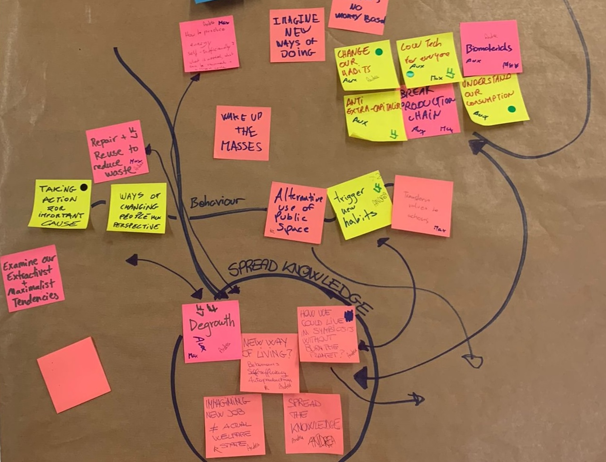
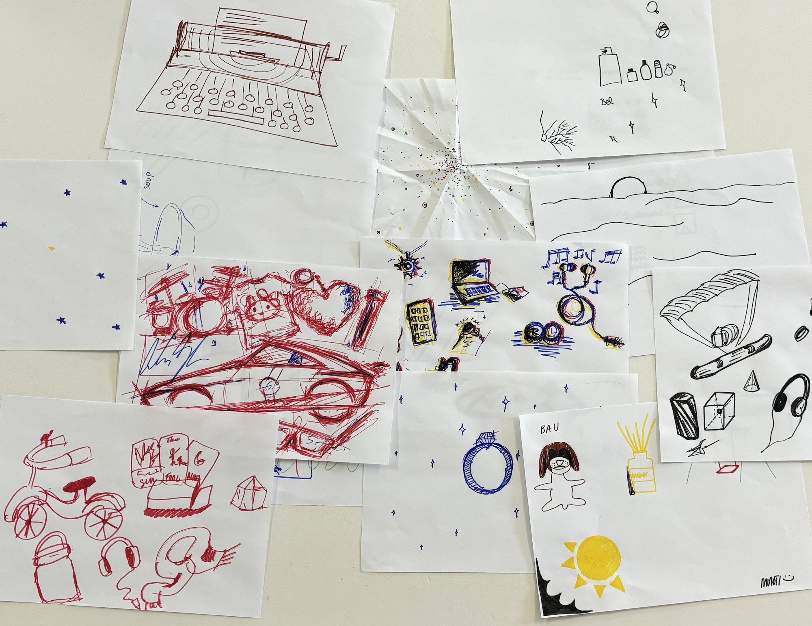
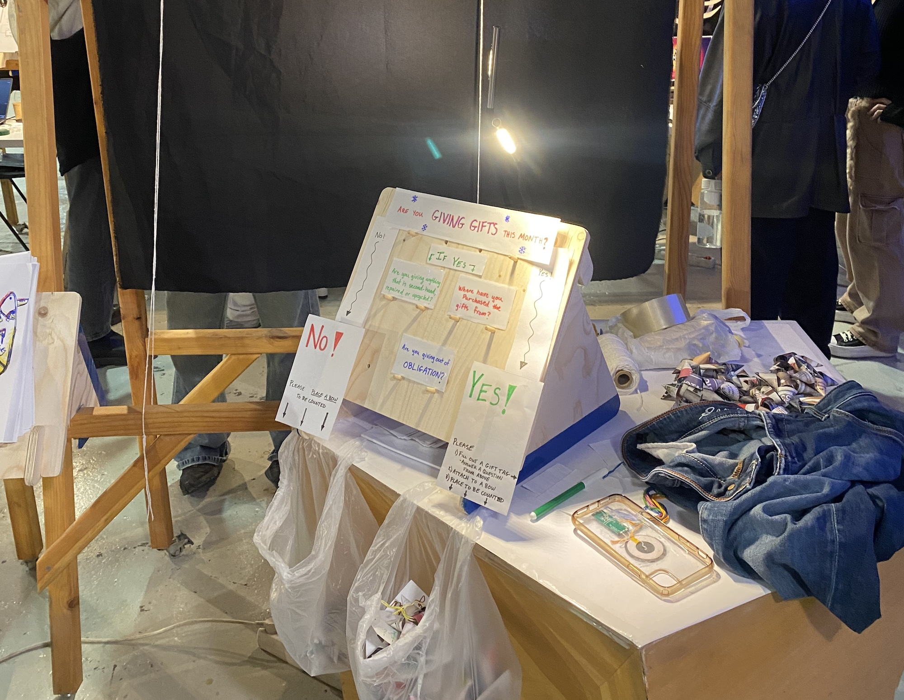
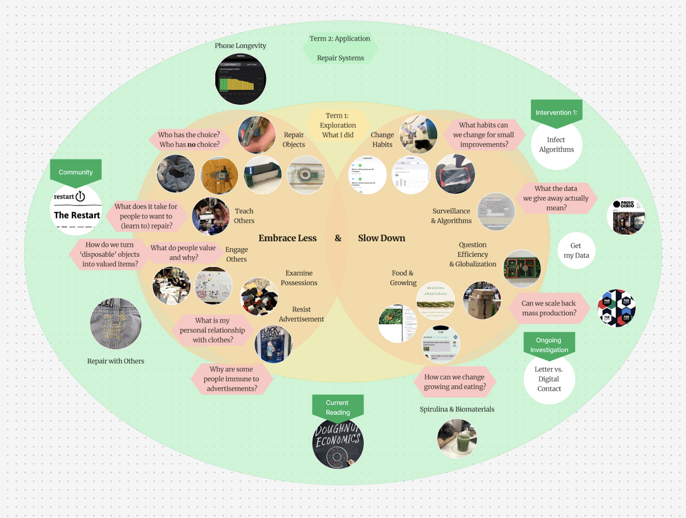

# Design Studio

## Design Studio 01

<!-- Button with photo in it -->
<!-- Intro Week -->

    <a style="box-shadow: 0px 0px 0px 0px #181040; display: flex; flex-direction: row; align-items: flex-start; width: 100%; height: 100%; object-fit: cover; background-color: #7e56c1" href="../term1/designStudio/designWK01">
        

        </img>
        

        

        <b>Intro Week</b> 
        Pick your purpose & design from a first person perspective
        

    </a>

<!-- Session 2 -->

        <a style="box-shadow: 0px 0px 0px 0px #181040; display: flex; flex-direction: row; align-items: flex-start; width: 100%; height: 100%; object-fit: cover; background-color: #7e56c1" href="../term1/designStudio/designWK02">
            

            </img>
            

            

            <b>Session 02</b> 
            Individual design intervention and roles of prototyping
            

        </a>
    

<!-- Session 3 -->

    <a style="box-shadow: 0px 0px 0px 0px #181040; display: flex; flex-direction: row; align-items: flex-start; width: 100%; height: 100%; object-fit: cover; background-color: #7e56c1" href="../term1/designStudio/designWK03">
        

        </img>
        

        

        <b>Session 03</b> 
        Collaborative design spaces and interventions
        

    </a>

<!-- Session 4 -->

    <a style="box-shadow: 0px 0px 0px 0px #181040; display: flex; flex-direction: row; align-items: flex-start; width: 100%; height: 100%; object-fit: cover; background-color: #7e56c1" href="../term1/designStudio/designWK04">
        

        </img>
        

        

        <b>Session 04</b> 
        Collaborative design interventions
        

    </a>

<!-- End of Term -->

    <a style="box-shadow: 0px 0px 0px 0px #181040; display: flex; flex-direction: row; align-items: flex-start; width: 100%; height: 100%; object-fit: cover; background-color: #7e56c1" href="../term1/designStudio/termEnd">
        

        </img>
        

        

        <b>End of Term</b> 
        Design Dialogue and end of term 1 debrief 
        

    </a>

## Design Studio 02

<!-- Button with photo in it -->
<!-- Session 1 -->

    <a style="box-shadow: 0px 0px 0px 0px #181040; display: flex; flex-direction: row; align-items: flex-start; width: 100%; height: 100%; object-fit: cover; background-color: #7e56c1" href="../term2/designStudio/design02WK01">
        

        </img>
        

        

        <b>Session One</b> 
        Reflect on the first term and look to next steps
        

    </a>

 

