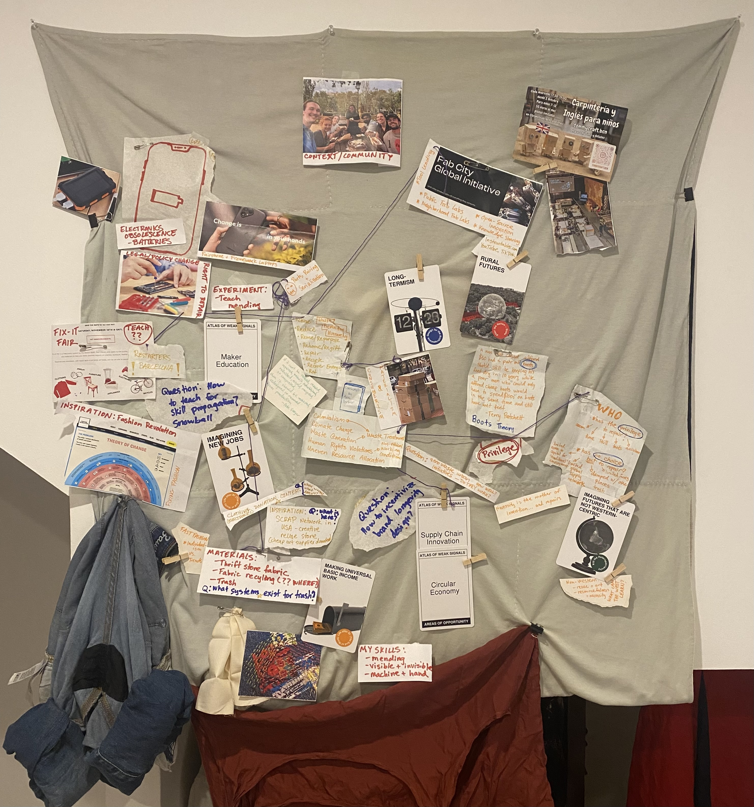
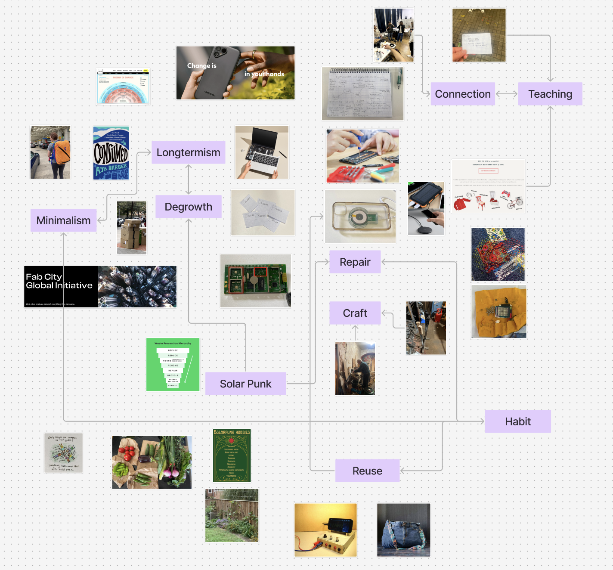
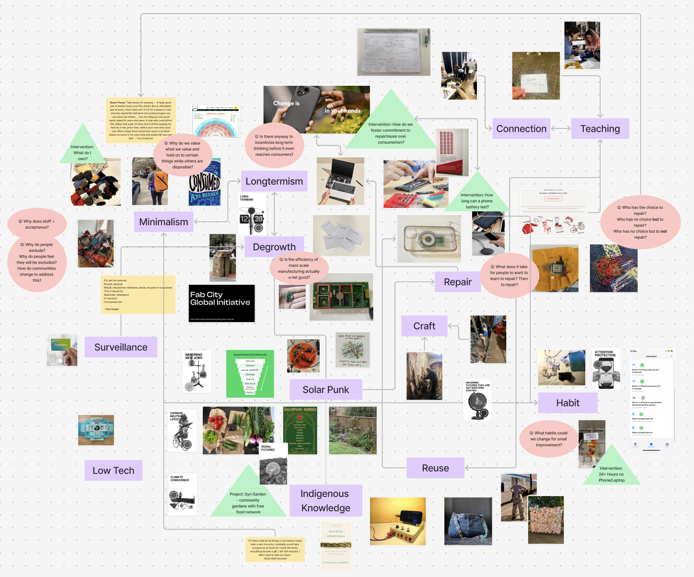
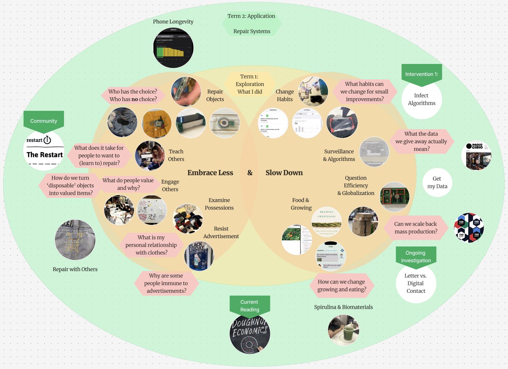

# Design Space 

<iframe style="border: 1px solid rgba(0, 0, 0, 0.1);" width=100% height=500px src="https://embed.figma.com/board/msRCytVlzBiSf6fdEdZBc4/Simplified-Design-Space?node-id=0-1&embed-host=share" allowfullscreen></iframe>

=== "Design Space - 01"
    
    !!! abstract "Date" 
        08 October 2024 

    { align=left }

    The first design space I made was from the series of objects/photos I brought in as part of our assignment. It was a bit of a mess of ideas, connections, and lots of ripped up paper. 

=== "Design Space - 02" 

    !!! abstract "Date" 
        09 October 2024 

    { align=left }

    The second design space reused a lot of the objects/photos I had in the previous one, but also employed the help of the t-shirt quilt I made in 2016 before I went off to college as a backdrop which could be a bit more permanent than the thin paper we had in class. 

    Additionally, this Design Space included some of the cards from the Atlas of Weak Signals. 

=== "Design Space - 03" 

    !!! abstract "Date" 
        17 October 2024 

    { align=left }

    The third design space is a the same as the second design space with a few elements added digitally because I have not printed new additional images or found a more permanent solution for maintaining the design space yet. It is a work in progress and I am sure it will continue to change. 

=== "Design Space - 04" 

    !!! abstract "Date" 
        17 November 2024 

    { align=left }

    The blanket I was using as the backdrop of my physical design space ended up needing to be on my bed as the weather is getting colder. So, I finally decided to convert my physical design space to a digital one. While the physical version felt more tactile, more me, it has also gotten stale. Having it up on the wall, hard to reach without a stool made it challenging to update it. Additionally, having to print photos of things I wanted to add to it made it challenging. So, I am in the process of converting my space to a digital one. It is still a work in progress. There are a lot of things from the physical one that have not made it onto the digital one yet. I hope to fix this soon, and will continue to build it out, making connections, sharing insights, adding projects. 

=== "Design Space - 05" 

    !!! abstract "Date" 
        24 November 2024 

    { align=left }

=== "Design Space - 06 (For Design Dialogue 1)" 

    !!! abstract "Date" 
        17 December 2024 

    { align=left }

=== "Design Space - 07" 

    !!! abstract "Date" 
        20 January 2025

    { align=left }

=== "Design Space - 08" 

    !!! abstract "Date" 
        02 February 2025

    { align=left }