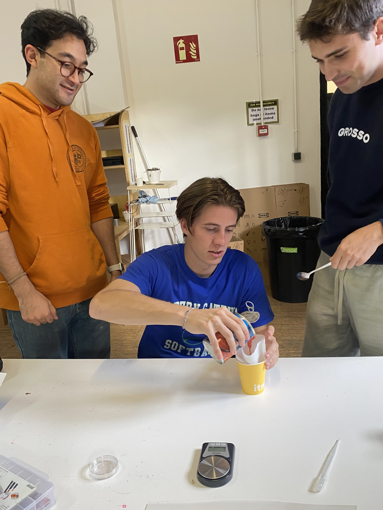
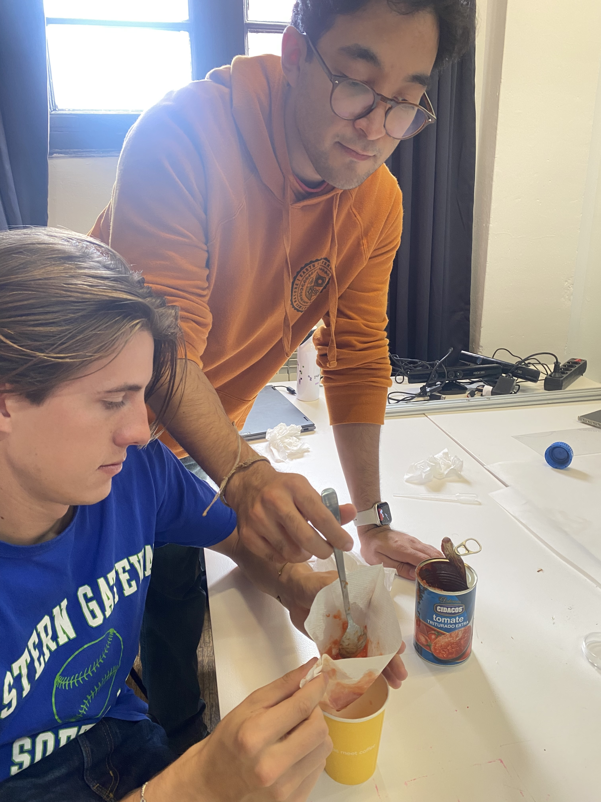
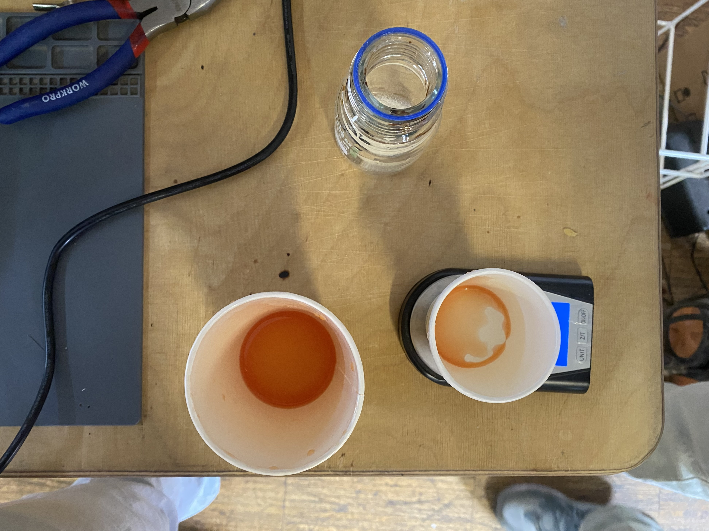
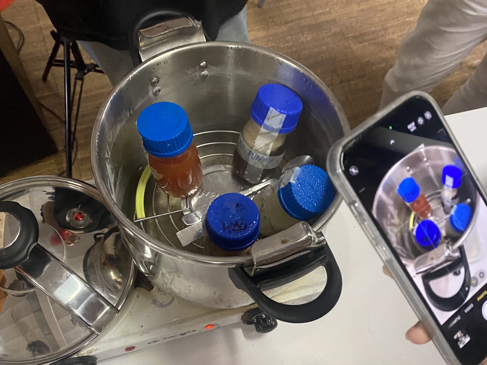
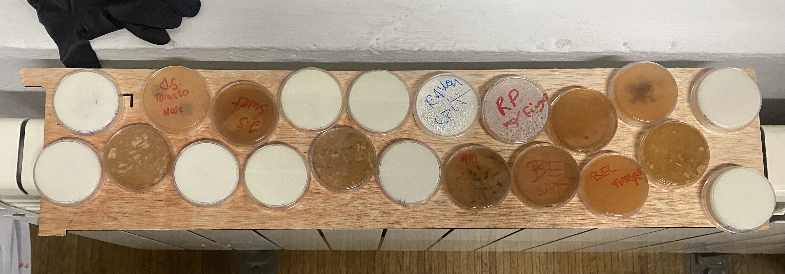
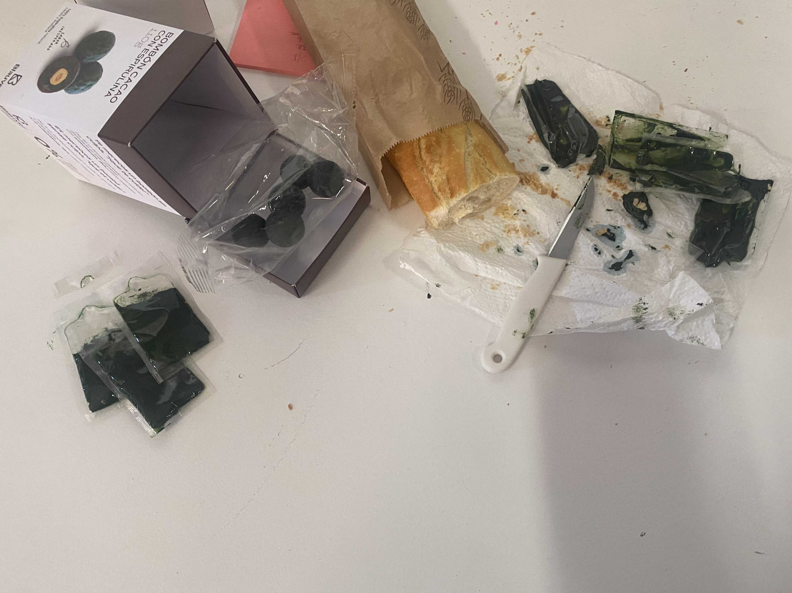

# Biology Zero

!!! abstract "Course Details"
    **Name:** Biology Zero 

    **Dates:** 26 November to 28 November 2024 

    **Faculty:** Núria Conde

Throughout this course, Núria spoke a lot about climate change and the challenges we are facing as a globe. One of the points she made was about the human population on Earth and the problems global population growth will continue to create as we concentrate more and more in urban centers and use more and more of the Earth's resources. 

<iframe title='World population' src='https://www.theworldcounts.com/embeds/counters/8?background_color=white&color=black&font_family=%22Helvetica+Neue%22%2C+Arial%2C+sans-serif&font_size=14' style='border: none' height='100' width='100%'></iframe>

Additionally, a main theme of Núria's lessons was the need to effectively communicate scientific research to the general public and the challenges that this presents. Translating scientific work into understandable information and then taking that information and creating actionable suggestions to inform individuals about how to make sustainable choices is a huge challenge and often leads to a disconnect between experts and the general public. 

She also explained about some of the institutional challenges scientists face when they want to share work, including the need to pay journals to publish their work. Once the work has been published, the copyright of the article belongs to the journal and the scientist cannot share free versions of their work. These kinds of gate-keeping along with private corporations (mostly US based) swooping up experienced researchers for high paid, speculative, and potentially morally questionable research is part of further challenges scientists face when trying to do research that could actually help the world. 

## Growing Things

For hands-on work, we started by creating agar compounds to put in petri dishes in which to grow bacteria. She demonstrated that this type of science can be done extremely easily, with kitchen items.

!!! abstract "She had two (and a half) rules for the lab"

    1. Read the label 
        - Then follow the label 
    2. Keep things clean and tidy 

<!-- { align=left width=47% } -->
{ align=right width=48% }

!!! abstract "DIY Auxitic* for LactoBacillus2 (Original Recipe)"

    * 20 gr Tomato juice 
    * 5 gr Bovril 
    * 15 gr Agar 

*an environment made for a specific organism 

Our group ran into some confusion about how to scale down the original recipe to fit the 100ml jar we had for mixing. Eventually we managed to get our mixture to be a red enough color that Núria felt meant we had enough acid from the strained tomato juice in our mixture for the *LactoBacillus* to be happy. 

 
 

!!! abstract "The necessary components to create an environment for the bacteria to grow" 

    * Carbon source
    * Nitrogen source
    * Correct osmolarity
    * Correct pH 

{ align=left width=47% }
{ align=right width=47% }

{ align=right width=40% }

She also introduced the idea of positive and negative controls which help validate results by being tests with known outcomes. If the expected outcomes do not occur, then the whole test should be considered invalid and should be repeated with appropriate adjustments made. 

!!! quote ""
    * Negative Control - to make sure nothing happened when it shouldn't have (test against contamination)
    * Positive Control - known isolation and concentration to make sure something can happen and the experiment was set up correctly (to check dilution)

{ align=left width=100% }

 

## Spirulina & Fermentation 

{ align=left width=45% }

Núria also introduced us to the idea of growing spirulina and fermenting kombucha. We tried some fresh spirulina from [Blauver](https://blauver.com/en/blauver){:target="_blank} on some bread as well as having some of their spirulina chocolates and Núria demonstrated methods of harvesting spirulina and some tips on how to grow it. 

 
 
 

In the next term, I hope to grow some spirulina and ferment some kombucha as well along with some of my classmates who are also interested. We were tempted us start as soon as this seminar ended but Núria reminded us that we were about to leave for two weeks of breaks, so we will come back to this in the new year. 

## Genetically Modified Organism 

I was initially very resistant to doing this assignment. I have been struggling with the ethical implications of gene editing, particularly when it involves editing non-human organisms where the global consequences are unknown. However, I have also been nervous about editing human genes because of the potential slippy slope towards eugenics. I do not know enough about these subjects to feel confident that my impact would be a beneficial one and not have significant and negative unforeseen consequences. 

However, for the sake of this assignment, I have decided to approach it with the understanding that my intentions are what matter most. I do not intend to suggest edits that will cause new problems to pop up.

I decided to look into editing the genes of the bacteria that causes Lyme Disease which can be transfered by a bite from a tick to a human. From searching on Wikipedia, I discovered that the bacteria is [*Borrelia mayonii*](https://en.wikipedia.org/wiki/Borrelia_mayonii){:target="_blank"}

I received a lot of help from [Carlo Silveira](https://carlossilveiradesign.gitbook.io/mdef-diary){:target="_blank"} who talked me through a lot of the processes I would need for this project. Thank you Carlos! 

The idea for this proposed project would essentially be to 'vaccinate' ticks against the bacteria that causes this disease. By altering the DNA sequence of the bacteria, the piece of the code that activates the bacteria could be nullified. This would then inhibit the ability of the bacteria to spread to humans through a bite. Carlos explained, using the terminology of logic gates which I understand from my background in engineering, that the function of the sequence that activates the bacterial string can be inverted with a 'not gate' :material-gate-not:{ .lg .middle }. 

Carlos helped explain that the basic steps I would need to follow for this process to happen are as follows:

1. Find the promoter* in the *Borrelia mayonii* sequence 
2. Invert the function of the sequence of the promoter
3. Replace the previous promoter with the new one in the plasmid** 
4. Reinsert the plasmid into the tick for the Trojan Horse effect to take place 
5. Observe whether the immune system of the tick recognizes or rejects the bacteria 

    (* the DNA sequence that initiates the transcription of the RNA) 

    (** the altered sequence which will be added to the bacteria to allow the new effect to take place)

Through my research, I found a paper about sequencing the genome of the *Borrelia mayonii* [Whole Genome Sequence and Comparative Genomics of the Novel Lyme Borreliosis Causing Pathogen, *Borrelia mayonii*](https://pmc.ncbi.nlm.nih.gov/articles/PMC5193363/pdf/pone.0168994.pdf){:target="_blank"} Kingry, et. al, 2016. Although my understanding of this article is very limited, I have tried to understand at least the basics of this system. 

The genome sequence for both the MN14-1420 and MN14-1539 strains of *Borrelia mayonii* can be found at this [link](https://www.ncbi.nlm.nih.gov/datasets/genome/?taxon=1674146){:target="_blank"}. The idea, as explained above, would be to find the promoter in the sequence and invert the function of it. From digging through the paper, I believe the desired gene would be *BB_K48* which is described as an 'immunogenic protein P37'. Since this gene dictates immune response, my understanding is that it could be altered to reverse the function of the immune response elicited by the body from this bacteria.

Since this research is targeted at laying the groundwork for a potential vaccine, I attempted to understand the Results and Discussion sections of the paper, however I will admit to understanding very little of what was said. Therefore, I think I will leave the rest of this speculation and research to the professionals who understand these things much better than I ever could. 