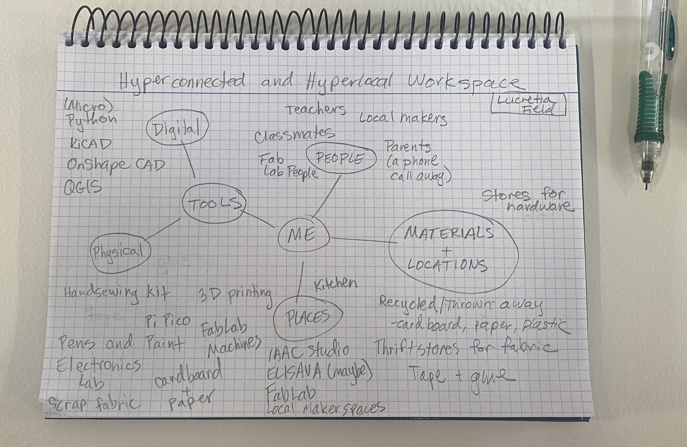

# Design Studio 01 

Our week of Design Studio Intro began with an overview of what the Design Studio is and a list of recommendations for success in the course: 

    * Take chances
    * Knock on doors 
    * Build trust - start ASAP 
    * Connect with what you care about 
    * Small steps are best steps
    * Try and do it yourself 

I am excited to take these recommendations to heart, although I am finding myself nervous about the challenges connecting with locals will present going forward, I am working to embrace the excitement. 

## Hyperlocal and Hyperconnected Workspace 

We were asked to think about and document what workspaces we have access to in our practice going forward in MDEF. Specifically, we were asked to think beyond the traditional workspaces we might think of which might be limited to the IAAC lab or studio. Additionally, in our thinking about hyperlocal and hyperconnected workspaces, we should consider the people, things, and materials we have access to that could be included in our practice going forward. 

I started by thinking about what tools, materials, and people I am used to have access to compared to what I will have access to here. I will miss the easy access to the nearly limitless supply of art materials from fabrics, paper, yarn, thread, and so much more that I have at my parent's home as well as my mom's expertise on fiber arts projects that I can always count on and my dad's knowledge of coding and circuit projects. They are just a phone call away, but I have to make sure I mind the time difference. 

{ align=left }

I sketched up a quick diagram of what I will have access to here. I expect this diagram will grow and change as I learn more about the resources available to me going forward.

## Design Space 

=== "Design Space Iteration 01"
    
    !!! abstract "Date" 
        8 of October 2024 

    { align=left }

    The first design space I made was from the series of objects/photos I brought in as part of our assignment. It was a bit of a mess of ideas, connections, and lots of ripped up paper. 

=== "Design Space Iteration 02" 

    !!! abstract "Date" 
        9 of October 2024 

    { align=left }

    The second design space reused a lot of the objects/photos I had in the previous one, but also employed the help of the t-shirt quilt I made in 2016 before I went off to college as a backdrop which could be a bit more permanent than the thin paper we had in class. 

    Additonally, this Design Space included some of the cards from the Atlas of Weak Signals. 

## Atlas of Weak Signals

{ align=left }
