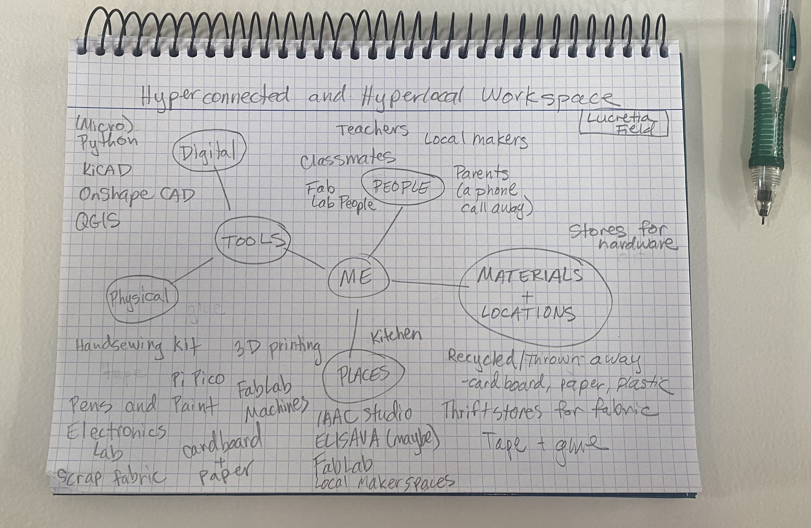
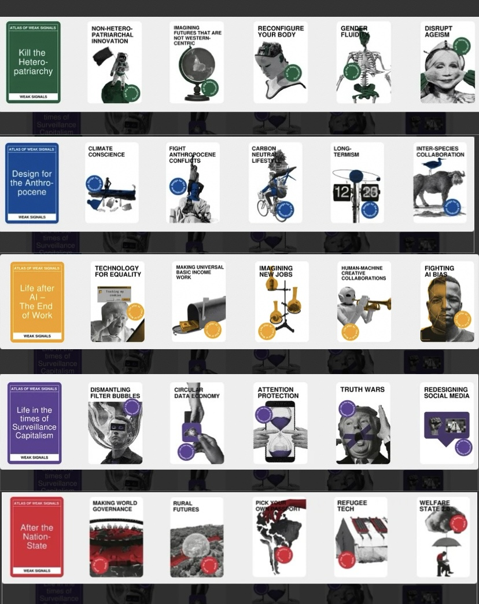

# Design Studio 01 - Intro Week 

Our week of Design Studio Intro began with an overview of what the Design Studio is and a list of recommendations for success in the course: 

    * Take chances
    * Knock on doors 
    * Build trust - start ASAP 
    * Connect with what you care about 
    * Small steps are best steps
    * Try and do it yourself 

I am excited to take these recommendations to heart, although I am finding myself nervous about the challenges connecting with locals will present going forward, I am working to embrace the excitement. 

## Hyperlocal and Hyperconnected Workspace 

We were asked to think about and document what workspaces we have access to in our practice going forward in MDEF. Specifically, we were asked to think beyond the traditional workspaces we might think of which might be limited to the IAAC lab or studio. Additionally, in our thinking about hyperlocal and hyperconnected workspaces, we should consider the people, things, and materials we have access to that could be included in our practice going forward. 

I started by thinking about what tools, materials, and people I am used to have access to compared to what I will have access to here. I will miss the easy access to the nearly limitless supply of art materials from fabrics, paper, yarn, thread, and so much more that I have at my parent's home as well as my mom's expertise on fiber arts projects that I can always count on and my dad's knowledge of coding and circuit projects. They are just a phone call away, but I have to make sure I mind the time difference. 

{ align=left }

I sketched up a quick diagram of what I will have access to here. I expect this diagram will grow and change as I learn more about the resources available to me going forward.

## Design Space 

Check out my Design Space which I will develop during the term to reflect my interests, design process, and trajectory in the course. The Design Space serves as a documentation and navigation tool for organizing, situating, and reflecting upon my personal design practice throughout the course. 

[Design Space](../designStudio/designSpace.md){ .md-button }

## Atlas of Weak Signals

The Atlas of Weak Signals (AoWS) is a ideation system that aims at examining trends before they become trends and then considering and discussing the implications of those potential trends. 

In our class, we started by doing an example as a whole class to demonstrate how these cards can be used to speak conversation 

{ align=left }

## Reflection 

Below is my audio reflection from the end of Week 3 of MDEF and after one week of Design Studio.

  <audio controls src="../../../audio/DesignStudioReflection1.mp3"></audio>