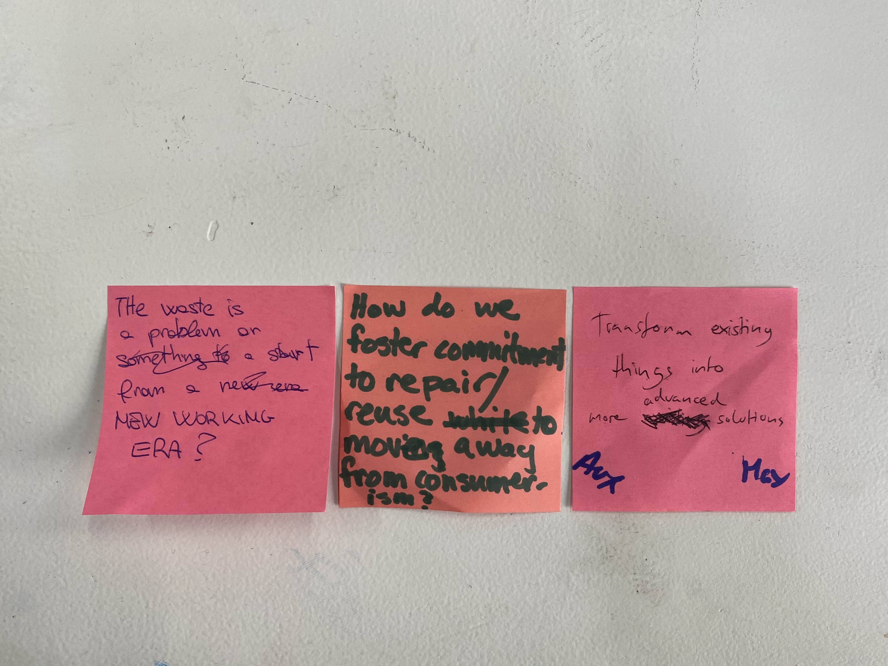
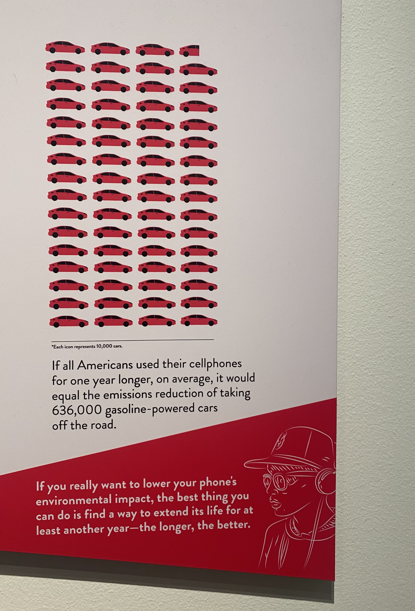
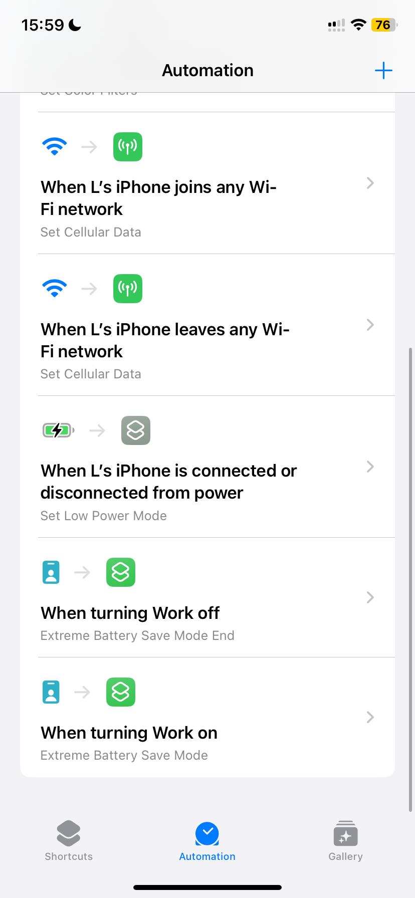
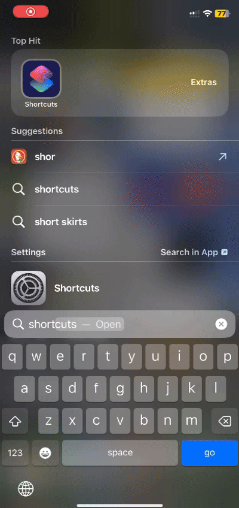
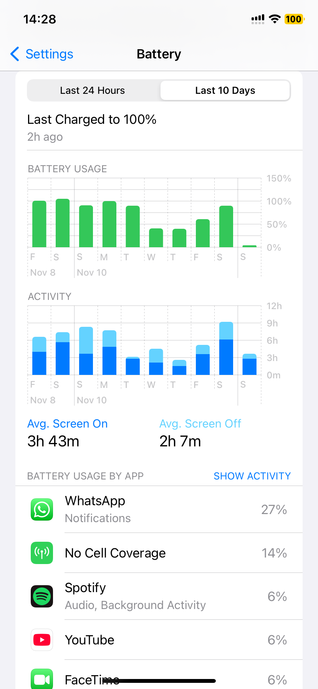

# Design Studio 01 - Third Session 

!!! abstract "Course Details"
    **Name:** Design Studio 01 - Session Three 

    **Dates:** 04 Novemeber 2024 

    **Faculty:** Jana Tothill Calvo & Roger Guilemany

## Collective Design Space 

Unfortunately, I was sick during this session. I met with a group of six people later and we ended up splitting into two groups, one with three people and the other with four. 

We discussed a lot about very different ideas, from alternative energy sources to how to change habits to retrofitting, repairing, reusing materials and much more. 

{ align=right width=100% }

Ultimately, the group I ended up with came up with three questions we wanted to address. From there we came up with an idea to try to test out methods of making my 2019 iPhone 11's battery last longer. I have been thinking of getting a new phone because this one is old, with a battery that runs down very quickly. However, I don't want to buy a new phone. I don't want to spend the money, I don't want to contribute more to the environment impact of of phone, and if I am being honest, because I like the feeling of proving that I can do it. 

{ align=left width=50% }

I saw this graphic at an exhibit in Washington, DC in May and it has stuck in my head since then. While it doesn't have a source to fact check it, I think the general concept feels accurate even if the number is not substantiated. 

So, our group all decided to examine and test our relationship with our phone batteries by trying different strategies and commenting on how it changed our habits and relationships with our phones as well. 

## Group Design Intervention 

<figure markdown="span">
    <video src="" controls="controls" style="max-width: 100%;"></video>
    <figcaption></figcaption>
</figure>

### My experience 

The initial idea of adding a solar panel to my 2019 iPhone 11 with a Maximum Battery Capacity of 73% sounded like an interesting technical challenge. However, in my design review with Saúl, he suggested attempting other ways to make my phone battery last longer between recharges. I decided to set up some automations in the Shortcuts app that would hopefully extend the time required between recharges even longer than the solar panel concept would. 

{ align=left width=47% }
{ align=right width=48% }

I already had an automation activated on my phone to turn on *Low Battery Mode* when it is disconnected from power. I made another automation to turn off Cellular Data automatically when I am am on Wifi and turn them back on when I leave Wifi. An additional automation I created was *"Extreme Battery Save Mode"* the intention was to activate this during class when I didn't want to be distracted by my phone anyway. This mode would turn off Cellular Data and Bluetooth, turn the screen to black and white mode, and dim the brightness to the minimum. I would like to have been able to close all apps that were open in the background as well, but I didn't figure out how to do that yet. 

One of the biggest draws on my battery has been *"No Cell Coverage"* which I think is because I still have my number from the USA activated. I data roaming turned off for that line, but when I turn off the line in general, my phone says that this number will be removed from my device. I do not want to remove my old phone number from my phone because it is still what I use for Wifi calling and iMessage. I intend to do more research on this and see if there is a way to force my phone to stop looking for towers that are not there. 

In terms of talking about habits, this certainly kept me from engaging with my phone as much during class time, which is valuable not only for my battery, but also means I was more engaged with the class. I did notice that during my time trying to make my battery last longer, I ended up using my laptop for more things. I did video calls to friends and family back home on my laptop rather than on my phone. So, in terms of reducing my energy consumption, I am not sure how much this helped. However, it was interesting to see my habits change. 

I did not manage to make it a full 24 hours without charging my phone because of a few different factors. 

    1. Habit
    2. My phone is my morning alarm 
    3. Discomfort

{ align=right width=30% }

If I acquired an external alarm clock so that I wasn't worried about my phone dying and missing my morning plans, I would be more willing to try not charging my phone every night. That may be the next step in my personal exploration of my relationship with my phone. At some point, I want to try going 24 hours without touching anything connected to the internet to examine my habits around being constantly connected. This experiment could potentially coincide with a period of time where I let me battery run down completely without rushing to recharge it.  

It took a while for me to get the shortcuts set up how I wanted them to work. So, I really only spent two days actively trying to reduce the battery usage of my phone. I intend to keep up this attempt going forward, but want to make sure it is sustainable, and therefore I will give myself Saturdays to not worry about screen time or battery usage. Therefore, this battery usage graph shows a fairly successful attempt on Wednesday and Thursday. On Friday, I was using my phone for documentation of the project, which I believe made the battery usage go up further. I am excited to keep trying to change my habits with my phone. To disengage more actively while also helping preserve the battery life so that I can keep this nearly 5 year old phone for at least another year. 

## Design Space Updates 

Check out my Design Space. I am in the process of turning my physical design space into a digital one so that I can more easily update it. It is still very much in process, I am sure I will continue to reorganize it and update it going forward. 

[Design Space](../designStudio/designSpace.md){ .md-button }

## Reflection 

Below is my audio reflection after the second session of Design Studio.

  <audio controls src="../../../audio/DesignStudioReflection3.mp3"></audio>

