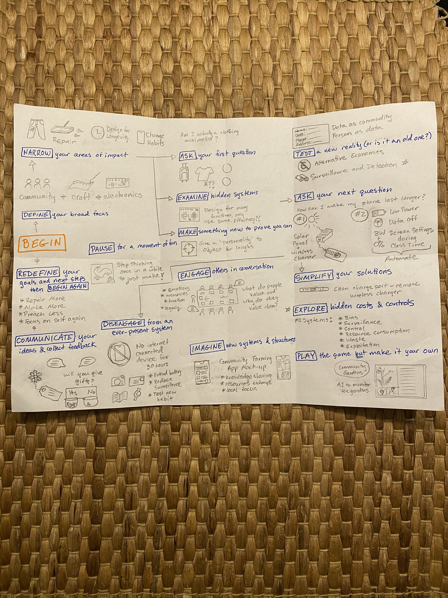
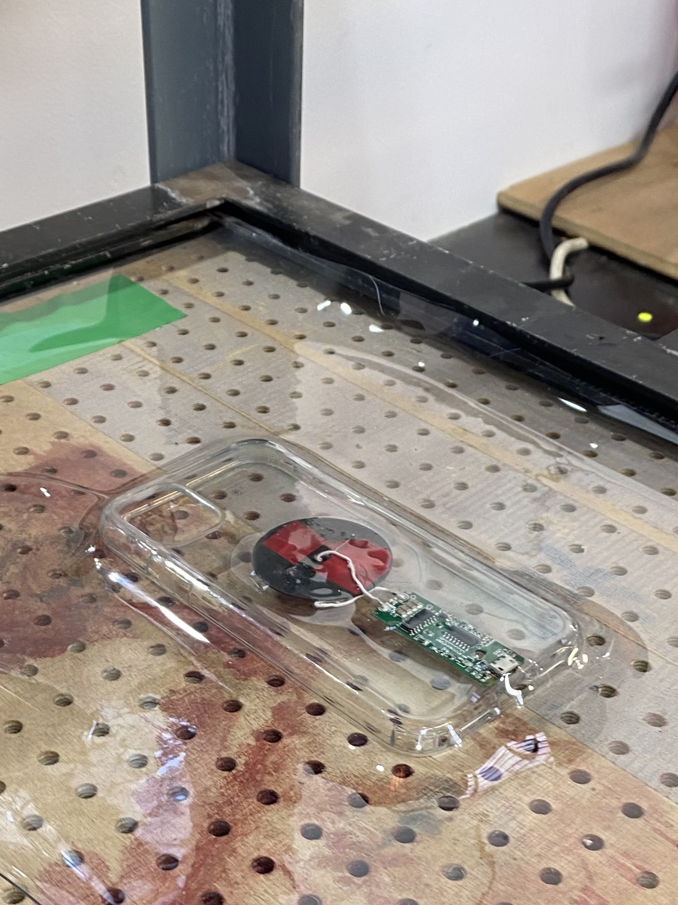
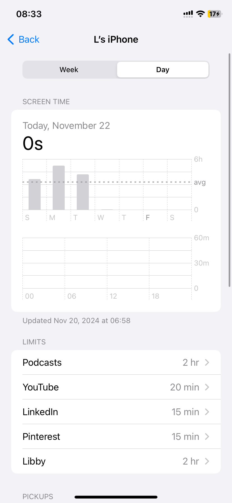
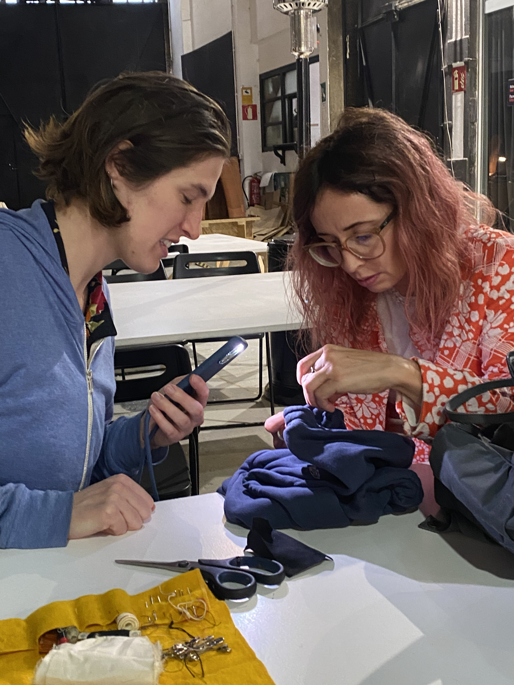
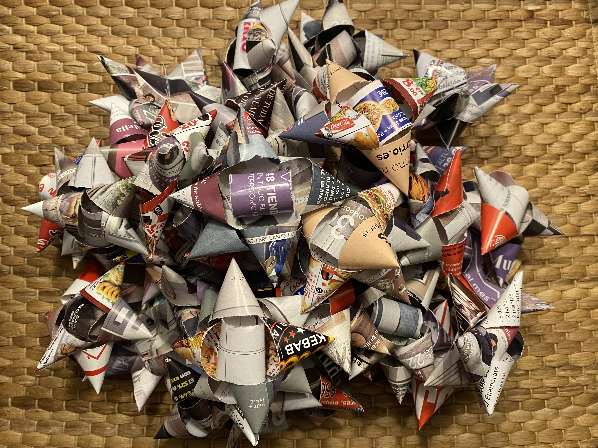
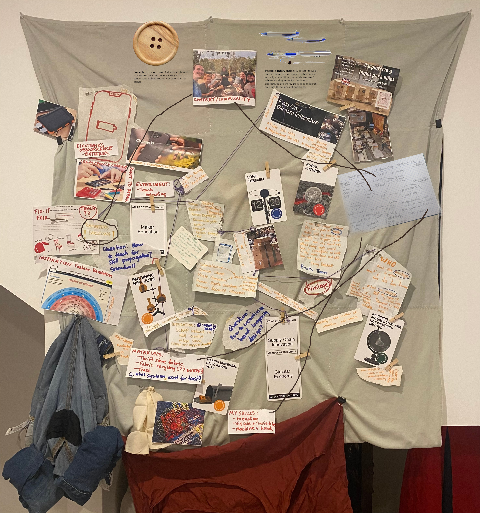
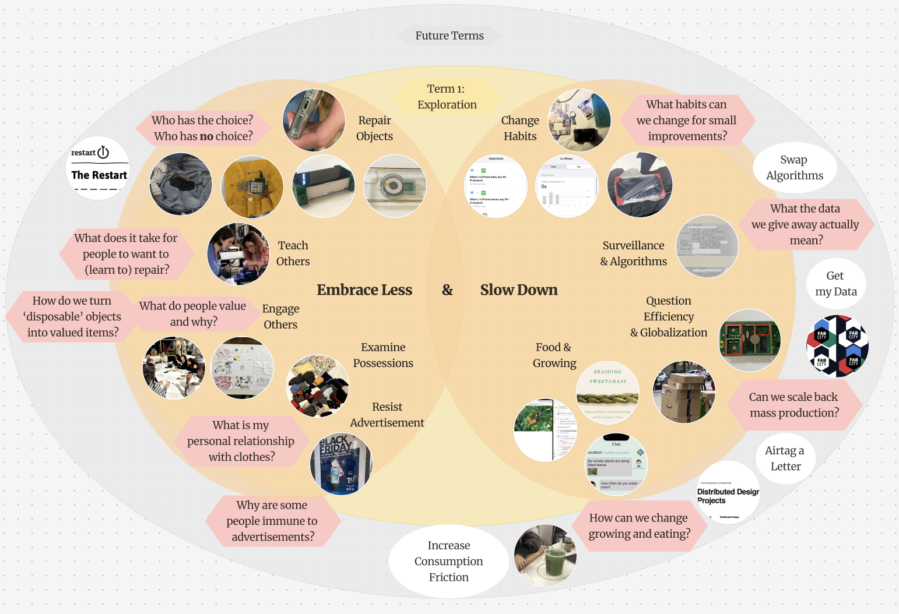

# Design Studio 01 - End of Term

!!! abstract "Course Details"
    **Name:** Design Studio 01 - End of Term

    **Dates:** 06 January 2025 

    **Faculty:** Jana Tothill Calvo & Roger Guilemany

## Draft Pictorial 

Here is the draft of my pictoral. The idea has changed a bit since my initial proposal. After the Design Dialogues, I felt that my vision had changed about what I wanted to communicate and how. Now, I am interested in exploring the idea of taking small actions in the face global, overwhelming crises. I want to highlight the idea of scaling back. The format still includes a letter,  a hand-made envelope, and drawn reflections on my work. However now it focuses on communicating the idea of scale, measurable steps, and a somewhat chaotic process which feels integral to how my term has felt. I hope that the chaos does not distract too much from the message I am trying to get across. 

<!-- Slideshow container -->

  <!-- Full-width images with number and caption text -->
  

    
    
  

  

    
    
  

  

    
    
  

  

    
    
  

  <!-- Next and previous buttons -->
  <a class="prev" onclick="plusSlides(-1)">&#10094;</a>
  <a class="next" onclick="plusSlides(1)">&#10095;</a>

<!-- The dots/circles -->

  
  
  
  

### The text of the letter:

Dear Reader, 																				

I hope you are doing well and not thinking too much about the current state of affairs. Here’s the thing, we live in a world in crisis, which is overwhelming and scary. There is a global climate emergency perpetrated by over-consumption, over-production, and massive amounts of waste, all driven by the a constant drive for more. This crisis on its own would be enough to make anyone lose hope, but it has fueled and is fueled by other crises like global conflicts, resource and economic inequality, loss of local community support, and a collective focus on simultaneously numbing ourselves to the suffering while constantly being bombarded with information specifically chosen by algorithms to keep us in a state of panic, fear, and division. So, all that said, dear reader, to combat this, let’s try to focus on ourselves and our small impacts, shall we? 

What pieces of our lives can we pour energy into to make life better? What actions can we take to foster kindness and support in our communities? The world is big, too big to address all of it, so what can we do to have a local impact? What can we do to fight back against algorithms and corporations telling us what to desire, how to feel, and what to think? 

Amidst all these overwhelming questions, my head is spinning and I am getting stuck. So, to combat that, I have attempted to take small, tentative steps towards testing my impact. Contained in this envelope is what I have tried so far. These are my attempts at responding in minute, measured, investigative ways to the crises while maintaining most of my sanity. It is a mess, like my feelings about this work. Perhaps it could also serve, dear reader, as a guide for your own reflection and practice, if you choose to take up the mantel. 

So, dear reader, I hope this letter finds you well and maybe, just for a moment, you will pause, step back, and examine your own choices. Maybe, just for a moment, you will really actively choose care, for yourself, your community, for our world. At least that is my hope. 

All the best, 

Lucretia Field 

## Images from Term 

### Object's Intervention 

The resulting images from the intervention asking people what object they value show a really fun moment in the course. Additionally, this was a moment where I finally engaged with the larger community outside of our direct classroom, which is something I want to do more of going forward. 

### Phone Charger 

This photo shows an important lesson I learned this term: sometimes the simplest answer really can work. It is probably a better use of time to exhaust the possibility that the simple solution won't work before committing to a more complex one. I made a whole elaborate system to attach a wireless charger to my phone case when it wouldn't charge correctly from the port. However, to make it able to charge correctly, all I had to do was carefully and thoroughly clean the charge port. I had tried before embarking on the wireless charger plan, but I hadn't tried hard enough. So, keep things simple I guess is the most useful lesson to have learned. 

### Phone Habits 

Not using my phone or laptop for over 24 hours was a really interesting experiment to do in this term. Part of me was surprised by how easy it was to do and how nice to felt to disconnect, another part of me knows that I likely won't do it the same way again because it required significant changes to my routine that, while refreshing, would complicate my normal life significantly if I made it a habit. However, maybe going forward in the next term, I will try it again or at least in small doses. 

 

### Clothing Mending 

I did a few different mending projects this term, from my own jeans, to a few pieces of clothing for my classmates, to a moment where I did my best to teach someone else the techniques I know to alter clothes. This photo shows me teaching mending, which I hope to do more of in the next terms, even as I continue to mend clothing for myself and others. 

### Design Dialogue Bows 

These bows represent another moment of potentially misguided effort. I committed to making these bows as a visual hook for my presentation at the Design Dialogue and as a symbolic statement about consumerism. Ironically, I made way too many: about 80 bows when only 20 were actually used during the Dialogue. Additionally, it was pointed out to me during the event that I had turned paper that could theoretically be recycled, into non-recyclable junk, which was exactly what I was trying to reduce. So, while I had fun making the bows and they did serve as a conversation starter, perhaps next time it would be useful to take a step back before committing to making quite so many and doing just a little too much when a simpler solution probably would have been more elegant anyway. 

## Design Space Progression 

### First Design Space 

### Pydigital Design Space  

### Simplified Digital Design Space for Design Dialogue 

<!-- ## Reflections from Design Dialogue 

I think somewhere along the way, I lost my direction again. I think I got caught up in the deadline of the design dialogue and the exhaustion from so much energy spent thinking as part of this program. Somewhere in the past few months between sort of finding direction and now, I lost it again. 

At the design dialogue, I was challenged to explain why I had the display I had. The bows that I had made served very little purpose in the long run and the challenge I received was "why?" but with the followup question of, you made something that was recyclable into something that is not recyclable, so what was your reason? There has to have been a strong reason why I did this then. Unfortunately, I wasn't able to give one, because I had gotten wrapped up (pun not intended) in the concept I had started down, without necessarily knowing what the why was. 

So, I think going forward, I have to figure out how to find my stronger reasons, to have stronger convictions, even if I might be wrong, but be able to explain them at least. 

I need to dig deeper into my first person perspective and stop trying to lecture. This design dialogue became too much about conversations - but I wasn't even recording those conversations very well, so, how do I change that for the future? Should all the conversations be recorded and I'll have to go back through them by hand, or is there a different thing I want to get out of these dialogues? Perhaps the path I have been on is not the right one. It helps to know that now, I guess. 

But what does the next term look like now? Do I build a community, if so, how? If I am thinking of going back to the US after this program, then what is the value of building a community here? 

So, with those questions still unanswered, what are the skills I want to learn next term? 

I want to use certain fabrication tools more: 

    - CNC - learn to make bigger things - more solid things. Will need to have a reason why, or I can just make things to learn the skills 
    - Lasercut - want to learn to develop quicker and try things more quickly and modularly 
    - How the superlab runs, I want to engage more with the people who run it and learn what things they need to do. Learn how a maker space works 

Things I want to do in general: 

    - Experiment with biomaterials - ask Salvador maybe 
    - Grow plants - can we do garden things on the roof or at Valldaura - automation, can I actually use the 'Grow Organic' project experience somehow? 
    - Kombucha - with Kevin 
    - Spirulina - with Kevin?
    - Cashew cheese - with Kevin? 
    - Make a fume extractor for the classroom from an old fan in the machine paradox box 

People I want to engage with more: 
    - Fab Lab people 
        - Josep and Dani 
        - Julia and Jessica 
        - Fab City people - I want to understand this 
    - People from other programs 
        - Atticus at Valldaura 
        - Salvador in AI 

Things in general, look into existing systems and things that work, see if there are ways to learn those, use those, 'scale' them although not necessarily in a capitalistic way 

Okay, some less happy thoughts: 

Am I just too much of a follower to be good at this? 
Are my own convictions or values or ideas too nebulous? When I am trying to figure these things out, do I get too committed to a single idea because it feels real in the moment, but then I don't examine things.
Why would I make a community here if I'm just going to move? But can I afford not to? 
Do I have too much trouble following through with plans to be in charge of something like this? 

So, where am I now? 
Still annoyed about consumerism, but what right do I have to tell anyone else what to do when I'm on a high horse of superiority. Also, I'm coming from a place of privilege and while I may recognize it, I haven't done much to learn about others or give context to the questions I still have. 
In general, I still have so many questions, too many to follow up on or with. 

So, from a first person perspective, what am I interested in? 

    - I want to know what happens when we switch algorithms 
        - prototype by switching with someone you actually know - physically switch phones or youtube accounts?
        - as you use someone else's algorithm, you would be changing theirs, potentially, depending on how it works 
        - just playing certain videos on the same wifi can influence what videos get shown too - how can we play with that? 
        - but the real crux is how do you get to switch with someone hwo you don't already overlap with?
        - is there a way to see the algorithms? 

    - What data does google actually have on me, or any other big company for that matter? 
        - look into ways to get that information 
        - Why? = because it feels scary, it feels like I want to be able to wrap my head around what corporations actually know about me 
        - How are the manipulating me? And everyone else?

    - How do we actually verify things? 
        - I think this is something I have been thinking about for a while, how do we know what gets recycled or composted or anything else? 
        - How do we know our data is being used, that we're being manipulated? 

    Maybe it's less about increasing friction and more about increasing transparency and understanding? 

    - show what the impact of your Amazon purchase will actually be somehow or your query on ChatGPT or why you are being shown a specific video. What if it is less about making it harder to buy new, but instead is about making it easier to know what you are buying. Digital material passports... but here's the thing, I don't want to write code, I don't want to mess with blockchain, I want to make things with my hands, sew, sculpt, create in those ways. So... once again, I am back to where I have always been. Wanting to make changes in ways that I don't know how to and don't want to really. BLAH! ugh! 

    
 -->