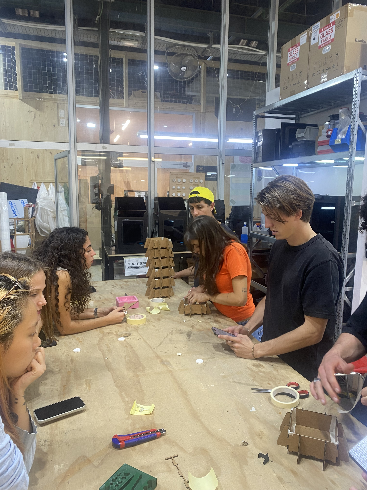
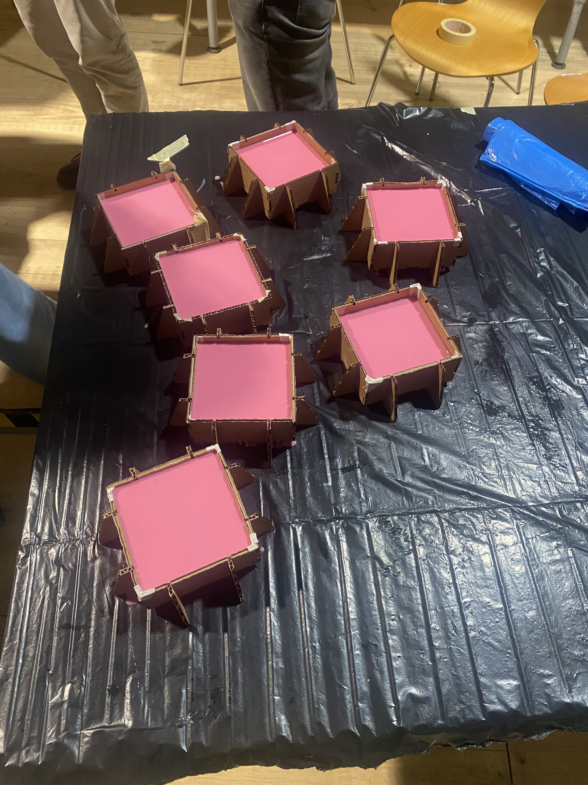
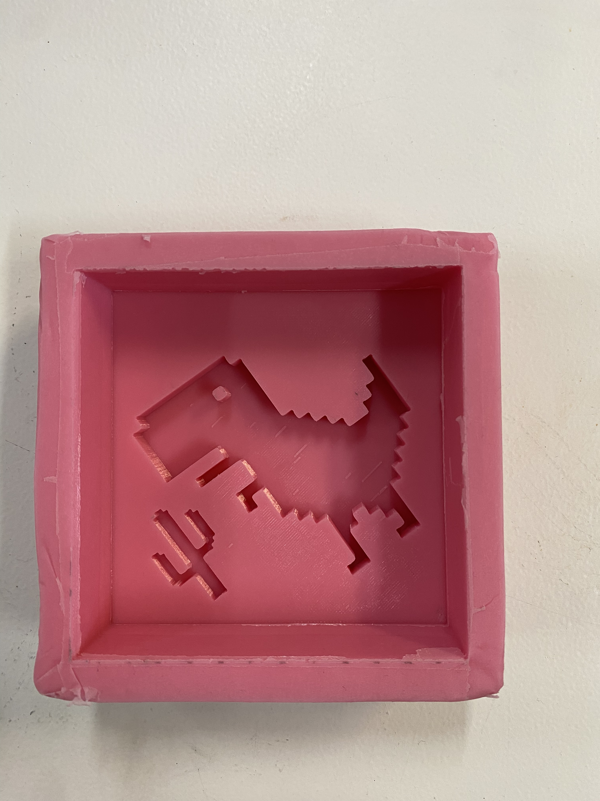

# Fundamentals of Digital Fabrication 

!!! abstract "Course Details"
    **Name:** Fundamentals of Digital Fabrication  

    **Faculty:** Dídac Torrent, Santiago Fuentemilla Garriga, Daniel Mateos, Josep Marti Elias, & Adai Surinach

## Session 01 

!!! abstract "Session 1" 
    08 October 2024: Introduction to the course

Here is where I will document my work in the Fundamentals of Digital Design class. For now, we have had an introduction to the Superlab space and an overview of the plan for this term. More will follow. 

## Session 02 

!!! abstract "Session 2" 
    16 October 2024: Introduction to Arduino IDE and Barduino

<figure markdown="span">
{ align=left width=25% }
We had an introduction to the Barduino and the Arduino IDE, setting up basic functionality of using the ESP32 with Arduino.
</figure>

## Session 03 

!!! abstract "Session 3" 
    22 October 2024: Introduction 2D design with Rhinoceros

## Session 04

!!! abstract "Session 4" 
    31 October 2024: Introduction 3D design with Fusion 360

## Session 05 

!!! abstract "Session 5"
    13 November 2024: CNC milling

## Session 06 

!!! abstract "Session 6"
    19 November 2024: Casting and mould design theory

<figure markdown="span">
{ align=left width=30% }
{ align=left width=30% }
{ align=left width=30% }
</figure>

## Session 07 

!!! abstract "Session 7"
    20 November 2024: Networking with microcontrollers

    Faculty: Daniel Mateos & Josep Marti Elias

<figure markdown="span">
{ align=left width=30% }
During this session we connected our Barduinos to the wifi and made our own local network of devices talking to each other. We could remotely change the colors of the RGB LEDs on the boards of other people in the class which led to a fair amount of hilarity. 
</figure>

## Session 08 

!!! abstract "Session 8"
    27 November 2024: TouchDesigner 

    Faculty: Tatiana Butts

<figure markdown="span">
{ align=left width=42% }
{ align=right width=50% }
</figure>

<!-- 27 November 2024: Modular Design  -->

## Session 09

!!! abstract "Session 9"
    04 December 2024: *Design Dialogues* preparation