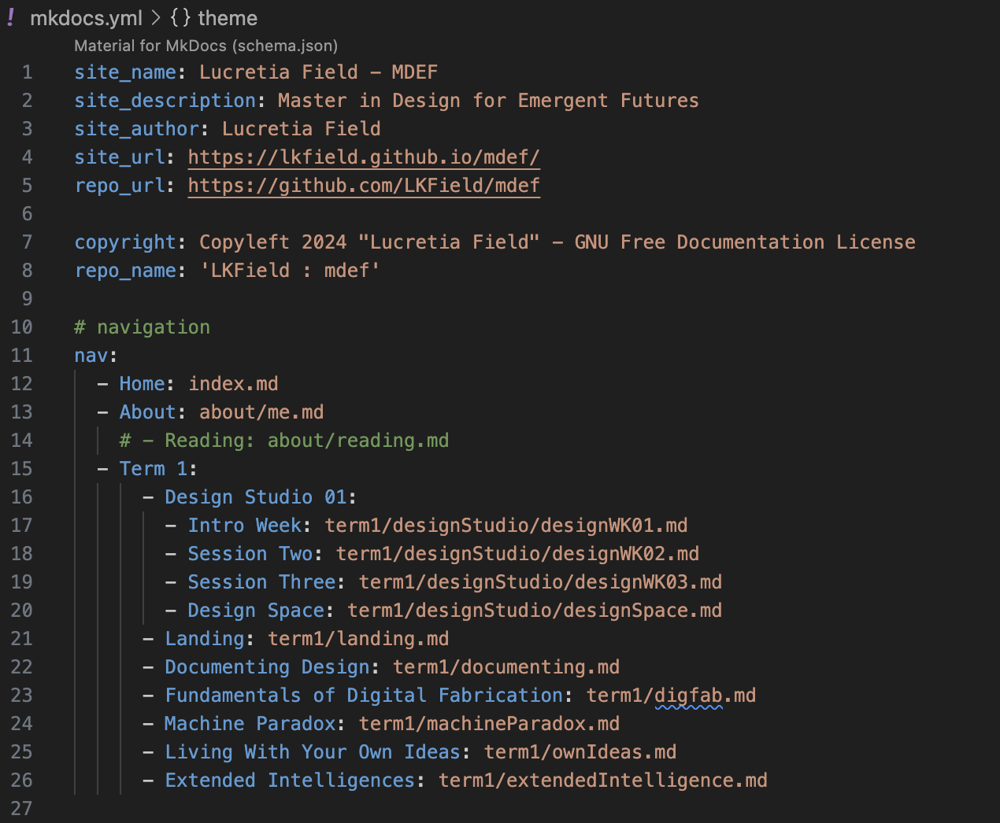
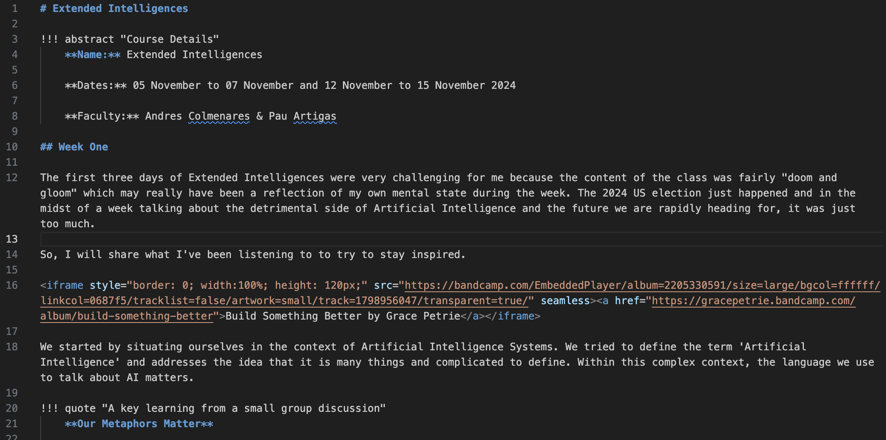
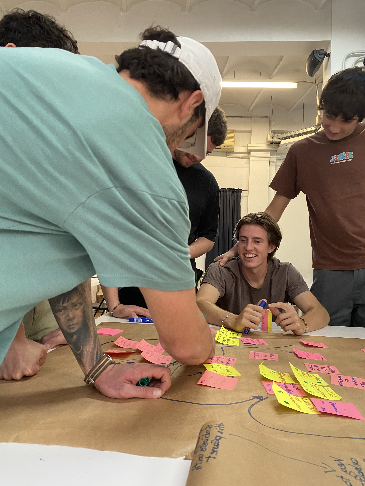
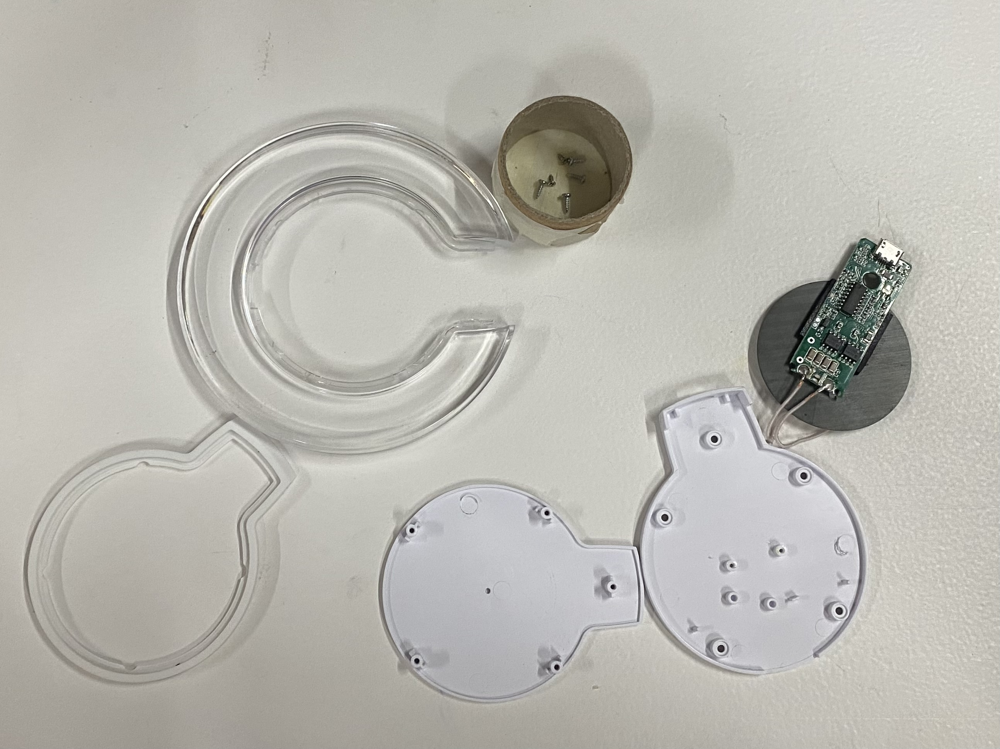

# Documenting Design

!!! abstract "Course Details"
    **Name:** Documenting Design 

    **Dates:** Multiple Times

    **Faculty:** Pablo Zuloaga Betancourt

## Website 

I have built a website before using Wordpress. I have even tried coding my own site with HTML and CSS although I found that process tedious and I struggled to turn the design vision I had into reality. 

For this website, I wanted to create it for free rather than having to pay a hosting fee. In class we were introduced to the idea of hosting a static site on GitHub which seemed like a good option. 

I decided I didn't like the limitations of GitBook or the other suggested options, but I liked the look of the websites from previous years that used Material for MkDocs. So, I started up my site using MkDocs and occasionally taking inspiration from the pages of students from previous years as well. 

MkDocs is relatively straightforward and easy to use because Markdown is relatively easy to understand and a lot of tutorials exist online. I have not quite figured out how to do all of the things I would like to be able to do with this site in terms of customization, but it is a good start and I am sure I will continue to learn more. 

### My MkDocs 

I have a pretty basic structure to my Markdown files. I have been implementing some HTML into the files as necessary to embed images, video, and external links as necessary. 

``` yaml title="Navigation menu YAML"
nav:
  - Home: index.md
  - About: about/me.md
    # - Reading: about/reading.md
  - Term 1:
      - Design Studio 01:
        - Intro Week: term1/designStudio/designWK01.md
        - Session Two: term1/designStudio/designWK02.md
        - Session Three: term1/designStudio/designWK03.md
        - Design Space: term1/designStudio/designSpace.md
      - Landing: term1/landing.md
      - Documenting Design: term1/documenting.md
      - Fundamentals of Digital Fabrication: term1/digfab.md
      - Machine Paradox: term1/machineParadox.md
      - Living With Your Own Ideas: term1/ownIdeas.md
      - Extended Intelligences: term1/extendedIntelligence.md

```

``` markdown title="Top of Extended Intelligences Page Markdown example" linenums="1"
!!! abstract "Course Details"
    **Name:** Extended Intelligences 

    **Dates:** 05 November to 07 November and 12 November to 15 November 2024 

    **Faculty:** Andres Colmenares & Pau Artigas

## Week One 

`The first three days of Extended Intelligences were very challenging for me because the content of the class was fairly "doom and gloom" which may really have been a reflection of my own mental state during the week. The 2024 US election just happened and in the midst of a week talking about the detrimental side of Artificial Intelligence and the future we are rapidly heading for, it was just too much.` 

So, I will share what I've been listening to to try to stay inspired.

<iframe style="border: 0; width:100%; height: 120px;" src="https://bandcamp.com/EmbeddedPlayer/album=2205330591/size=large/bgcol=ffffff/linkcol=0687f5/tracklist=false/artwork=small/track=1798956047/transparent=true/" seamless><a href="https://gracepetrie.bandcamp.com/album/build-something-better">Build Something Better by Grace Petrie</a></iframe>

We started by situating ourselves in the context of Artificial Intelligence Systems. We tried to define the term 'Artificial Intelligence' and addresses the idea that it is many things and complicated to define. Within this complex context, the language we use to talk about AI matters. 
```

<!-- { align=left width=100% }
{ align=left width=100% } -->

Unfortunately, there has been a slight issue I have been having with line breaks in this code. This has resulted in me needing to resort to some silly hacks like including line break indicators in HTML. I hope to fix this at some point, but for now, this solution works despite being inelegant.  

``` html
<br><br><br>
```

It was helpful to add a spellchecker to Visual Studio Code so that I could catch my typos. I added the "Code Spell Checker" extension which greatly improved the spelling on my website. 

Additionally, I learned a useful way to embed video into these documents is to directly paste the video into the GitHub page and then build the HTMl class around it. For example, this allows the video have controls and sound which were not working as well when I put in a relative path to the video file in my repository. 

``` html
<video src="https://github.com/user-attachments/assets/e0970369-a601-4505-973f-5b1ce7edbb6e" controls="controls" style="max-width: 100%;"></video>
```

I am continuing to learn more and expect that this webpage will keep changing, growing, and becoming more and more personalized as the course goes on. 

## Documentation 

In terms of videos and photographs in the documenting process, I am getting better at remembering to take photos and videos of the work I am doing in class. I now frequently take photos now even when I am not sure what exactly I am documenting and often I find I end up using some of the random photos I took. 

{ align=left width=36% }
{ align=left width=20% }
{ align=left width=36% }
