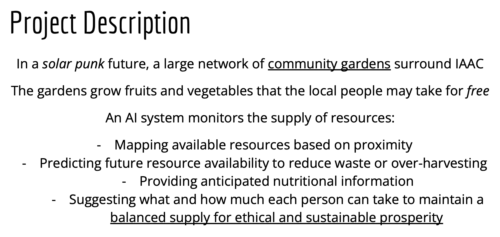

# Extended Intelligence 

!!! abstract "Course Details"
    **Name:** Extended Intelligence 

    **Dates:** 05 November to 07 November and 12 November to 15 November 2024 

    **Faculty:** Andres Colmenares & Pau Artigas

## Week One 

The first three days of Extended Intelligences were very challenging for me because the content of the class was fairly "doom and gloom" which may really have been a reflection of my own mental state during the week. The 2024 US election just happened and in the midst of a week talking about the detrimental side of Artificial Intelligence and the future we are rapidly heading for, it was just too much. 

So, I will share what I've been listening to to try to stay inspired.

<iframe style="border: 0; width:100%; height: 120px;" src="https://bandcamp.com/EmbeddedPlayer/album=2205330591/size=large/bgcol=ffffff/linkcol=0687f5/tracklist=false/artwork=small/track=1798956047/transparent=true/" seamless><a href="https://gracepetrie.bandcamp.com/album/build-something-better">Build Something Better by Grace Petrie</a></iframe>

We started by situating ourselves in the context of Artificial Intelligence Systems. We tried to define the term 'Artificial Intelligence' and addresses the idea that it is many things and complicated to define. Within this complex context, the language we use to talk about AI matters. 

!!! quote "A key learning from a small group discussion"
    **Our Metaphors Matter**

    The language we use to talk about AI is always abstracted and we must recognize the intentions of those abstractions and perhaps reframe the language to take a more expansive, global, and nuanced view. 

In the lecture given by Gustavo Nogueira on temporality and AI, we were asked to take a step back and expand our view of the future; taking the time to slow down. Gust suggested that our perception of time has become distorted by the acceleration of technological change. The distortion of time then pushes social change at a rapid pace, which in turn speeds up the pace of life, which then pushes technological change even harder. This acceleration not only causes whiplash and backlash, but simultaneously makes us feel as if we are frozen, stuck in a time without control. 

!!! quote ""
    **How is your relationship with time?** 
    - Gustavo Nogueira

I imagine that Gust's talk was intended to be inspirational, to provide a different context for us to view the change we see happening around us. He asked us to check in with ourselves and to contextualize our own experience of time. He asked us to approach the past with gratitude and to focus on resiliency in the face of change. Unfortunately, given the context of my week, I found these ideas really challenging to hold on to. The immediacy of crisis tends to narrow the vision and while I agree that stepping back is helpful, for me, in that week, it was simply too soon. Which perhaps was exactly the point he was trying to make. 

!!! quote ""
    **What if the way we respond to the crisis is part of the crisis?** 
    - Gustavo Nogueira

That evening, I watched *Coded Bias*, a documentary by Joy Buolamwini about bias within facial recognition systems and the use of these systems in surveillance. I found it terrifying and upsetting, but also motivating. By exposing the severity of the problems, it fuels resistance and potentially a push back against these systems. For some reason, watching this was enough to push me, at least partially, out of my state of paralyzing fear and frustration. 

Back in class, we moved into talking about ethical and environmental impacts of increasing the use of AI Systems and the ever expanding infrastructure needed to maintain systems that we are becoming more and more dependent on. 

### The 5 (+1) Critical Data Center Studies:

-   :material-numeric-1-circle-outline:{ .lg .middle } __Earth__

    ---

    The physical infrastructure of these places, the logistical networks they require, and the materials extracted from the Earth have huge impacts on Earth. 

-   :material-numeric-2-circle-outline:{ .lg .middle } __Water__

    ---

    The water required for the entire life cycle of a data center (from the microchip manufacturing to the cooling of the massive structures) is staggering. 
    
-   :material-numeric-3-circle-outline:{ .lg .middle } __Labor__

    ---

    The cost to people, through exploitation of low income workers moderating content or creating datasets for training, of these systems is an often hidden piece of the AI puzzle.

-   :material-numeric-4-circle-outline:{ .lg .middle } __Energy__

    ---

    The energy required to run these data centers is also overwhelmingly huge and hidden from view of those who use these services. 

-   :material-numeric-5-circle-outline:{ .lg .middle } __Heat__

    ---

    The heat produced by this infrastructure is it's own problem as well, leading to fires and impacts on local climates around the centers.

-   :material-numeric-6-circle-outline:{ .lg .middle } __Waste__

    ---

    The end of the life cycle of electronics is e-waste processing and the harm to the Earth and people involved in this processing is also overwhelming. 

At the end of week one, we finally had a moment of hope when we were told what our project for the next week would be: to use AI to create a Design Fiction Artifact that would help MDEF students in an idealized Solar Punk world of 2044.  

!!! quote "Design Fiction" 
    The practice of creating tangible and evocative prototypes from possible futures, to help discover and represent the consequences of decision making

    Source: Near Future Laboratory

### Reflection 

Throughout the week, I kept finding myself more and more frustrated by the increasing reliance on AI and feeling superior that I "don't use it". The reality is that even if I have never made a ChatGPT querrie, and only once generated an image using MidJourney, I use these systems all the time. It is impossible to escape them, and if I am being honest, there is a lot of benefit to some of the uses of these systems. Additionally, I have privileges that have allowed me to stand on this moral high ground that I place myself on in terms of not using these tools. I learned English as my first language and therefore do not need to use ChatGPT to translate my thoughts into words I can put on this webpage. I had exposure to drawing skills as a young kid and learned, at least to some extent, how to turn ideas in my head into drawn pictures, so while I do not always have the time to create the art I envision, I can avoid using image generation AI and still mostly achieve the kinds of creative expression I want to. I am sure there are many other positions of privilege I do not yet recognize that allow me to hold my ground on this refusal to progress into the modern world. 

I think this week, while challenging personally and emotionally, reminded me why I take the stance I do, but also gently suggested that I need not be so rigid in that stance. The reality is these systems exist, many are beneficial, many are harmful, all of it must be viewed in context and with care. AI is a system made by humans, humans have bias and prejudices, AI therefore will reflect those ugly pieces of humanity unless we find a way to teach it to transcend our limitations. For now, I think I will continue to view AI Systems with trepidation and caution. 

So, now on to week two where we used AI to try to imagine a better future. 

## Week Two 

Once we started using AI in week two, I realized very quickly that I needed to relearn how to talk to a computer. We were writing code to run models and I had to completely shift my relationship with code and how I was interacting with the model. Inputting information as if I was talking to a human became important and remembering that I didn't have to tell the program how to process my question or what to do with the output was a habit I had to break. 

{ align=left width=100% }

We struggled to find a way to use AI for this vision. In some ways, this system could be implemented with simple sensor networks and an app, so we had a challenge to figure out how to fulfil the assignment while staying true to our vision of this system. 

I was fairly adamant that we not use facial recognition as a means of policing or monitoring people in our garden and was feeling uncomfortable with the idea of using a similar system to read someone's emotional state and suggest which snack would be most suitable to have in response. We decided that in an idealized Solar Punk world, the need for behavior to be monitored would likely be reduced. The hope is that with the change that allows this imagined egalitarian, sustainable future to arise, people's behavior would reflect a sense of responsibility and restraint. 

!!! quote "From *Braiding Sweetgrass* by Robin Wall Kimmerer" 
    It's funny: Had all the things in the market merely been a very low price, I probably would have scooped up as much as I could. But when everything became a gift, I felt self-restraint. I didn’t want to take too much.

Since our intention was to propose a way to encode this AI system of community garden appreciation with the values of*The Honorable Harvest*, this felt appropriate. 

### Demo

The small piece of this grand idea that we were able to, at least somewhat, achieve was inputting a question about what might be available in a community garden and then showing a picture and asking if any of the suggested fruits or vegetables were included in the picture. 

<!-- Video of our demo  -->

### Presentation and Article 

The presentation we gave about our project and the article we wrote are linked below. In these documents, you can find more about what we did, what we learned, and what we achieved. 

<!-- { align=left width=100% }

{ type=application/pdf style="min-height:25vh;width:100%" } -->

[Article](https://drive.google.com/file/d/1a3-h66_XR-Iy2trC186y7mNOoB0CWLuA/view?usp=sharing){:target="_blank"}

[Presentation](https://docs.google.com/presentation/d/1yfB8hbcEqHYPDVfYIKb6_ey23chUatqtnE8GyRNOMGA/edit?usp=sharing){:target="_blank"}

<!-- Embed presentation and article  -->

### Reflection 

By the end of second week of Extended Intelligences, I was still mostly on the anti-AI train. Working with it a little bit had allowed be to reconfigure my thinking about it a little bit. We had been asked to put aside our concerns about resource consumption or ethical implications for the sake of completing the project, but at the end, I think my biggest take away is that if we want to use learn to use these systems ethically and equitably, we need to find out how to design them to be better than us. We need to find ways to remove our encoded biases from their trainings and we need to learn to honor the resources we are using and restrain our consumption to avoid unnecessary waste. Artificial Intelligence is not bad or evil as I have often joked, it simply amplifies the bad and evil instincts within our society. It makes it easier than ever to profile others, to discriminate, to divide, to consume, and produce. Perhaps, with time, as Gustavo suggested, we will see the pendulum swing back. Perhaps if we stop and reflect, step back, we can encode these systems with more fair and equitable 'values' than the ones we ourselves have. 

I will continue to not use ChatGPT and may request that my face not be scanned the next time I go to an airport. I will continue to post very few pictures of myself on social media that can be used to feed to algorithms learning to identify faces, I will continue to be skeptical of the terms 'democratization' used in conjunction with AI, and until we breakdown the copyright and capitalist, ownership-profitability paradigm, I will continue to avoid using AI generated art. But perhaps I can start to recognize more that this is a moment in time when we feel particularly divided, particularly frozen as we hurtle through time on a rocketship of 'progress', the tools we create therefore, will be a reflection of this time and uncertainty and division, But maybe they don't have to be.   
