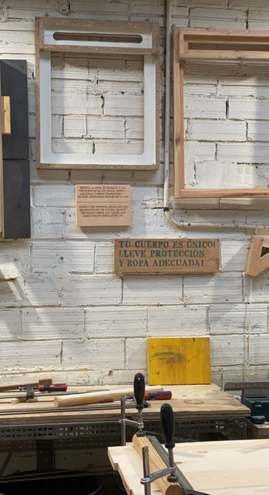
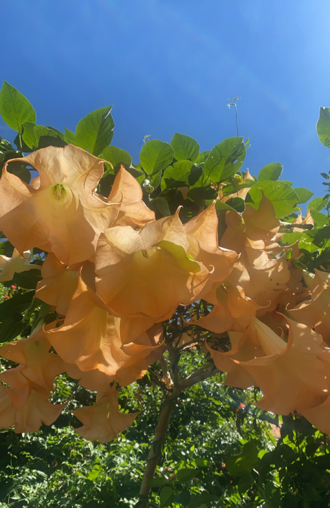

# Landing Week 

!!! abstract "Course Details"
    **Name:** Landing 

    **Dates:** 1 October to 3 October 2024 

    **Faculty:** Guillem Camprodon, Jana Tothill Calvo, Roger Guilemany, Josep Marti Elias, Milena Calvo Juarez, & Pablo Zuloaga Betancourt

## Meeting the Class 

Our first few days of classes were focused on learning more about the program, meeting our teachers, along with the other students, and getting acquainted with the place where we will be designing, discussing, and making for the next 10 months. 

### Kick-off Task 

The first assignment of our program was a visual introduction where we were asked to create a collage out of photos we had taken ourselves that represent us in different ways. 

| Key Objects | Cultural Influences   | More than Human Identity Influences   | Closest Community |
| ----------- | --------------------- | ------------------------------------- | ----------------- |
| { align=left } | { align=left } | { align=left } | { align=left } |
| Objects of making that are representative of my creativity as well as being the tools I have used to make many projects in my life. | A project representing my personal heritage as a problem solver, which I inherited from both my parents. One as a fiber arts crafter and the other as an engineer. | The more than human influence on my life is Pinewoods Camp where I grew up doing folk dancing as a child, and have more recently volunteered for an extended period over the summer. | The closest community around me is the folk dance community. The far reaching language of dance has let me travel through Europe with places to stay and also kept me grounded and connected at home. |

{ align=left }

### Nadya Peek 

We had the pleasure of having a class visit from Nadya Peek, the director of the [Machine Agency](https://depts.washington.edu/machines/){:target="_blank"} research group at the University of Washington in the department of Human-Centered Design and Engineering (HCDE). She spoke with us about her research over the years building machines and shared some of the work of the PhD students in her lab as well.

Her work was inspiring and exciting. I was particularly interested in the [Jubilee Project](https://jubilee3d.com/index.php?title=Main_Page){:target="_blank"} which is a "extensible multi-tool motion platform" used for automation projects including tool switching without a person needing to change the tool. I also found her work on the [Cardboard Machine Kit](https://dl.acm.org/doi/pdf/10.1145/3025453.3025491){:target="_blank"} exciting and look forward to our forecasted MDEF module on cardboard machines. 

| Images from Dr. Peek's slides | | 
| ----------- | --------------------- |
| { align=left } | { align=left } |

## Getting Acquainted with Poblenou 

On our second day of class, we went on a morning tour of some of the places around Poblenou, the neighborhood where IAAC is located, to meet some of the local makers and organizers who may become our best resource on collaborations in our upcoming interventions. 

{ align=left }

### Poblenou Urban District

We checked out the [Poblenou Urban District](https://poblenouurbandistrict.com/en/){:target="_blank"}, a non-profit aimed "to promote its creative community and place Poblenou as Barcelona’s Creative District." We saw the art gallery space as it was being set up for a show over the weekend and were given a copy of the [map](https://poblenouurbandistrict.com/en/membres/){:target="_blank"} of the local galleries and spaces that are part of the network. 

### TransfoLAB BCN

Next, we went to [TransfoLAB BCN](https://www.transfolabbcn.com/home){:target="_blank"} and saw the workspaces they have there including a wood shop, metal shop, bioreactor, a Precious Plastics shop, and jewelry shop. I am excited to learn more about the metalworking classes they have there to learn more about metal fabrication. 

### Bioma

Finally, we headed over to [Bioma](https://www.instagram.com/bioma.cat/){:target="_blank"} which is an urban farm space that has had many different organizations 

=== "Poblenou Urban District"

    { align=left width="200"}

=== "TransfoLAB BCN" 

    { align=left width="200" }

=== "Bioma" 
    
    { align=left width="200"}
    { align=left width="200" }
    { align=left width="200" }
    

## Documenting Design 

We ended out first week of classes with an introduction to Documenting Design. We made our websites using *git* and had an introduction from Pablo Zuloaga Betancourt about storytelling as part of our MDEF documentation. 

After playing around with different methods of website creation, I landed on the idea of using MkDocs Material to use markdown to customize my documentation site rather than using *html* or a *gui*. Let's see how this goes as the course goes on. 

## Beyond Session 

In the evening of our final day of classes for the week, we rushed over to ELISAVA to attend our first Beyond Session. Unfortunately, we arrived late and missed the crucial context for the work of Lara Almárcegui. It was exciting to get to see the ELISAVA space at least at a glance. 