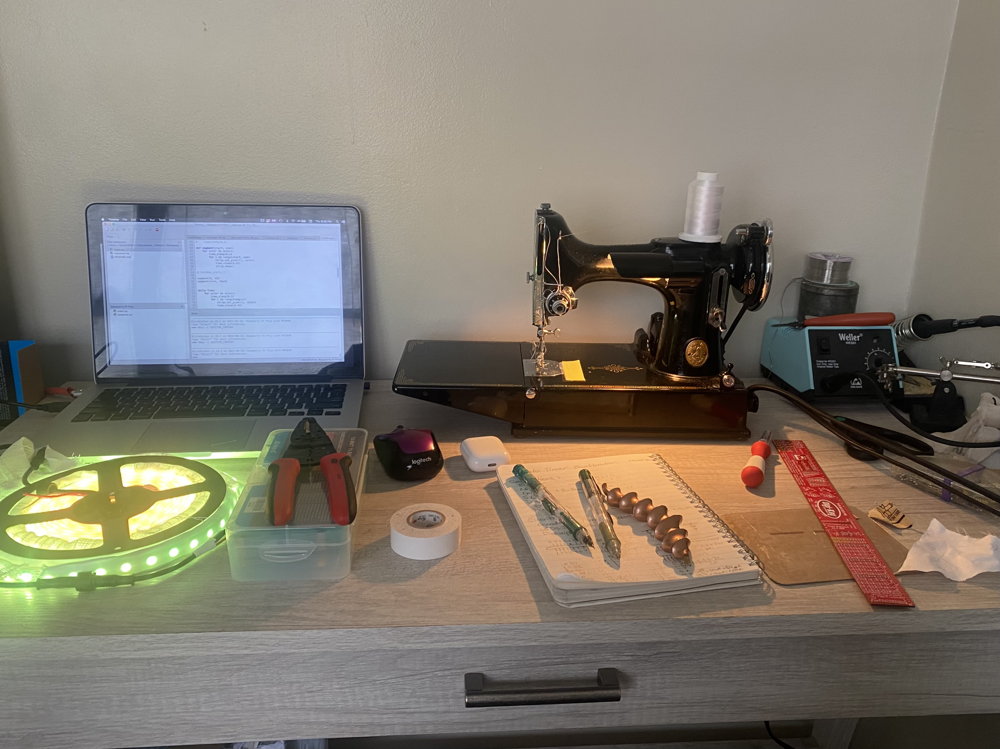
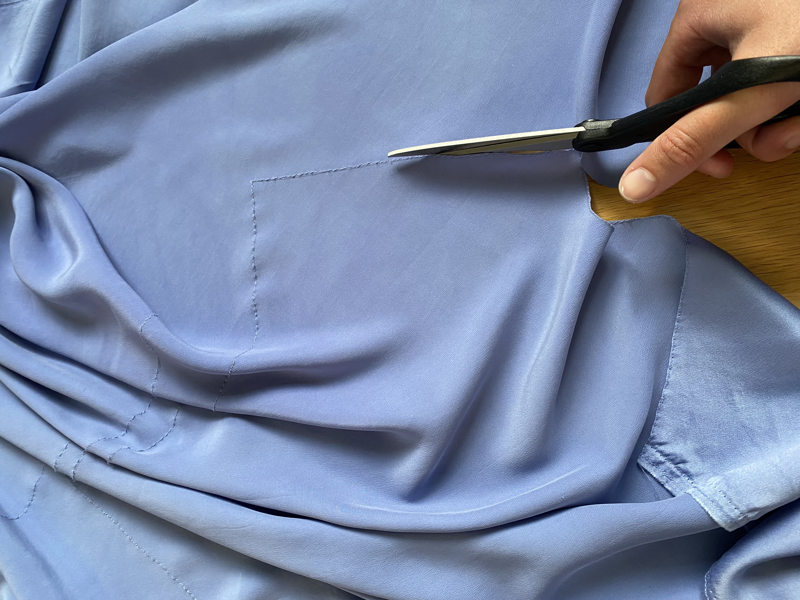
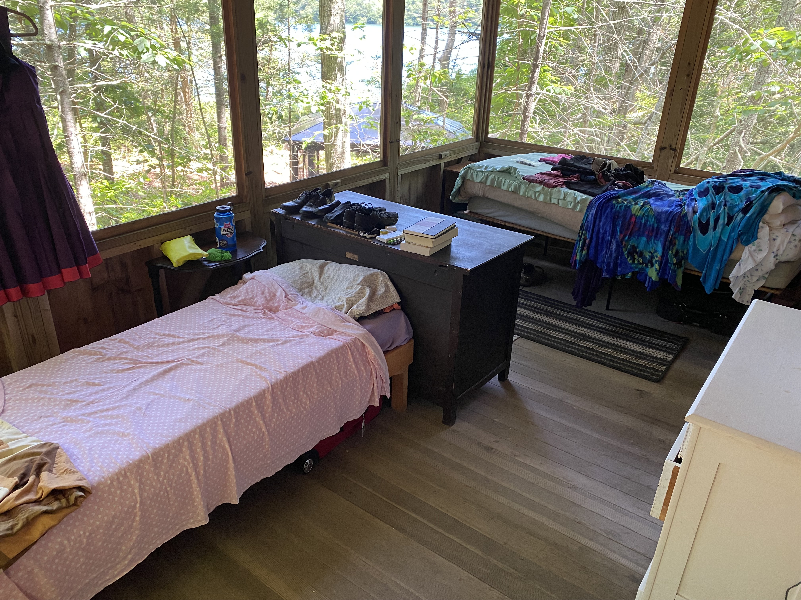
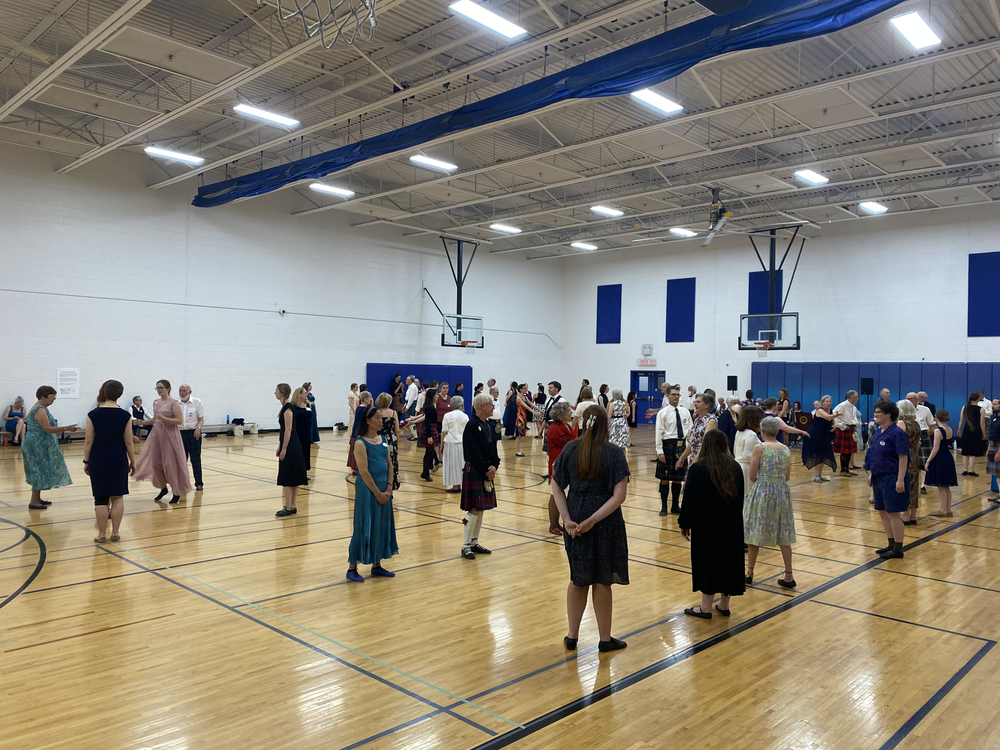
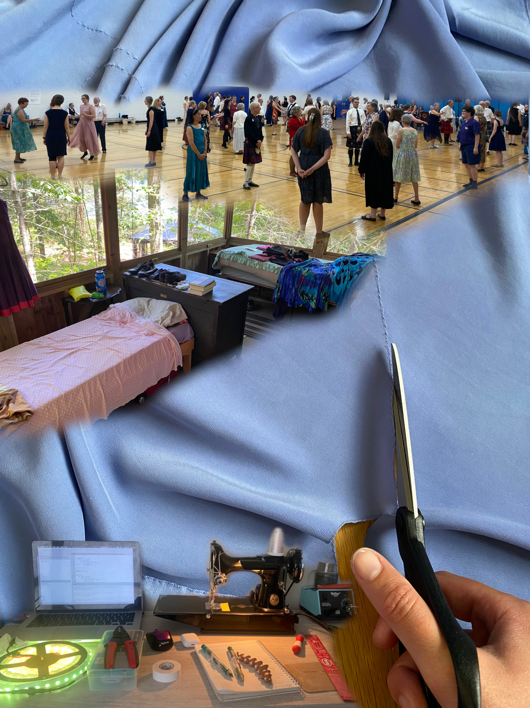
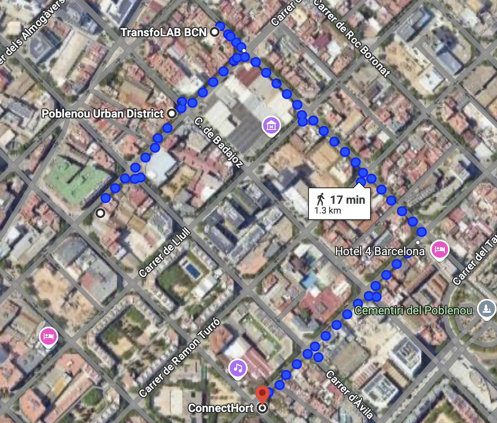

# Landing Week 

## Meeting the Class 

Our first few days of classes were focused on learning more about the program, meeting our teachers, along with the other students, and getting acquained with the place where we will be designing, discussing, and making for the next 10 months. 

### Kick-off Task 

The first assignment of our program was a visual intoduction where we were asked to create a collage out of photos that represent us in different ways. 

| Key Objects | Cultural Influences   | More than Human Identity Influences   | Closest Community |
| ----------- | --------------------- | ------------------------------------- | ----------------- |
| { align=left } | { align=left } | { align=left } | { align=left } |

Each image must represent one of the following bullet points: 
* Key objects that say something about you.
* Cultural influences: Aspects of your background, heritage.
* More than human influences in your identity (not objects).
* The closest community around you.

{ align=left }

### Nadya Peek 

## Getting Acquainted with Poblenou 

On our second day of class, we went on a morning tour of some of the places around Poblenou, the neighborhood where IAAC is located, to meet some of the local makers and organizers who may be people we seek to collaborate with through our upcoming interventions. 

{ align=left }

### Poblenou Urban District

### TransfoLAB BCN

### Bioma