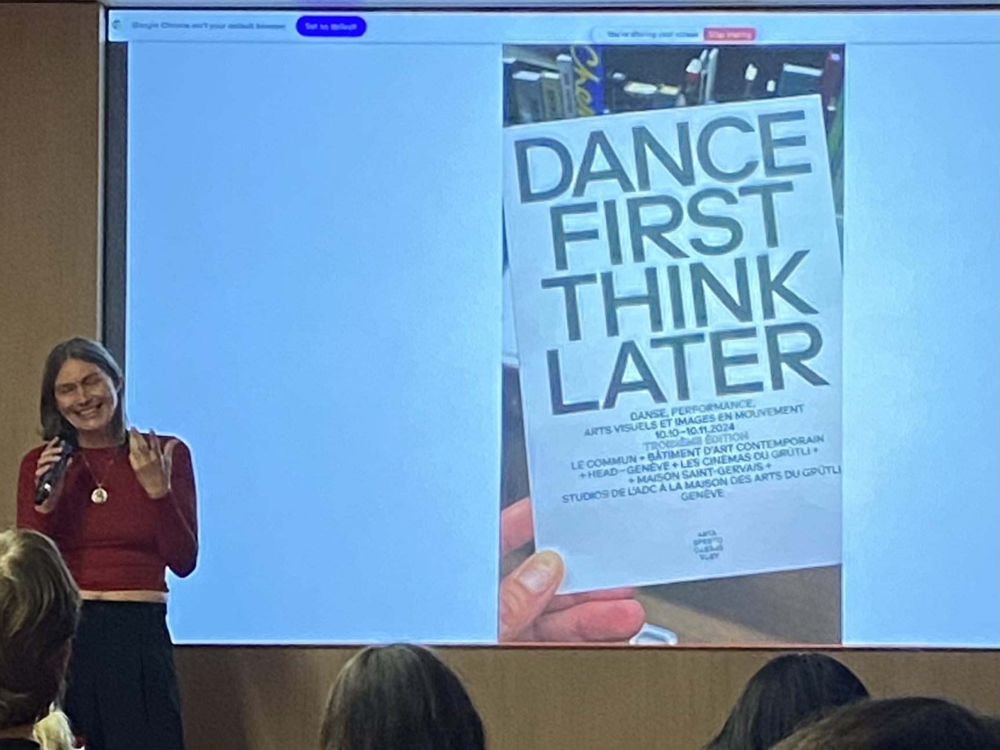
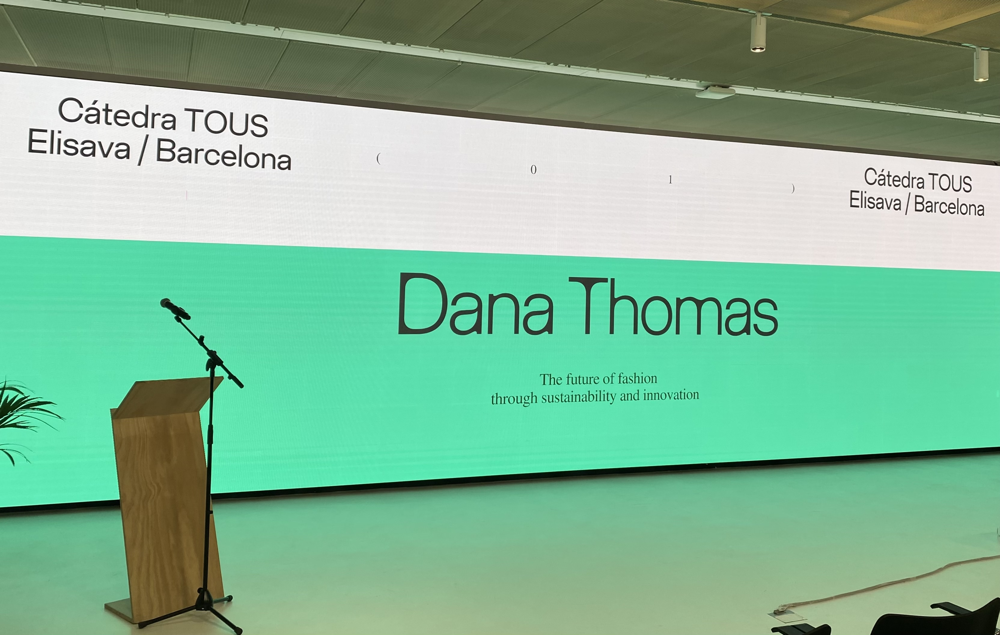

# Lecture Series Reflections 

Beyond Sessions are the lecture series we have at Elisava. Various artists and designers are invited to speak to a larger group of Master's students in various Elisava programs. 

While I am not going to include reflections on all of the Beyond Session here, I intend to highlight the ones that we particularly interesting and inspiring to me. I will also include reflections on relevant other lectures I attend to catalogue my full experience 

!!! abstract "Beyond Session"
    **Speaker:** Lara Almárcegui 

    **Date:** 03 October 2024 

Basic notes: Showed up late, didn't understand what was happening 

!!! abstract "Beyond Session"
    **Speaker:** Stanislava Pinchuck

    **Date:** 10 October 2024 

!!! abstract "Beyond Session"
    **Speaker:** Amandine David  

    **Date:** 17 October 2024 

!!! abstract "Elisava Masters' Talk"
    **Speaker:** Sissel Tolaas

    **Date:** 23 October 2024 

Can we smell the past? Sense memories 

!!! abstract "Beyond Session"
    **Speaker:** Lara Almárcegui 

    **Date:** 03 October 2024 

!!! abstract "Beyond Session"
    **Speaker:** Julia Lohmann 

    **Date:** 07 November 2024 

Bake them a cake and ask to share it 
Seaweed as a material 
More things for sure 

Want to reach out 

!!! abstract "Beyond Session"
    **Speaker:** Pleun Van Dijk

    **Date:** 14 November 2024 

Didn't feel inspired by this one 

!!! abstract "IAAC Lecture Series"
    **Speaker:** Moritz Dörstelmann 

    **Date:** 21 November 2024 

He was dynamic - mostly inspiring 

!!! abstract "Beyond Session"
    **Speaker:** María Llopis

    **Date:** 28 November 2024 

{ align=left, width=33%}

María's freeing energy about dancing in the face of struggles, adversity, or other trauma was somewhat refreshing. 

!!! abstract "Elisava TOUS Talk"
    **Speaker:** Dana Thomas 

    **Date:** 11 December 2024 

{ width=50%, align=right}

The lecture by Dana Thomas had a very different feel than many of the other lectures I have attended. It was much more formal than the Beyond Sessions and as far as I could tell, there were many more people who are not part of the Elisava Masters programs in attendance. 

I found Dana's optimism that change within the fashion industry is coming to be refreshing. She mentioned the push by younger generations to hold fashion brands accountable and spoke about many of the new laws that the EU and some US states are implementing to make brands accountable for the end of life of their clothes rather than leaving the responsibility on consumers to properly dispose of worn out or unwanted clothes. Additionally, she spoke about digital material passports which will also increase accountability for brands to uphold their sustainability promises.

