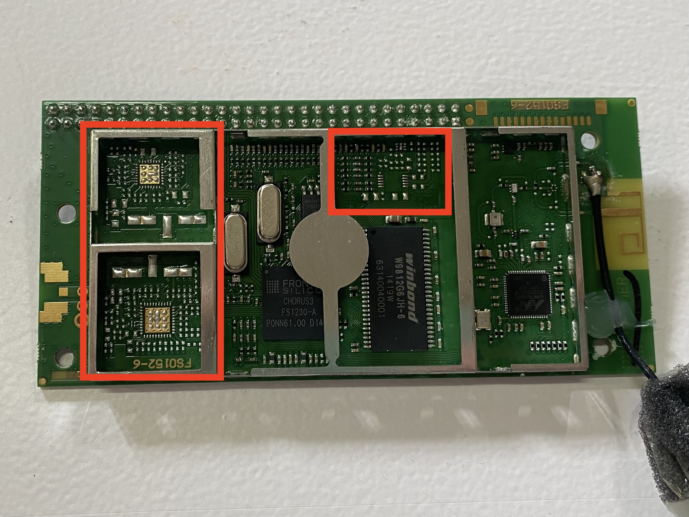
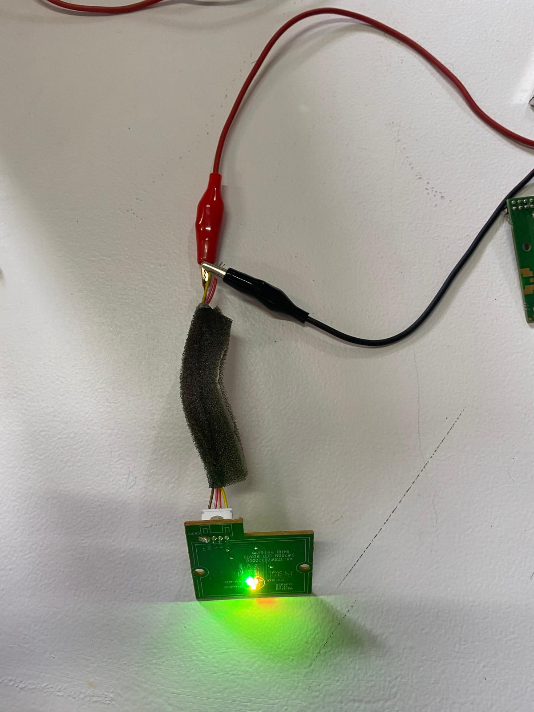

# Machine Paradox 

The Machine Paradox was a two week seminar on the idea of understanding machines. We took apart broken, obsolete, or otherwise discarded machines, deeply examined how they work or don't, and then reconfigured them to make our own 'almost useless machines'. 

## Week One: Taking Machines Apart 

The first week involved selecting discarded electronics and then taking them apart in groups, carefully documenting what we found inside and reflecting on their construction and then beginning to hack components. 

To document the disassembly process and our findings, we wrote up an Obsolescence Forensic Report for each of the items we examined. This process helped us stay organized and focused with our examination of the items. Our group ended up taking apart two different objects: a speaker and a single burner electric stove top. These two items were very different from each other. It was interesting to have one object that was very complicated, with many different printed circuit boards (PCBs) and lots of plastic pieces, while the other was extremely straightforward and easy to understand and fix. 

### The Speaker

[Obsolescence Forensic Report - Phillips Spotify Multiroom Speaker](https://hackmd.io/@rQJY_Xz8RTK8eVC1g-RlWQ/B1i49MT1kl/edit)

!!! note "Object One Overview"

    - Phillips Spotify Multiroom Speaker 
    - Model Number: SW750M/12
    - Serial Number: LM1A1440001069
    - Color: Black
    - Made in: China
    - Input: DC15V - 2A

In taking apart the speaker, we noticed that one of the reasons it may have been discarded is that the connection method had become obsolete. Instead of having an audio input jack, or even a Bluetooth connection, this speaker appeared to require an app to set up the Wifi connection to allow the speaker to connect to devices that could play the music. This clunky connection method probably seemed like a good idea when it was designed, or it was chosen as part of a 'design for obsolescence' scheme, but in trying to hack the device, not having an audio jack made it difficult. 

{ align=left width="46%"}

We also noticed a few design choices that were part of the Design for Manufacturing process. For example, the Wifi PCB had many spaced for chips that were unpopulated. We speculate that the PCB was designed such that there could be a Bluetooth connection in addition to the Wifi one, but that for this product, that feature wasn't necessary. It was still cheaper for production to use a board that was designed for more functionality, but to just not populate the unneeded components. 

We were unable to get the device working as a whole, but we did manage to get some simple pieces of it working. We did not try to get the Wifi board working and instead focused on the components that we could more easily understand, like the LED indicators, push buttons, and the speakers themselves. 

{ align=left width="46%"} 

{ align=right width="46%"}

### The Stove

[Obsolescence Forensic Report - Mesko Stove](https://hackmd.io/@U44nZlfqQPe_jVWHw45SIw/SkDZVVp1Jx/edit)

!!! note "Object Two Overview" 
    - Mesko Stove 
    - Model Number: MS6508
    - Serial Number: 2010

The second device we took apart was much simpler. The whole thing came apart by removing a single nut from a bolt and we could see the entire circuit, follow the wires, and understand it pretty quickly. By removing the thermo fuse, we were able to get it working again, just without a overheat protection in place. This simplicity was nice when compared to the speaker. 

### Reflection 

Overall, the experience of taking things apart to understand them and maybe fix them, while not a new experience for me, was very satisfying and interesting in the context of this class. It is an good exercise to reflect on how the things we use everyday are manufactured. Before starting this program, I had found myself thinking a lot of about pieces of modern life that are opaque, with curtains drawn between our experience interacting with them and the actual processes by which they operate. I was primarily thinking then, about systems and larger scale things and reflecting that while a small subset of experts may know how these things work, there is no one person who understands what is behind every curtain of every modern convenience we have. No one single person understands how everything works. Even experts at understanding large systems may completely miss the minutia of how smaller components or pieces of things work. 

This exercise in taking apart obsolete electronics scratched a bit of that itch to understand. It shined a light on some of the systems in place that allow consumer electronics to be manufactured at high volume and low cost because of shortcuts within the design process. It was a good reminder that simple designs are easier to work with, to understand, to fix, but simple is not always what the industry wants to see. 'Straightforward' is not always easiest when it comes to mass production. The number of people, machines, and processes involved in creating the speaker must be staggering, and so few people ever even see inside the object that was created for the purpose of bringing music and entertainment into people's homes. 

## Week Two: Almost Useless Machine 

The next week was about taking our objects and reconfiguring them into new objects that are 'almost useless' machines. The idea was to use the pieces we had been able to hack during the previous week to create a machine that tells a story - is a commentary of some kind - but that has not real 'use' in its own right. 

Our group started by brainstorming about ideas and quickly settled on a general question: what does a machine feel? From there, we talked a lot about different ideas of how to demonstrate that and eventually decided to make 'a stove that gets hot... for you' as a silly manifestation of giving emotions to a machine. 

Below is the resulting video of our machine and the presentation about our design process is linked as well. [Slides Presentation](https://docs.google.com/presentation/d/1xWSH7AEOs1MPdsh6HLzKN5DltwJdVjIe4HFIWQEe8Rs/edit?usp=sharing)

<video src="https://github.com/user-attachments/assets/66226c49-ab8b-48f2-9bca-f763ef88a4b3" controls="controls" style="max-width: 730px;">
</video>

