# Living With Your Own ideas 

## Prosthetic 'to become the best version of yourself' 

I started by trying to figure out what "the best version of myself" would even mean. I set a timer for 10 minutes, put headphone on with some Scottish folk music and just wrote everthing that came to mind. 

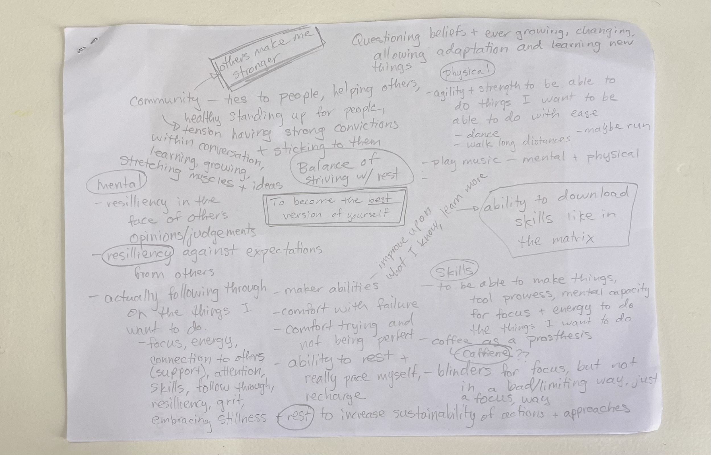{ align=left }

The highlights included: 

    * caffeine as an energetics prosthetic? 
    * ⁠⁠balance of striving/action with rest/recovery 
    * ⁠⁠ability to download skills like in The Matrix 
    * ⁠⁠comfort with failure and imperfection
    * ⁠⁠follow through on ideas and goals (which require focus, 
    energy, support from others, skills, resiliency to setbacks, and embracing rest) 

From there I started thinking about the balance between focus and rest. I started prototyping with materials I had lying around and the following prosthetic is the result. The idea is to have focus for a set amount of time - for example, 25 minutes, as is suggested with the Pomodoro Method - and then to have the visor automatically raise to allow me to broaden my focus and to nudge me to rest from the focus. 

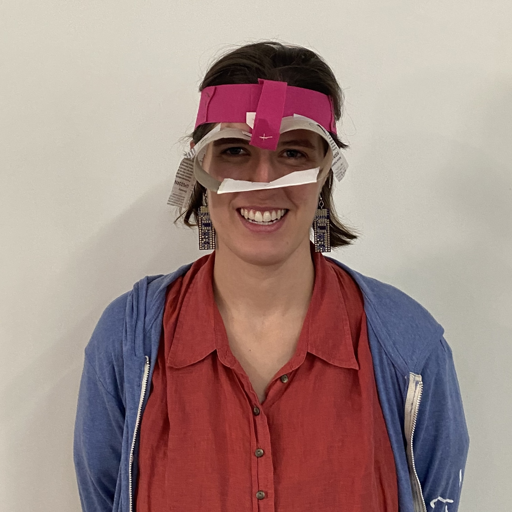{ align=right width="300"}

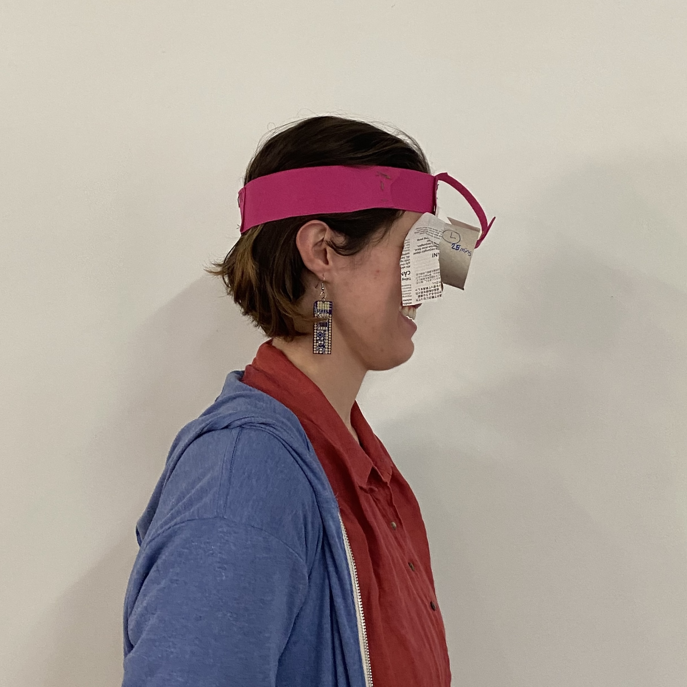{ align=left width="300"}

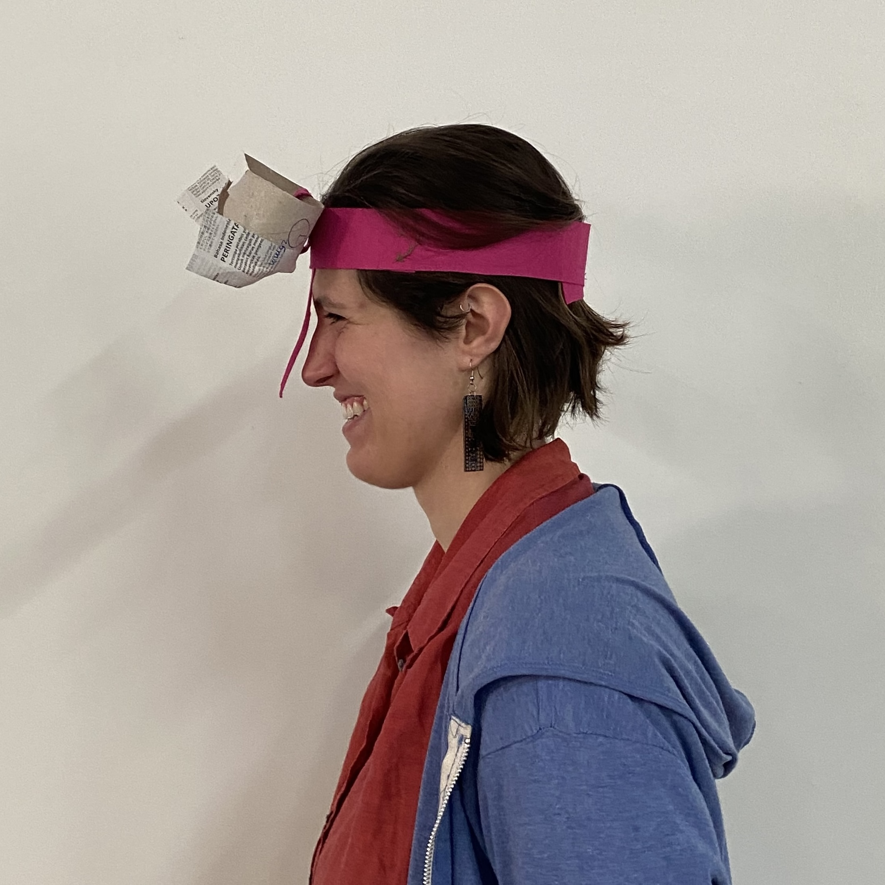{ align=right width="300"}

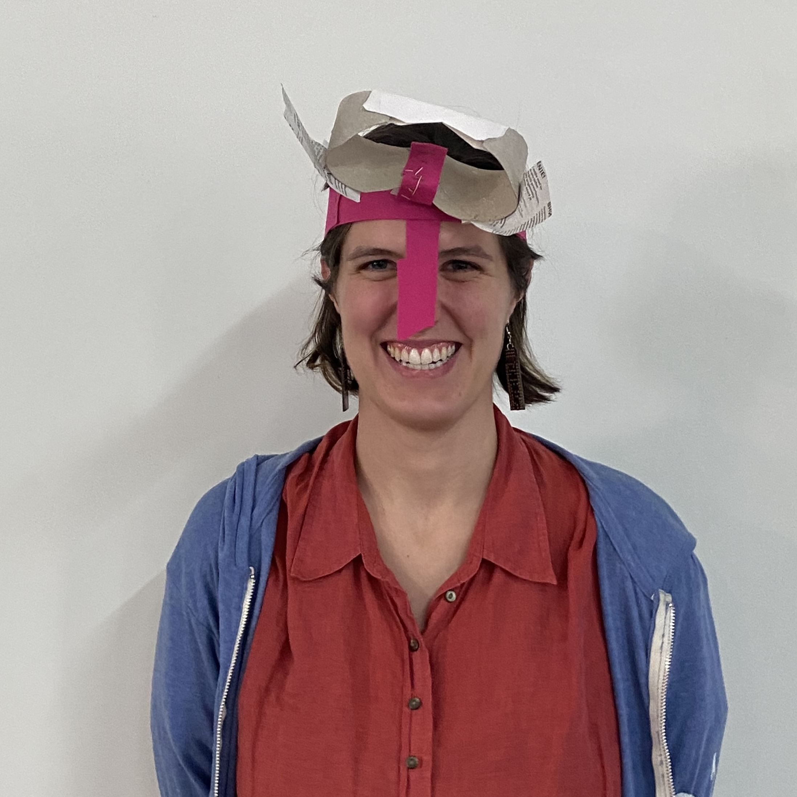{ align=left width="300"}

Through wearing this prosthetic, I decided I don't think the implementation of this idea makes sense. Putting 'horse blinders' on to focus on an activity doesn't really work, but it can represent the idea of having focus, energy, and commitment to follow through on implementing or testing ideas. It also embodies the idea of rest and changing perspective. 

Maithili decided to try my prosthetic to help her focus while reading. She commented that it did help a bit, if you covered the sides. I guess for prototype two, I would need to make sure the sides are better covered so that the tunnel effect actually happens. 

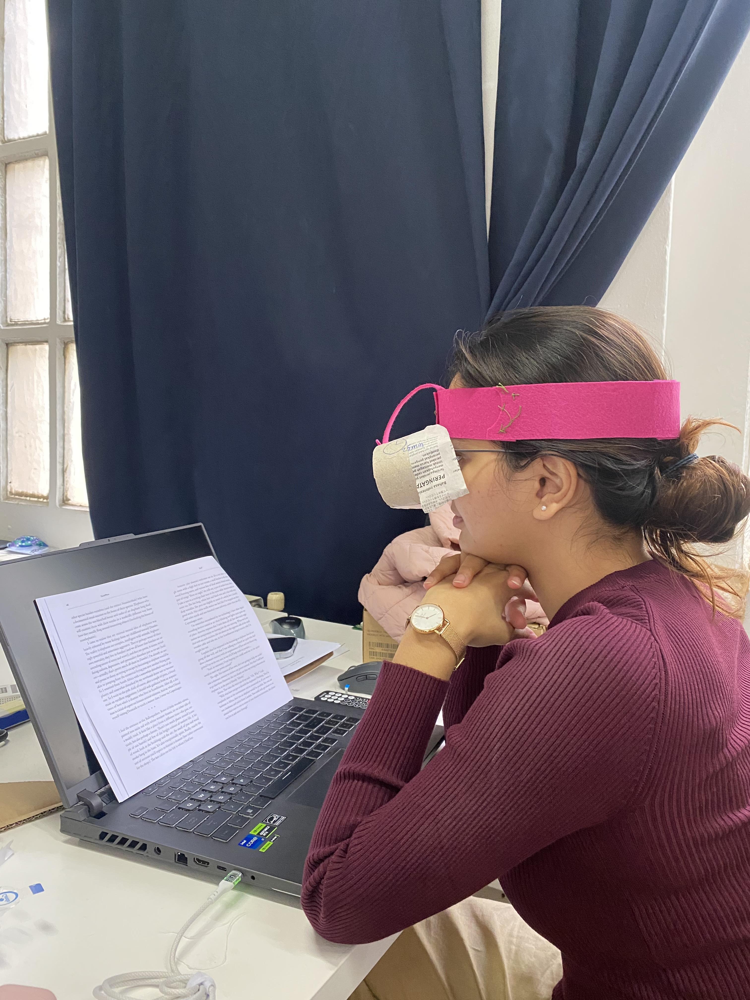{ align=left width="300" }
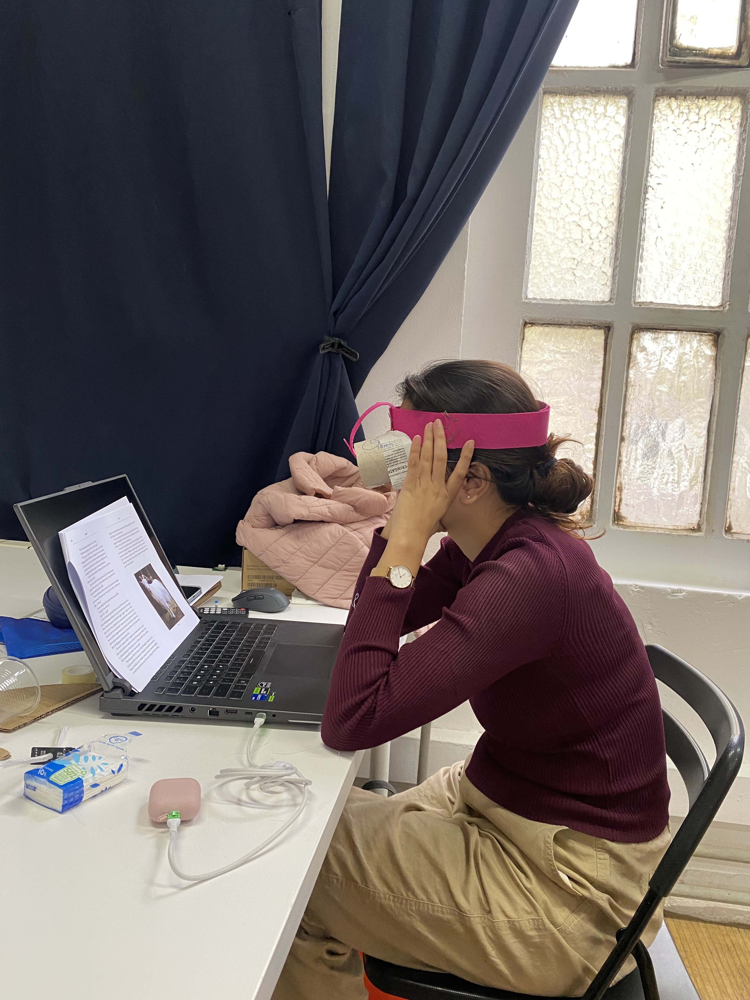{ align=right width="300" }

<!-- 
Video 01 
Video 02 
-->

<!-- 
## Prosthetic 'to become something else (non-human)'

{ align=left }

Video 01 
Video 02
-->

## Prosthetic 'to judge/be judged' 

The final prosthetic prompt was to make a prosthetic to judged a certain way. The idea was to dictate how we would be perceived by a detective would be following us for an hour while we did our best to be judged in a certain way. 

### Detective Work 

I am a bad detective, that is what I discovered during this exercise. I started trying to follow 'the subject', Hanna, as she left the classroom, walked to Itnig to get coffee, then walked to the beach. I am not sure exactly at what point she knew I was following her, but probbaly almost immediately after she stepped out of the IAAC building, if I am being honest. Well, I guess if I want a future as a Private Investigator, I need to learn discretion. 

??? note "Evidence" 

    | 14:45 Leaving the classroom | 14:50 In Itnig | 14:56 Crossing the street | 
    |--------|--------|--------|
    |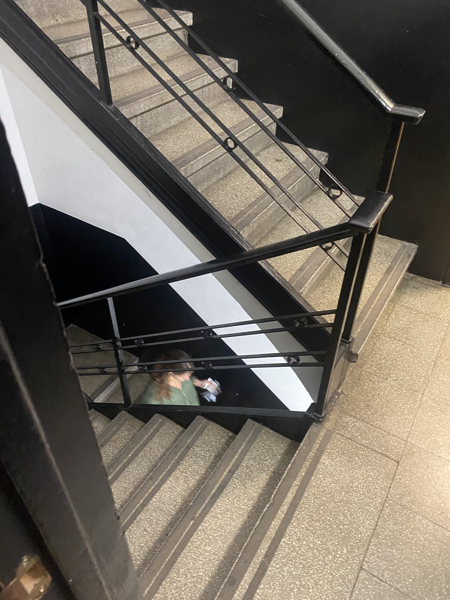{ align=left width="300" } |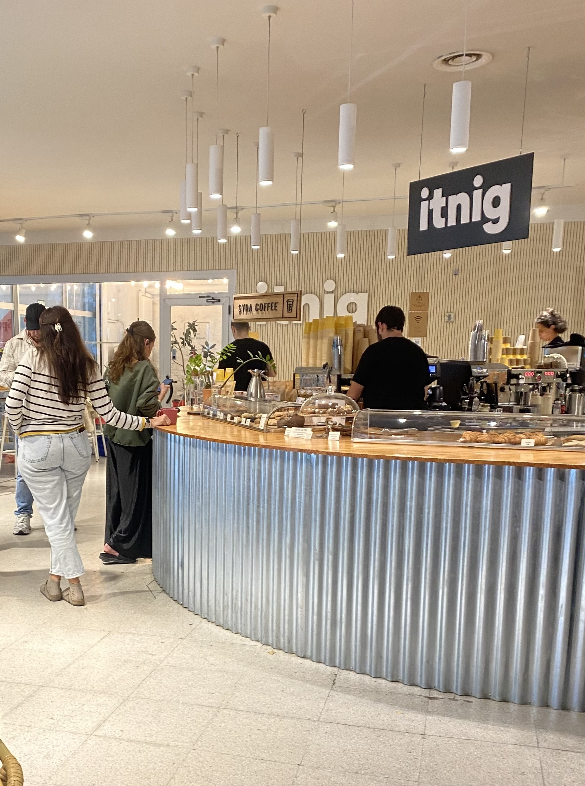{ align=left width="300" } | { align=left width="300" }|
    | **15:01 First Audio Note** | **15:03 Crossing Ronda Litoral**| **15:04 Coffee Finished** |
    |  <audio controls src="../../audio/1501_detectiveNote.mp3"></audio> | { align=left width="300" }| { align=left width="300" } |
    | **15:06 Digging a hole** | **15:07 More digging**| **15:08 Putting something in the hole?** |
    |{ align=left width="300" } |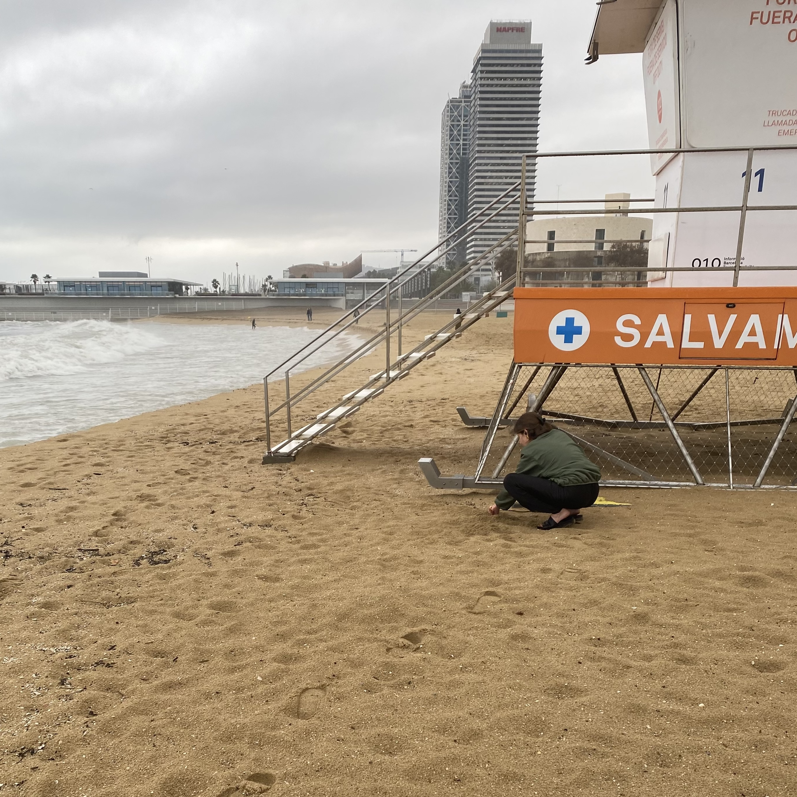{ align=left width="300" }| 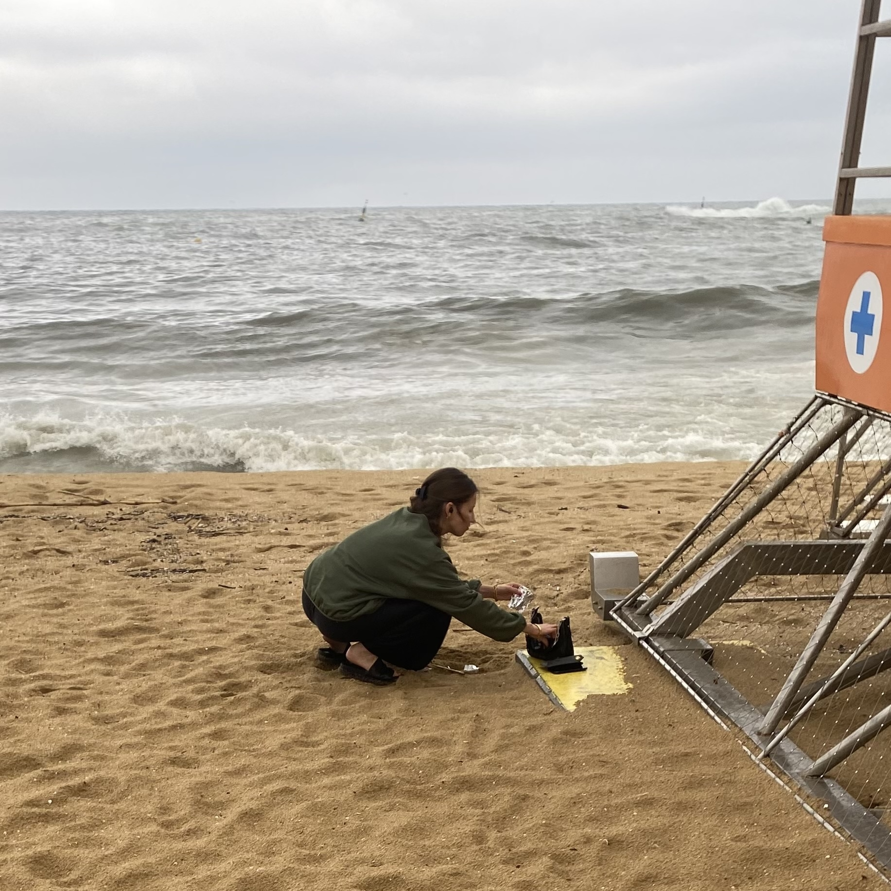{ align=left width="300" }|
    | **15:13 Walking along beach** | **15:20 Second Audio Note** | **15:19 Brief Movie** |
    | 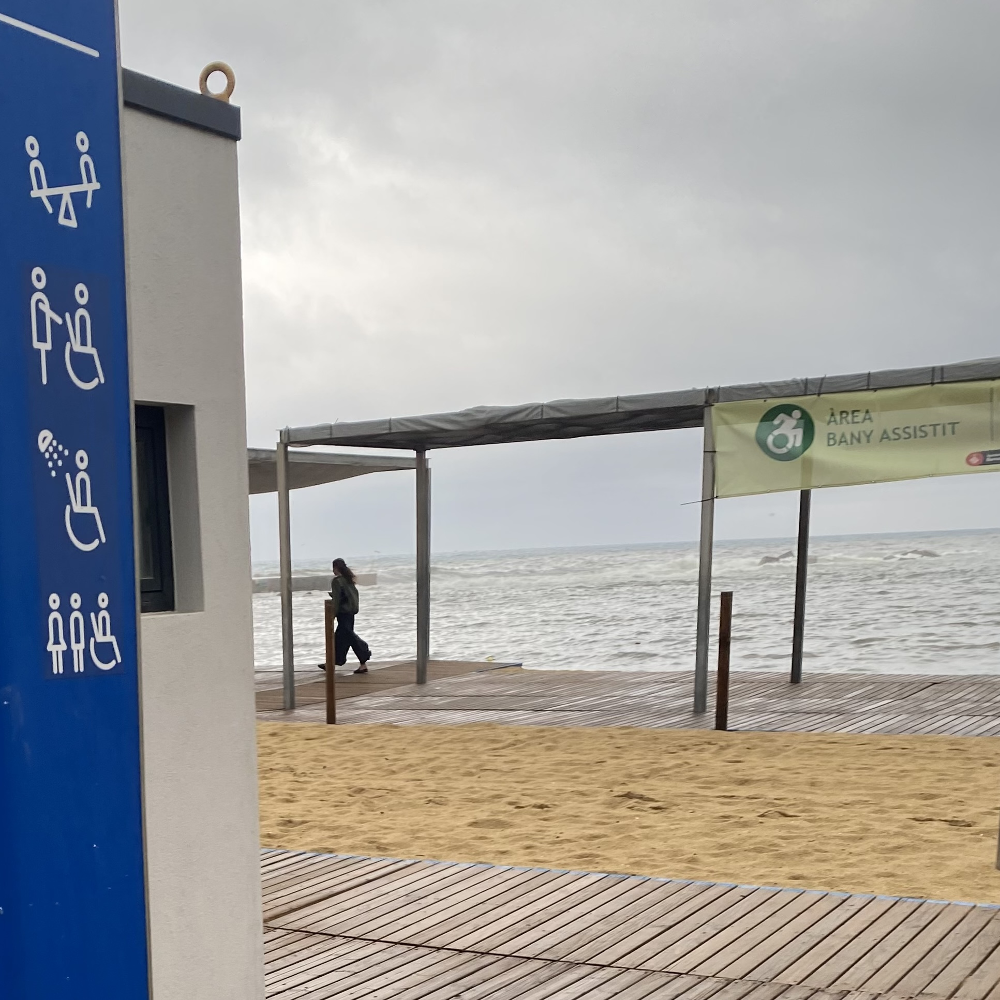{ align=left width="300" } | <audio controls src="../../audio/1520_detectiveNote.mp3"></audio> |  |
    | **15:21 Third Audio Note** | **15:23 Walking back** | **15:30 Walking back by metro** |
    |  <audio controls src="../../audio/1521_detectiveNote.mp3"></audio> | { align=left width="300" }| { align=left width="300" } |

 
Audio 

<!--
Video 01 
Video 02 

-->
