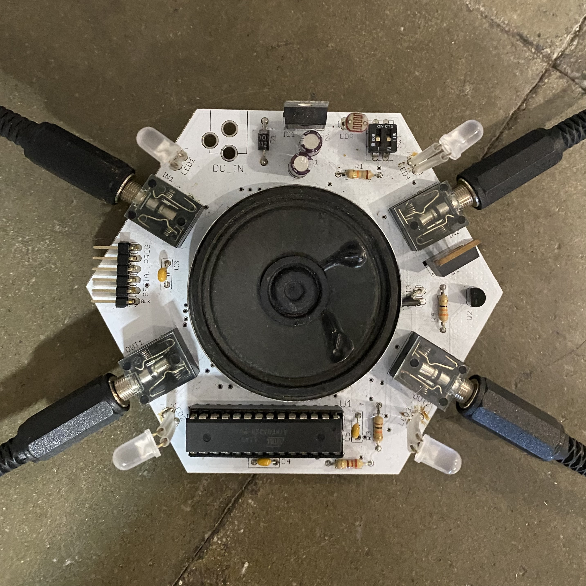

# Design With Others 

!!! abstract "Course Details"
    **Name:** Design With Others

    **Dates:** 19 November to 22 November 2024 

    **Faculty:** Laura Benítez & many guests 

Design with Others was a session led by Laura Benítez about the concept of 'othering' and how this impacts design, but also about how we can potentially use different models of living and designing to enrich our practices and lives. 

## Dr. Marta Delatte 

The first day, we had a guest lecture from Dr. Marta Delatte entitled "How to do things with Design Justice". She spoke about inclusivity and representation within the modern structure of our world. 

!!! quote 
    Good intentions does not always equal good design and is not an excuse for falling short 
    - Dr. Marta Delatte 

She spoke about the problems of data extraction; turning the nuance of identity into data, creating a mechanical process by which we claim to *know* a population, a culture, an individual. The consequences of this practice is often the reinforcing of existing unjust power dynamics. Accountability, she suggested, needs to not only come at the end of a design process, but should be laced throughout the process, holding space to actually listen to the voices of those most impacted by the decisions being made. 

!!! quote 
    How can we take the question, *What does this represent?* and turn it into *What is this doing with us, to us, and how are we responding?* 
    - Dr. Marta Dellate 

Dr. Delatte then introduced the idea of the Matrix of Domination, a framework developed by Patricia Hill Collins for examining oppression and privilege in a wholistic way. 

-   :material-domain:{ .lg .middle } __Structural Domain__

    ---

    Represents power embedded in institutions (law, politics, religion, and economics).

-   :material-account-search:{ .lg .middle } __Disciplinary Domain__

    ---

    Focuses on bureaucratic control mechanisms, including rules and regulations that dictate behavior.
    
-   :material-account-group:{ .lg .middle } __Hegemonic Domain__

    ---

    Relates to cultural ideologies and norms, shaping how people think about societal values.

-   :material-handshake:{ .lg .middle } __Interpersonal Domain__

    ---

    Examines personal relationships and micro-level interactions that reflect broader power structures. 

Her lecture continued by speaking about her research into Wikipedia articles. She shared statistics on the gender breakdown of biographical articles on Wikipedia. According to [this Wikipedia article](https://en.wikipedia.org/wiki/Gender_bias_on_Wikipedia){ target=blank }, (and yes I do realize both the irony and the beauty of using Wikipedia to check Wikipedia), as of 2023, only 19.65% of all biographies on Wikipedia were about women. Dr. Delatte shared a similar statistic and included that less than 1% of the articles were about non-binary people as well. 

!!! quote 
    What has encyclopedic worth? - Dr. Marta Delatte 

I found her material interesting, it was a good introduction to the idea of designing with others, however, it also left me with some significant questions. 

!!! question 
    * *Is the term 'feminism' no longer a useful term to use in discussion about much needed change in the way modern, western society is structured?* Those in favor of feminist methodologies profess that includes men in the scope of needed change, but I have to wonder, in the face of significant division and hurt around questions of equality, does this term which has a complicated history cause more pain than is helpful or necessary. Does the term, which claims to include men in an enlightened vision for the world, in fact alienate potential allies enough that it is no longer a constructive term to use in discourse? 
    * What does a fully inclusive future look like? At what point does inclusivity become so granular that it loses its meaning and potency? 
    * Is the structure of social media we have perpetuating 'othering' or does it provide a space for those who have been othered to see themselves represented? Do the bubbles we have on social media help us feel safe and seen or just create more division without the possibility of discourse in disagreement? Is social media the modern version of human zoos where we can go and gawk at those who are different from us or a means of liberating and connecting those who have lived in shadows, or perhaps both? 

  
<!-- Button with photo in it -->
<!-- 

    <a style="box-shadow: 0px 0px 0px 0px #181040; display: flex; flex-direction: row; align-items: flex-start; width: 100%; height: 100%; object-fit: cover; background-color: #7e56c1" href="#">
        

          </img>
        

        

        This website is a documentation of reflections and developments from my personal perspective of the MDEF 2023-2025 study program, which deals with collaboration, community building and sustainable development.
        

    </a>

 -->

## eemeemee

The next day of Design with Others, we started out class with a lecture from Laura. She spoke about intersectionality as a critical analytical tool to understanding complicated systems and interplays between identities. She also brought up the idea of *nomadic identity* and not being stuck to a single identity. 

She spoke about colonialism and the imposing of identities on others, of the erasure of community identity, and how all of this relates to the idea of otherness and sameness. 

It left me with more questions, which I am guessing was the purpose of her lecture. 

!!! question 
    * *When is seeing differences valuable and when does it harm?* Differences will always exist, they should exist, through difference evolution and growth can happen along with increasing empathy and understanding. However, differences are so often used to cause pain, exclusion, and harm. How can a balance of celebrating differences while not singling out the things that divide us be struck on a large, societal level? 
<!--     * Is it othering to feel wary of those who you perceive as being perpetuators of further othering? In the USA now, there is a huge division between different groups of people who profess to be either accepting of everyone or protecting themselves and their own. In reality,  -->

After the lecture, we went to L'Hospitalet de Llobregat to visit the collective eemeemee. We met [Óscar Martín](https://noconventions.mobi/noish/hotglue/){target=blank} and [Marzia Matarese](https://marzianx.net/){target=blank} there who showed us some of the projects they are working on. Óscar showed us the installation he is working on of semi-random light and sound generation from a network of devices that react to one another as well as the light in the space. He also showed us his work with slime molds that influence the sound generated from his device. 

{ align=left width=39% }
{ align=left width=22% }
{ align=left width=29% }

 
 
 
 
 
 
 
 
 

Marzia talked about her work with fungi and the various things she has tried to bring her life and her design practice closer to her values of working with mycelium more as a collaborator than as a material or a tool. 

## Mutan Monkey 

On the third day of the course, we visited [Mutan Monkey](https://www.mutanmonkeyinstruments.com/){target=blank} and met some members of the collective [Ojalá estë mi bici](https://ojalaestemibici.blogspot.com/){target=blank}, a collective focused on non-profit music events.

Laura gave a lecture at Mutan Monkey about Agency Situated Epistemology. She suggested that fiction, as a broad concept, not just literature can be a critical tool to speculate about potential futures and transform the present. This tied nicely into our discussions about Design Fiction during Extended Intelligences, although Laura took it to another level. She suggested that we all live in fictions created by the social narrative we operate in. These preverse fictions that we allow to structure our lives can cause lots of harm and we barely recognize them as fiction.

!!! question
    In the cycle of fiction shaping reality and reality shaping fiction, how much does the fiction we write about the past dictate our future by setting the past in stone from which we so often look for inspiration? How do we look back at the non-literature fictions we tell about history and then write those pasts such that they influence our present? 

During our visit to Mutan Monkey, I was performing a personal intervention to experience what a 24 hour period without using an internet connected device with a user interface would be like. More about that project can be found below. 

<figure markdown="span"> [No Phone Intervention](designStudio/designWK04.md#individual-intervention){ .md-button } 
</figure>

Here are some of the photos I took of the Mutan Monkey space on the borrowed camera I was using in place of my phone. 

<!-- Slideshow container -->

  <!-- Full-width images with number and caption text -->
  

    
  

  

    
  

  

    
  

  

    
  

  

        
        
        
  

  

    
  

  <!-- Next and previous buttons -->
  <a class="prev" onclick="plusSlides(-1)">&#10094;</a>
  <a class="next" onclick="plusSlides(1)">&#10095;</a>

<!-- The dots/circles -->

  
  
  
  
  
  
  

## Good Praxis 

The final lecture of this week-long seminar included a talk by [Arnau Sala](https://arnausalasaez.com/){target=blank} and another lecture from Laura.

The information Arnau gave us about degrowth, mutual aid, and changing perspectives was simultaneously overwhelming and inspiring. Like with all aspects of this program, there were many suggestions given of other projects to check out, books and articles to read, and documentaries or artists to check out. Arnau spoke about getting stuck within creative processes and getting blocked by overwhelming analysis of consequences. 

!!! quote 
    Try to examine a the following categories of an individual, a community, a collective when working towards mutual aid:
    **wants** * **haves** * **needs**

I found myself, as with ever other session in this week, with many questions and feelings swirling around by brain. 

!!! question 
    * How do you maintain a sustainable relationship with creation and action? How do you keep from getting overwhelmed by everything?
    * Do people actually value free things as Robin Wall Kimmerer (and many others including Arnau) suggests? Is it a question of scale? Can people on a global scale value gifts and things freely given or is the nature of globalization to create structures where we want to hoard, to take too much, to exchange some form of 'tangible' value for things? 

## Reflection 

Through out this entire week, I often felt that my head was going to explode with questions, contradictions, and nuances. I think the purpose of this week was to take our deep seated beliefs and to pull them into the light so we could examine them. *Does the world have to be structured the way you have always experienced it being structured?* Laura seemed to be asking us at every turn. She asked us to examine who is included in design and in future/world building and to carefully look at who is not. To look at our assumptions with the critical eye. 

I like to think of myself as someone who is fairly aware of my impact on others, who acknowledges, at least in some ways, the position and privilege I come from and the context that brings to my interactions with others. This week had me questioning if I know anything about anyone or anything at all. Which was uncomfortable in many ways and also felt potentially productive and valuable. I suspect it will take time for it all to sink in fully. 