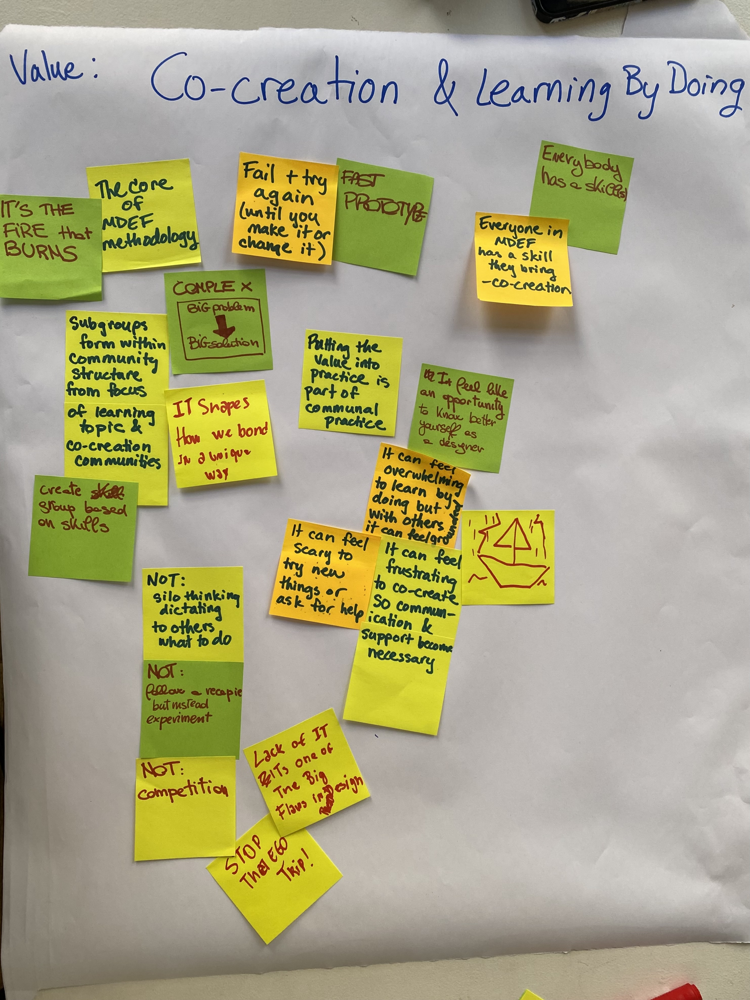
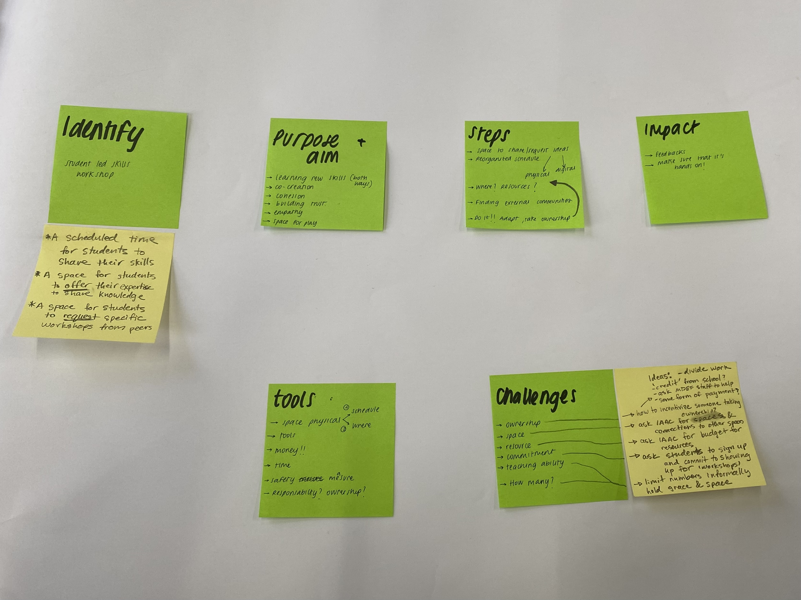
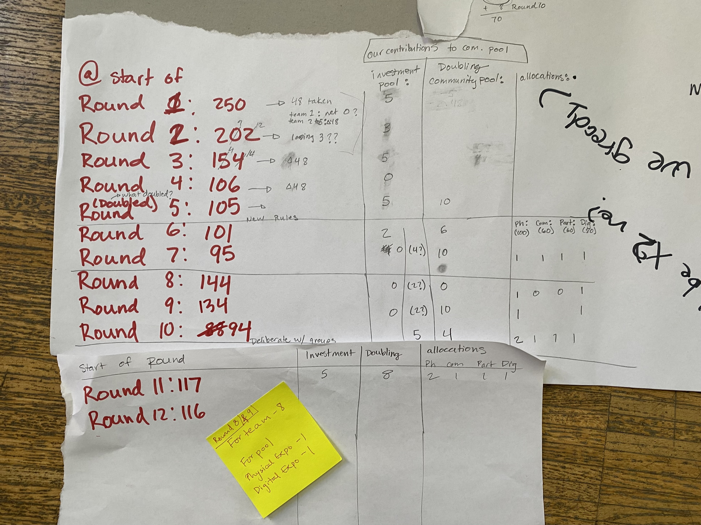

# Collective Intelligences 

!!! abstract "Course Details"
    **Name:** Collective Intelligences 

    **Dates:** 22 to 24 January 2025

    **Faculty:** Jessica Guy & Sally Bourdon

## Day 1 

On day one of the seminar, Jess and Sally introduced the contexts for what collective intelligence means in the context of design, particularly in contrast to more linear, centralized versions of design. Having not come from a formal design education background, I don't I have as strong a bias towards the centralized, elite view of design. I have had the privilege in my various design related practices of being able to participate in creative commons and open source initiatives, so these concepts were not new to me. 

{align=right width=50%}

I am excited to learn more about how to actually put them into practice more broadly in my life even outside of design. Distributed and openly shared knowledge and resources seems to me like the only logical way for humanity to continue existing in the future and it blows my mind a bit that it isn't already the universal norm. I think part of this, though is because it is really hard and often seems to work best at small scales, in local contexts. Therefore, I think in my practice in general in MDEF, I have been moving more and more towards the idea of looking and working hyper-local. Not necessarily physically local, but my situated practices have to come from a first person perspective and involve communities I am a part of because I feel that these sorts of collective practices only work when there are shared values, as we discussed in class, and those values can be really hard to maintain across large, complex groups. I hope to learn more about how these systems can work at bigger scales, though and look forward to exploring this more. 

<figure markdown="span">
    
Below is an additional audio reflection about the first day content. 

    <audio controls src="../../audio/ci_day1.mp3"></audio>
</figure>

Instructables.com, while maybe not the most elegant distributed and collective maker community, is a space that I have contributed to with some basic tutorials on projects I have done. Check out my project page below. 

<figure markdown="span">
    [FieldCrafting](https://www.instructables.com/member/FieldCrafting/){ .md-button target=blank}
</figure>

## Day 2 

On the second day of class, when we moved to talking about commons and commoning, I appreciated the many references Jess and Sally gave us. While I may not be able to read all of the book or check out all of the references they gave us, I appreciated the examples of ways in which these concepts function within the context of the current economic system we have, it gave me hope. 

{align=left width=50%}

The proposed project that my small group came up with as a way of using the values of Co-creation and Learning by Doing to help the MDEF community was something I have been thinking about for a little while now. The idea is to create a semi-formal space where we as students can offer our skills to other students in a more concrete way than the current methods we have of doing this allow. While I do not know if this will happen, I was inspired by the conversations we had about it and appreciated the spirit of the idea even if the reality of creating a time for each of us to lead a small workshop on one of our skills never actually happens. I think this type of project ties nicely into how I want to approach my MDEF project and life in general. Exchanges of skills, knowledge, and resources not linked to monetary compensation, but more about creating a richer life and world through shared experiences and learned skills. 

I also recognize that a project like this comes with challenges and so, as always with these idealized scenarios, I struggle to reconcile the version in my head with what might be a more realistic outcome. I feel that the examples shown in this class about that work, help keep me hopeful that these sorts of futures are possible for myself knowing that they require work, buy-in, clear expectations and management systems, and may often not run smoothly even with all that in place. The current larger scale status quo is not exactly easy, but it is familiar, and I am hopeful that different systems can become familiar at least to me in my practice and life, although I do not yet know exactly how. 

<figure markdown="span">
    
Below is an additional audio reflection about the second day content. 

    <audio controls src="../../audio/ci_day2.mp3"></audio>
</figure>

While I have not participated particularly actively, I am a part of a few different Discord channels about making and various nerdy hobbies that function as distributed platforms where people can share information, ask questions, share files, and support each other in general. Most of these communities have codes of conduct and or community guidelines that are compulsory to follow to be part of the group. Often they have moderators who are sometimes both human and bot. I have not participated as much in these communities as I would like because I still find online spaces with strangers to be intimidating, but after this class, I may try to engage a bit more with them because I can recognize what a valuable resource they can be for information and support. I hope to tip toe slowly into some of those spaces to determine if the community values mesh well with my own and see how I can participate more in those spaces. 

## Day 3 

{align=right width=50%}

On the final day when we discussed the Distributed Design Platform, I was very interested in some of the example projects and found myself wondering what other communities like this exist that I don't know about. 

When we transitioned to talking about Decentralized Autonomous Organizations (DAOs), I will admit, I got slightly lost in the technological side of things. I appreciated the tie in to Decentralized Autonomous Communities (DACs), which felt more tangible to me somehow. I will admit, I still didn't understand a lot about how these communities function, but I appreciated the general concept of community organized systems and the formalization of lexicon to describe them. 

<figure markdown="span">
    
Below is an additional audio reflection about the third day content. 

    <audio controls src="../../audio/ci_day3.mp3"></audio>
</figure>

<figure markdown="span">
    
Additional reflections on the resource game we played at the end of the class. 

    <audio controls src="../../audio/ci_game.mp3"></audio>
</figure>

