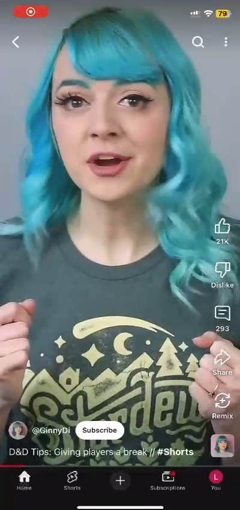
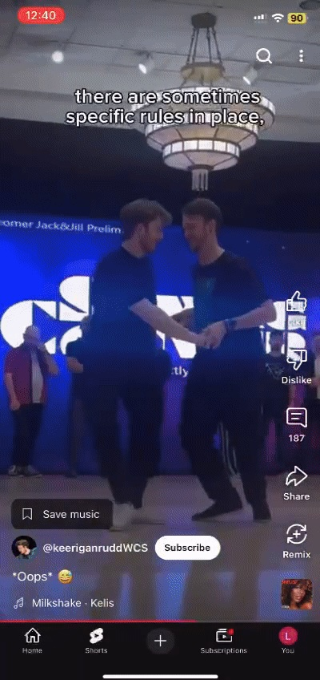
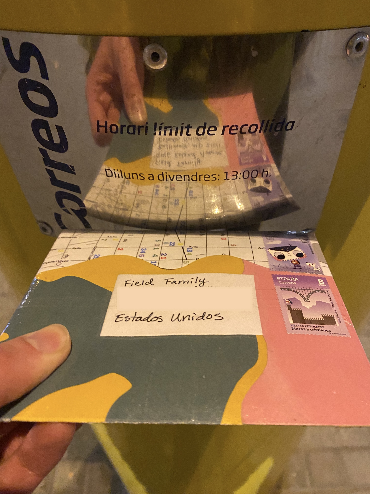
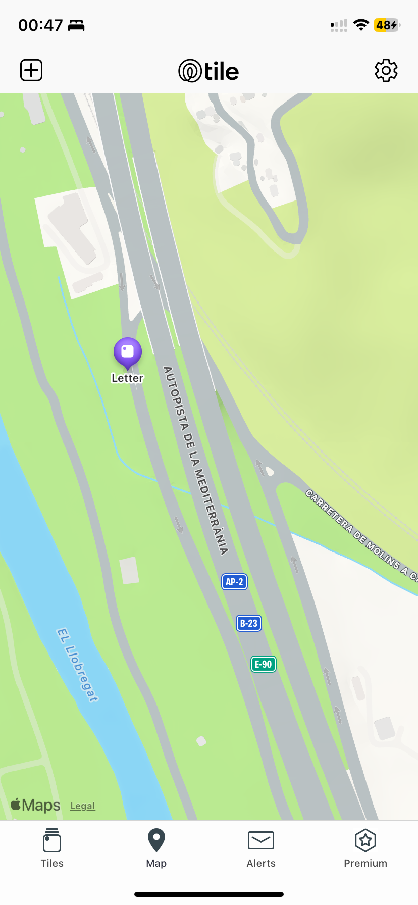
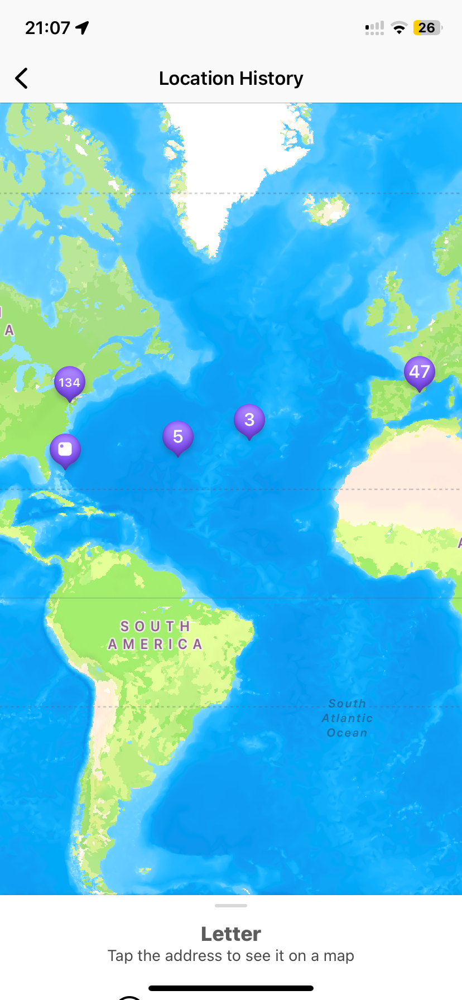
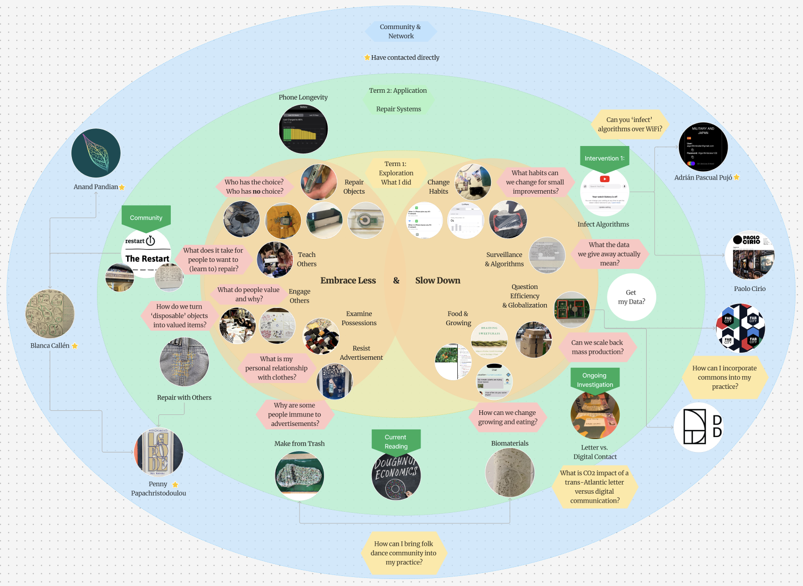

# Design Studio 02 - Second Session 

!!! abstract "Course Details"
    **Name:** Design Studio 02 - Second Session 

    **Dates:** 20 January 2025

    **Faculty:** Jana Tothill Calvo & Roger Guilemany

## Situated Intervention 

### Autoethnographic Research 

- <b>Defined study boundaries:</b> Can I understand the object of my study? Can I define the boundaries of my study?
- <b>Authenticity:</b> Was my first person perspective authentic? Was it meaningful?
- <b>Plausibility or scholarship:</b> Is this useful? Can it be written and explained?
- <b>Criticality:</b> So what? Did my actions make me learn about other things?
- <b>Self-revealing communication:</b> Did I show my work transparently? Was there something I didn’t show? Why?
- <b>Ability to Generalize:</b> Does it relate to others, can it be meaningful for others? What kind of profile is the one which I am looking at?

### Infect Algorithms
#### Statement of Alternative Present

!!! quote "Present Continuity"
        
    Users of internet platforms like myself are inundated with information fed to us by algorithms that we cannot see or understand. These algorithms influence how we think, what we value, and how we spend our time and money. We are often not aware of where these influences come from and have little power to fight back against these filter bubbles which may not truly reflect our own values, but instead come from the external influence of our algorithms. The algorithms hold us in thought patterns and social circles that further validate our current beliefs, creating a polarized world where we unquestioningly believe propaganda and are unwilling to engage with ideas that differ from our own. 

!!! quote "Alternative Present"

    Users of internet platforms like myself are able to directly influence what information is shown to us by hacking our algorithms to take back control. These hacked algorithms challenge us to examine how we think, what we value, and how we spend our time and money. We have control over what information feeds our algorithms and fight back against filter bubbles by introducing randomness and opposing views to actively challenge our beliefs and deeply examine our values. The hacked algorithms push us out of our current thought patterns, enabling us to question propaganda, and to open space for engaging in new social circles where we are empowered to have constructive conversation with people who hold beliefs different from our own. 

!!! question "Connection to Proposed Interventions"

    Intervention 1: How possible is it to infect a local network with certain content on a media platform? 

    Intervention 2: How can we scale the algorithm infection to be modular and portable to make a larger impact? 

#### What we did 

[Flavio](https://flavio-grimaldi-students-iaac.gitbook.io/flavio_grimaldi){:target="_blank"} had an unused iPhone which we installed YouTube and Instagram on. We logged into my students.iaac.net Google Account on YouTube to simulate a fresh YouTube account. Simultaneously, Flavio made a new account on Instagram to use for reels. 

[Mohit](https://mohitchopra.notion.site/Home-11cf63009b748004a336e4cc92903c61){:target="_blank"} and I used YouTube Shorts, screen recording our normal account's suggested Shorts and those of the new phone. We did not search for any content on the new phone, just interacted as we would normally with the content provided to us by the blank algorithm. I used the search function on my normal account to look for channels with a clear visual details which would be noticeable in the infinite scroll. The goal was to see if the content from our normal accounts could influence what was shown on the new account.

Flavio and [Ramon](https://ramon-prat-gibert.gitbook.io/ramon-prat-mdef-website){:target="_blank"} did the same with Instagram. 

#### Insights 

At the start of the YouTube experiment the fresh algorithm showed a lot of random things. A few of the types of Videos I had seen before 

<figure markdown="span">
    {width=75%}
    <figcaption>Fresh algorithm first screen recording</figcaption>
</figure>

<figure markdown="span">
    {width=75%}
    <figcaption>My algorithm first screen recording</figcaption>
</figure>

Some of the videos were similar to videos I had seen before by YouTube algorithm had become so personally tailored to me, but what I saw on the new account did not directly relate to what my algorithm is like now. 

As the experiment went on, I did not see any of the specific videos from the channels I had searched for pop up on the fresh account. Below are some of the types of videos I tried to 'infect' the other algorithm with. 

{width=24%}
{width=24%}
{width=24%}
{width=24%}

We did eventually notice some of the same videos appearing across devices. This happened after Flavio, Mohit, and I were sharing a local WiFi network at Falvio's house. It is possible that the noise of IAAC's WiFi was too overpowering or that it took more time for the crosstalk between the devices to take hold. 

<figure markdown="span">
    {width=75%}
    <figcaption>Video from 29 January on my algorithm</figcaption>
</figure>

<figure markdown="span">
    {width=75%}
    <figcaption>Same video from 2 February on new algorithm</figcaption>
</figure>

Another moment we saw the same video pop up was on 2 February when the same random video showed up on my personal account and on the new device. Again, this was only after we were sharing the same WiFi. 

<figure markdown="span">
    {width=75%}
    <figcaption>Video from 2 February at 17:47 on my algorithm</figcaption>
</figure>

<figure markdown="span">
    {width=75%}
    <figcaption>Video from 2 February at 16:06 on new algorithm</figcaption>
</figure>

We also observed that the new phone, Mohit's account, and Flavio's YouTube showed the same random picture at one point when we were on the same WiFi. Flavio had not opened YouTube shorts in a long time. Mohit has a very specific, tailored algorithm and so this was introducing a random video into his video which we assume was because of the shared WiFi. 

<figure markdown="span">
    {width=75%}
    <figcaption></figcaption>
</figure>

We concluded that there is definitely crosstalk among devices on the same network, but not necessarily in a way we can control. More investigation will need to be done to determine if 'infection' is actually possible the way we had hoped. It seems likely that creating noise is possible, but dictating what the content of that noise is may not be possible. We will have to test more to find out if it is. 

### Trans-Atlantic Letter 

Another investigation I started recently is an investigation to estimate what the impact of sending a physical trans-Atlantic is. I approached this by sending a Tile tracking device through the mail to my parents back in the US. It has been interesting to watch the journey. 

<figure markdown="span">
    {width=50%}
    <figcaption></figcaption>
</figure>

<figure markdown="span">
    {width=75%}
    <figcaption>The letter sat on the side of a road for 2 days without moving</figcaption>
</figure>
<figure markdown="span">
    {width=75%}
    <figcaption>The letter crossed the Atlantic to Miami then flew to NYC</figcaption>
</figure>

<!-- #### Statement of Alternative Present

!!! quote "Present Continuity"
    

!!! quote "Alternative Present" 

 -->

### Network 

I have recently started meeting with people involved in the various projects and research that I am interested in. I do not yet feel I have built a network, but I am beginning to feel I am forming connections that may be useful in the future. 

!!! abstract "People I've met" 

    * Blanca Callén - met before a Restart Barcelona party. Writes and speaks a lot about repair 
    * Anand Pandian - met through Blanca. Lives in Baltimore, MD, USA a block from the first house I lived in. Is teaching about repair 
    * Penny Papachristodoulou - met through Blanca. Artist working with weaving and textile repair. Interested in collaborating on an electronics/textile project of some kind 
    * Adrián Pascual Pujó - met through Saúl. Elisava student who researched about algorithm manipulation and filter bubbles 
    * Paolo Cirio - spoke briefly after Beyond Session about algorithm manipulation 

    * Many former contacts who I want to reach out to within the context of my MDEF project of uncovering blackboxes and repairing systems and products 

The updates to my design space show the growing network and community I am building. This is a basic visualization of the conversations I have been having and the connections I am looking forward to forming as well. 

    

### Folk Dance Community 

An area of intervention that I have just started thinking about is the world of folk dance that has been an integral part of my life for all of it. I do not yet know exactly how this will manifest, but I hope to organize a dance workshop when my friend from the USA is in town to explore if this is an area of intervention that I want to commit to exploring more. 

## Design Space 

Updates to my Design Space to include the community and contacts I am starting to make here in Barcelona and some of those back home as well. 

<figure markdown="span"> [Design Space](../../designSpace.md/#__tabbed_1_8){ .md-button } </figure> 

## Reflection 

Below is my audio reflection after the first intervention of term 2.

 
<figure markdown="span">
    <audio controls src="../../../audio/DesignStudioReflection_02Feb.mp3"></audio>
</figure>