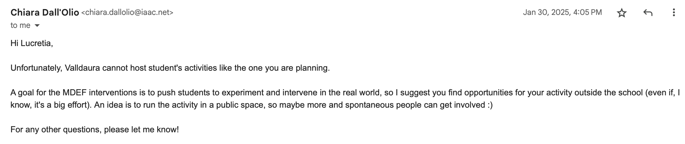
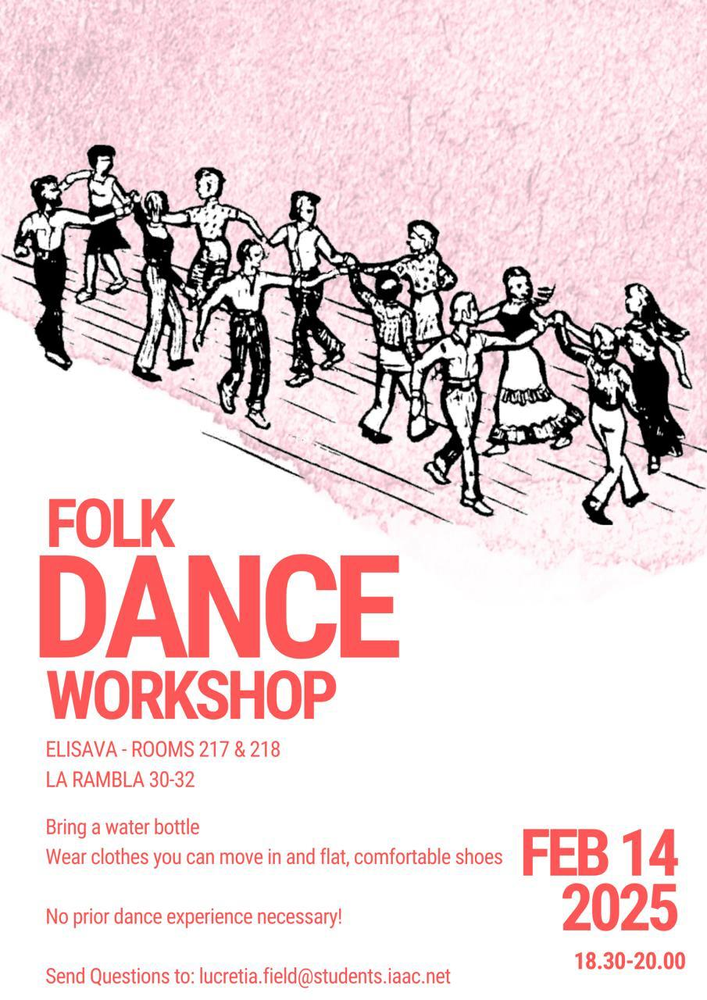

# Design Studio 03 - Third Session 

!!! abstract "Course Details"
    **Name:** Design Studio 03 - Third Session 

    **Dates:** 03 February 2025

    **Faculty:** Jana Tothill Calvo & Roger Guilemany

## Situated Intervention 

### Context 

I grew up doing various kinds of folk dance primarily from the United Kingdom and American immigrants who mixed their home traditions together with other 'American' influences to create new dance styles. Most of these dances are social in nature rather than being focused on performance or competition. 

Since leaving the USA, I have felt the loss of these dances and the community that forms around them, so in the spirit of hybrid profiles as is the MDEF way, I decided to test out what it might be like to bring these dances to Barcelona. The timing worked out well because I happened to have a friend coming to visit from the US who teaches some of these dances at conventions and has skills at leading groups of novices through some fun, silly dances. I decided to ask them if they would be interested in hosting a workshop and their enthusiasm at the idea set my whole scheme in motion. 

### Statement of Alternative Present

!!! quote "Present Continuity"
        
    People, such as myself, who have moved to Barcelona and feel disconnected from their home communities and long for activities that feel familiar may struggle to find spaces that fulfill their community needs. One of the traditions that may be lacking is that of dance in a social setting. Without having a space for dancing to familiar music, laughing with friends, and building social networks through movement, a fundamental thing needed for happiness and fulfillment might be missing. The present version of dance in Barcelona, in a club where there is lots of alcohol, darkness, loud music, and a fun, but potentially overwhelming environment, does not work for everyone to suit their psychological and physical needs. 

!!! quote "Alternative Present"

    People, such as myself, who have moved to Barcelona can find connection to new communities through familiar traditions and shared new experiences. Through dance in a social setting, they can find space for laughter with new friends and opportunities for community building to fulfil these fundamental human needs. Through a structured community practice of sharing traditional social dances from participant's heritage or personal experience, people who find club atmosphere's overwhelming or unpleasant can find a space for forming new connections and bonds of support through movement. 

### Planning 

Initially, my ambition was to host the event at Valldaura Labs where there is a space that could be perfect for a dance event. I had dreams of going to local Irish pubs in Barcelona to try to find traditional musicians who might be willing to play. I shared this idea with my friend who does one of these styles of dance when he is at home in the US and he seemed interested as well. 

So, then, just as the excitement was mounting, I started encountering barriers and challenges, the most significant eventually becoming my own anxiety about trying to bridge these worlds. 

#### Challenge 1: Finding a Space 

So, I started by asking to use Valldaura and was told that this wouldn't work. So, after dealing with many moments of second guessing myself, I reached out to ask if there was space at Elisava for me to host the workshop, which was quickly approved.  

#### Challenge 2: Overcome by own doubts

With a space worked out, I then had to overcome the biggest hurdle, actually making a flyer, inviting people, and asking people to join a nebulously planned event that I barely felt confident about running. 

Eventually, I got up the courage to throw together a flyer for the event and posted it to the IAAC WhatsApp group. I got almost entirely resounding silence in response, but one person I didn't know asked if she could join and bring a friend. I was very excited and tried to stress the informality of the event while also highlighting that it would likely just be a fun social event to meet new people and move in a space to music. 

### Gather Materials 

While I already had the most important thing, a teacher, who I knew could provide the second most important thing, music, and I had eventually found a space, I decided to bring a piece of the dance culture from back home to this event. At the dance events back home, one of the details that I think helps make it welcoming and inclusive is the use of name tags. Many dance events create custom name badges that attendants then keep as souvenirs. 

So, I bought some stickers and brought along markers so that people could make their own name tags. I think the theory of this practice is that at an event where not everyone knows each other, name tags allow people to feel more comfortable meeting new people because they don't have to try to remember their name. When asking someone new to dance, these can provide a nice reminder and equalizer. 

<!-- 
 -->

### The event 

On the day of the dance itself, 3 people who had said they were interested in joining reached out to say they could not make it. We ended up with a total of 9 people. I think 12 would have been more optimal, as it would have worked better for some of the dances, but it was still a nice event no matter what. 

<figure markdown="span">
    <video src="#" controls="controls" style="max-width: 100%;"></video>
    <figcaption>Teaching Half Hannikin</figcaption>
</figure>

<figure markdown="span">
    <video src="#" controls="controls" style="max-width: 100%;"></video>
    <figcaption>Sample Dancing</figcaption>
</figure>

<figure markdown="span">
    <video src="#" controls="controls" style="max-width: 100%;"></video>
    <figcaption>End of the night: Trenchmore Breakdown</figcaption>
</figure>

I believe everyone who joined had a good time. There were a lot of laughs and moments of silliness, which was ultimately the goal of the event. 

At the end of the night, I put the idea out there that if anyone was interested, maybe we could arrange another dance event where people could share dances from their life. While there was not a huge amount of enthusiasm about this, it seemed like people at least enjoyed the experience they had at this event. 

### Reflection 

Perhaps ultimately the most useful part of this intervention was how many times I found myself getting stuck in anxiety and how many times I eventually managed to push through it. There were many more things I wish I had done to help the event be more successful and I did find myself somewhat disappointed with the turn out, but it was a first step. Even if it ends up being the last step of trying to do this kind of thing while I am here in Barcelona, I am glad I did it. 

Doing this event, no matter how small and somewhat silly it ended up being, it is something I can now say I did. Perhaps there will be more later, but for now, I took a first step, which felt important to have done. 

## Reflection on Toni Navarro Talk - In Progress 

In my projects about repair, there are many implicit assumptions about 'goodness'. First and foremost, I am assuming that repair is 'good', that it reduces waste generation and production of new objects, which is in turn I am assuming, a good thing. I am assuming the waste produced when broken or old things are discarded is harmful to the environment, humans, and non-humans on our planet and that repair leads to less waste, reducing these problems. I am assuming that increasing access to and awareness of repair will help rather than hurt, creating a cultural shift that will not cause more suffering. The implicit assumption that repair is good, worthwhile, and helpful is baked into my project. 

During the development of this project, I am conscious of my positioning and do not want to overstep my place and context. I do not want to enter established repair spaces and expect to change things, to upend systems or communities that are functioning effectively with institutional knowledge. I do not want to disrupt existing structures, but instead, I hope to offer opportunities for opening more spaces to help more people be involved in repair communities. 

Additional assumptions I am making are that repair is ethical in how it treats human expertise and material goods. The expectation in this work is that people who are doing repairs are being treated ethically and are compensated according to their skills. I also am assuming that the material is being used carefully, thoughtfully, ethically, and is not being wasted or downgraded for the sake of repair. Additionally, I am proceeding under the assumption that repairs will not cause the repaired object to become more ecologically or economically problematic by adding material. These assumptions all depend on the repair being made, the skills, habits, and practices of the person or community doing the repair, and the available materials and resources. 

It is my intention with this project to source material from places that remove waste from garbage streams rather than create more. I do not want to reduce functioning items to scrap material all for the sake of a repair of something else. When possible, I will try to use material that has already been deemed at its end of life. For example, I have used fabric I found near a trash bin to create new items and fix my clothes. Even this presented a potential issue, though because it is possible that these clothes would have been picked up by people who collect usable materials and resell them here in Barcelona. By turning these pieces of clothing into patches for my jeans, dog toys to give as gifts, and a pair of slippers, did I inadvertently turn functioning clothes into materials that cause more waste? I would like to think that because these actions allowed me to not buy new, the net gain is positive, but because of the nature of the work I am trying to do, I am not sure how possible it is to measure that kind of impact and assess it. 

So, going forward, I will try to be thoughtful about my choices and actions. I will work to record possible alternative outcomes for objects I am using if I had not intervened. To track my own waste production from these repairs, I could gather all of the waste generated during the repairs, from pieces of thread to tiny fabric scraps. I already am fairly frugal when it comes to throwing out scraps, I save pieces of fabric and save pieces of thread that are long enough to use on another project. Unfortunately, knowing myself, I am prone to overthinking these things. If I become too vigilant with my tracking of waste, I fear that I will stop acting at all, stop repairing or creating, out of fear of making a worse impact by intervening than if I had not. It has to be a balance, I suppose. 

The ideal applications of this work are that people who engage with it become empowered to repair, to seek opportunities to learn repair skills, waste and purchase less, and spread their new cognizance about repair to others in a cascading effect. The ideal would be to show people the beauty of repair and the emotional value that can be added to objects by taking care to repair them. Possible deviations from my intended purpose are that in an effort to repair, people create more waste or turn functional objects into disposable materials which don't get used thoughtfully. Additionally, by providing access to repair skills and understanding, people who practice repair professionally, might find their skills being less in demand. This sort of shift would have to come with a massive cultural shift, though, so I do not anticipate that happening on a large scale from my small project. There are likely more possible deviations from my intent, however, these were the first that came to my mind when thinking about misuses of my project. 

<!-- In terms of mechanisms by which to evaluate my project from an ethical standpoint, I am not sure exactly how to do that. 

1. Evaluate the following aspects in relation to your project: 
    - What assumptions –about goodness, justice, society…– are implicit in its conception (meta-ethics)? 
    - What guidelines or norms should be followed during its development (normative ethics)? 
    - What criteria could be established to assess its consequences, and what protocols would you apply in case of negative outcomes (applied ethics)? DONE?
	
2. Design is "a material way of doing ethics" that must anticipate the trajectories of its products. Imagine a possible scenario that reflects the ideal application of your project: 

    - How are your intentions and values embedded or inscribed in it? 
    - What factors could cause a deviation in the context of use?

3. What mechanisms of evaluation and participation could help democratize your design process by making it more transparent, collaborative, and accountable? How can situated knowledge and marginalized communities be included to take their interests and needs into account?

4. Non-human agency compels us to adopt a more humble position as designers, moving away from modern fantasies of total control. What degree of autonomy do you attribute to the material and technical components of your project? Identify the "actants" or "cognizers" at play, their differentiated responsibilities and specific roles. 

-->

## Design Space 

Updates to my Design Space. 

<figure markdown="span"> [Design Space](../../designSpace.md/#__tabbed_1_9){ .md-button } </figure> 

<!-- ## Reflection 

Below is my audio reflection. 

 
<figure markdown="span">
    <audio controls src="../../../audio/DesignStudioReflection_02Feb.mp3"></audio>
</figure> -->