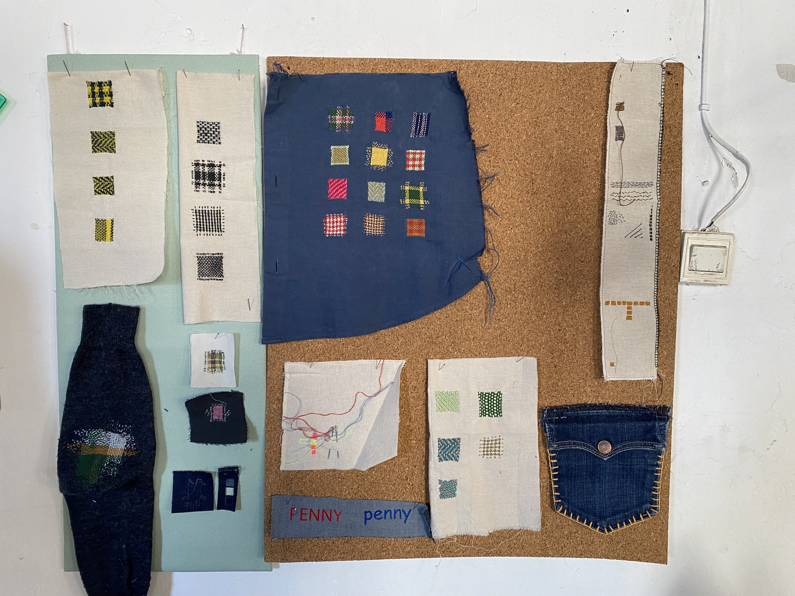
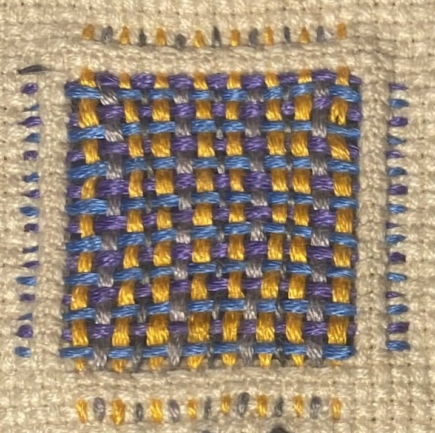
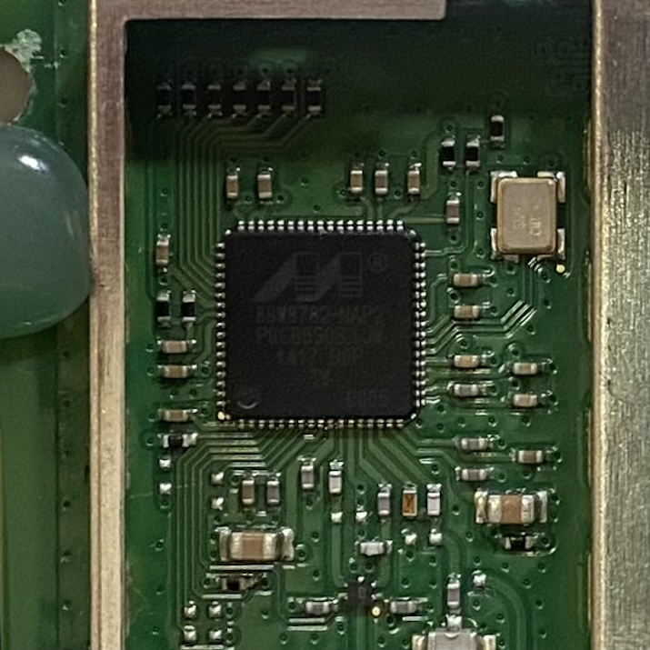

# Design Studio 04 - Fourth Session 

!!! abstract "Course Details"
    **Name:** Design Studio 04 - Fourth Session 

    **Dates:** 17 February 2025

    **Faculty:** Jana Tothill Calvo & Roger Guilemany

## Situated Intervention 

The intervention I completed for this week's investigation was not the most formal intervention, but more like getting started on a project and intervention I had been meaning to start for a long time. 

I have been having conversations about collaborating on a project with Penny Papachristodoulou of the collective [La Pode del Raval](https://www.instagram.com/lapodedelraval/){:target="_blank"}. Penny works with textiles, doing visible mending and darning among many other creative practices. Some of the work in her studio is shown below. 

She is interested in exploring combining electronics, ideally related to sound, with the darning and repair. When we met, we talked about integrating storytelling into our project. Particularly, Penny is interested in using repair as a metaphor for telling stories about people healing from trauma. While we are still in the early stages of figuring out what exactly what we will do together, we had great conversations about the possibilities. 

We are planning to create some sort of installation or event to participate in [Fashion Revolution](https://www.fashionrevolution.org/frw-25/){:target="_blank"} which will give us a goal that is a few weeks after the Design Dialogues. My personal goal will be to have a prototype of the installation/event to test at the Design Dialogues on March 26th so that I can iterate on it for Fashion Revolution Week from April 22-27. 

Something I noticed during my discussions with Penny about integrating mending with circuits is how remarkably similar the darning patch looks to an integrated circuit chip. While I do not yet know how this may relate to the narrative I am building around this project, I find the similarity interesting and worth noting. 

So, for this intervention, I did a few different projects working on my own mending skills and testing out a basic system to integrate electronics into the mending pattern. 

### Woven Mending Test 

First, I experimented with the woven darning technique by mending my classmate's jeans. Because of the placement of the holes, I wanted to try to hide the mending as much as possible. Therefore, I used colors that matched as well as i could find. 

<!-- Slideshow container -->

  <!-- Full-width images with number and caption text -->
  

    
  

  

    
  

  

    
  

  

    
  

  

    
  

  

    
  

  <!-- Next and previous buttons -->
  <a class="prev" onclick="plusSlides(-1)">&#10094;</a>
  <a class="next" onclick="plusSlides(1)">&#10095;</a>

<!-- The dots/circles -->

  
  
  
  
  
  
  

### Electronics Test 

Penny gave me some conductive thread to experiment with. The information on the package suggests that the resistance will change when it is stretched. Penny and I had discussed the possibility of the outputs varying based on the stretch of the material, so I started by testing that with a very simple LED circuit. 

!!! note "Hilo Conductor"

    Resistance (approximate):

        - Relaxed = 150Ohms/foot 
        - Stretched = 250Ohms/foot 

I was unable to see any difference in the brightness of the LED and since I did not have a digital multimeter to test with, this was the best I could do for the moment. Additionally, the thread does not feel stretchy at all, so I decided to try making a patch instead and using the pressure sensors we made in the H(n)MI class to vary the LED brightness based on how much pressure is applied to path. 

<!-- Slideshow container -->

  <!-- Full-width images with number and caption text -->
  

    

    
    
    

  

  

    

        
        
    

  

  

    

    
    
    

  

  <!-- Next and previous buttons -->
  <a class="prev-2" onclick="plusSlides_2(-1)">&#10094;</a>
  <a class="next-2" onclick="plusSlides_2(1)">&#10095;</a>

<!-- The dots/circles -->

  
  
  

The final result is a patch that has 3 LEDs connected to it which vary in brightness with the pressure applied to the conductors in the woven patch. As a first test to see if the pressure sensor works with this method of mending, I would say it is a success. Next I will want to include connections to the Arduino analog pins to be able to create sound or more complicated light patterns with the pressure from the sensor. 

### Next Steps 

The next steps I intend to take are to meet with Penny and see what she thinks about the pressure sensor patch and discuss next steps. I may also seek out some conductive thread that more clearly responds to stretching to create a different type of sensor. 

I hope to integrate some audio output into the mending. This will require attaching the circuit to the Barduino analog pins which may require some slight reworking of the stitching. 

Additionally, next steps will include trying this method out on an actual ripped fabric as a mending method. It may complicate the pattern more to not be using the cross-stitch grid to keep everything square. It is possible, though, that this will allow for more creativity within the pattern though. 

The options are many, and it was nice to get started actually testing this method and to see it working successfully. 

## Reflection on Toni Llacer Research Talk 

### Research Questions 

Some initial thoughts about research questions: 

- How does using 'visible mending' practices, such as darning or weaving patches with colorful thread or adding embroidery or colorful patches to clothing, elevate or diminish the desirability for people to wear the garment being modified? 
- How does adding electronic interaction, through soft sensors, lights, and sounds, to add character and story influence people's engagement with the concept of repair and change how they might approach repair in their own lives? 

### Theoretical Framework 

2. Theoretical framework - In Progress 
    a) Summarize your theoretical framework* (max. 5 lines)
    b) Select 5 sources -min. 2 academic papers- and explain why they are enlightening for you

### Methods 

3. Methods - In Progress 
Specify your practical approach: what data will you use, how will you gather it and when.

## Design Space 

Updates to my Design Space to reflect my progress and projects

<figure markdown="span"> [Design Space](../../designSpace.md/#__tabbed_1_10){ .md-button } </figure> 

<!-- ## Reflection 

Below is my audio reflection for this week of design studio.

 
<figure markdown="span">
    <audio controls src="../../../audio/DesignStudioReflection_02Feb.mp3"></audio>
</figure> -->