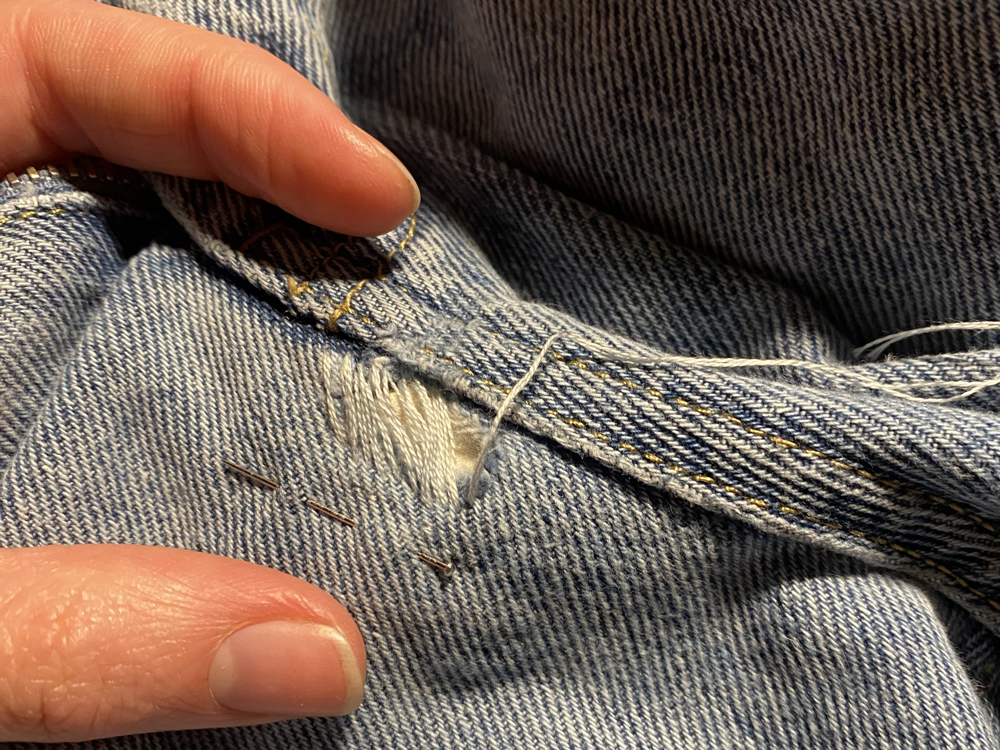
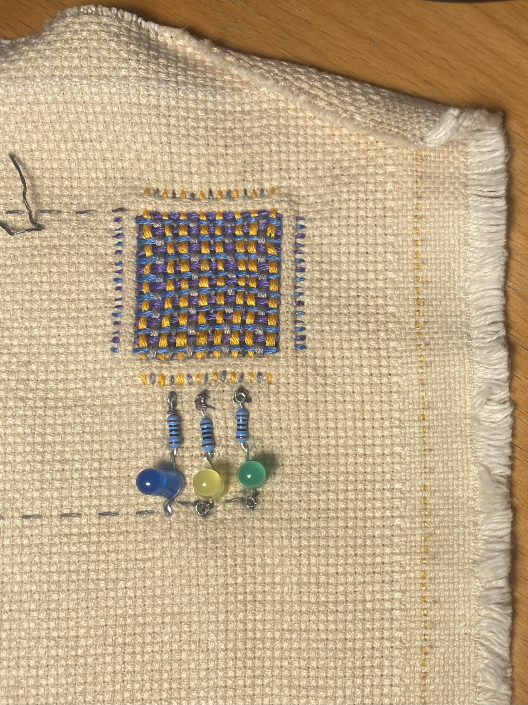

# Design Studio 04 - Fourth Session 

!!! abstract "Course Details"
    **Name:** Design Studio 04 - Fourth Session 

    **Dates:** 17 February 2025

    **Faculty:** Jana Tothill Calvo & Roger Guilemany

## Situated Intervention 

The intervention I completed for this week's investigation was not the most formal intervention, but more like getting started on a project and intervention I had been meaning to start for a long time. 

I have been having conversations about collaborating on a project with Penny Papachristodoulou of the collective [La Pode del Raval](https://www.instagram.com/lapodedelraval/){:target="_blank"}. Penny works with textiles, doing visible mending and darning among many other creative practices. Some of the work in her studio is shown below. 

She is interested in exploring combining electronics, ideally related to sound, with the darning and repair. When we met, we talked about integrating storytelling into our project. Particularly, Penny is interested in using repair as a metaphor for telling stories about people healing from trauma. While we are still in the early stages of figuring out what exactly what we will do together, we had great conversations about the possibilities. 

We are planning to create some sort of installation or event to participate in [Fashion Revolution](https://www.fashionrevolution.org/frw-25/){:target="_blank"} which will give us a goal that is a few weeks after the Design Dialogues. My personal goal will be to have a prototype of the installation/event to test at the Design Dialogues on March 26th so that I can iterate on it for Fashion Revolution Week from April 22-27. 

Something I noticed during my discussions with Penny about integrating mending with circuits is how remarkably similar the darning patch looks to an integrated circuit chip. While I do not yet know how this may relate to the narrative I am building around this project, I find the similarity interesting and worth noting. 

So, for this intervention, I did a few different projects working on my own mending skills and testing out a basic system to integrate electronics into the mending pattern. 

### Woven Mending Test 

First, I experimented with the woven darning technique by mending my classmate's jeans. Because of the placement of the holes, I wanted to try to hide the mending as much as possible. Therefore, I used colors that matched as well as i could find. 

<!-- Slideshow container -->

  <!-- Full-width images with number and caption text -->
  

    
  

  

    
  

  

    
  

  

    
  

  

    
  

  

    
  

  <!-- Next and previous buttons -->
  <a class="prev" onclick="plusSlides(-1)">&#10094;</a>
  <a class="next" onclick="plusSlides(1)">&#10095;</a>

<!-- The dots/circles -->

  
  
  
  
  
  
  

### Electronics Test 

Penny gave me some conductive thread to experiment with. The information on the package suggests that the resistance will change when it is stretched. Penny and I had discussed the possibility of the outputs varying based on the stretch of the material, so I started by testing that with a very simple LED circuit. 

!!! note "Hilo Conductor"

    Resistance (approximate):

        - Relaxed = 150Ohms/foot 
        - Stretched = 250Ohms/foot 

I was unable to see any difference in the brightness of the LED and since I did not have a digital multimeter to test with, this was the best I could do for the moment. Additionally, the thread does not feel stretchy at all, so I decided to try making a patch instead and using the pressure sensors we made in the H(n)MI class to vary the LED brightness based on how much pressure is applied to path. 

<!-- Slideshow container -->

  <!-- Full-width images with number and caption text -->
  

    

    
    
    

  

  

    

        
        
    

  

  

    

    
    
    

  

  <!-- Next and previous buttons -->
  <a class="prev-2" onclick="plusSlides_2(-1)">&#10094;</a>
  <a class="next-2" onclick="plusSlides_2(1)">&#10095;</a>

<!-- The dots/circles -->

  
  
  

The final result is a patch that has 3 LEDs connected to it which vary in brightness with the pressure applied to the conductors in the woven patch. As a first test to see if the pressure sensor works with this method of mending, I would say it is a success. Next I will want to include connections to the Arduino analog pins to be able to create sound or more complicated light patterns with the pressure from the sensor. 

### Next Steps 

The next steps I intend to take are to meet with Penny and see what she thinks about the pressure sensor patch and discuss next steps. I may also seek out some conductive thread that more clearly responds to stretching to create a different type of sensor. 

I hope to integrate some audio output into the mending. This will require attaching the circuit to the Barduino analog pins which may require some slight reworking of the stitching. 

Additionally, next steps will include trying this method out on an actual ripped fabric as a mending method. It may complicate the pattern more to not be using the cross-stitch grid to keep everything square. It is possible, though, that this will allow for more creativity within the pattern though. 

The options are many, and it was nice to get started actually testing this method and to see it working successfully. 

## Reflection on Toni Llacer Research Talk 

### Research Questions 

I have been thinking a lot about the sorts of research questions I am investigating and have come up with a long list, going from broad to more narrow. 

!!! question "Research Questions"

    * What motivates people who repair/upcycle broken/old objects to repair? 
    * What barriers to repairing do people who discard things without first attempting to repair them face to trying repair? 
        * Lack of skills? 
        * Lack of knowledge about repair as an option? 
        * Lack of resources, materials, time, tools?
        * Lack of community or support to repair?
        * Social or other pressure to purchase new things? 
    * How does age, culture, gender, and economics, influence who repairs?
        * How can a younger generation be involved more in repair as a means of reducing waste, gaining craft skills, and engaging with stewardship of the objects we own that are so easily replaceable? 
        * Who has the choice to repair? Who has no choice but to repair? Who has no choice but to buy new?
        * What role does gender play in the realm of repair?
    * What role does care and general upkeep play in reducing waste by treating objects as precious so that repairs may not be necessary for longer?  
        * What role does the quality of the product play in the need for repair in the first place?
    * How does using 'visible mending' practices, such as darning or weaving patches with colorful thread or adding colorful patches to clothing, elevate or diminish the desirability for people to wear the garment being modified? 
    * How does adding electronic interaction, through soft sensors, LEDs, and sounds, to add character and story influence people's engagement with the concept of repair and change how they might approach repair in their own lives? 
        * What method of interaction is more meaningful in creating engagement with the ideas of repair? 

From my recent work in the space of repair, I am developing a hypothesis which I hope to test during my research. For now it is as follows: 

Creating objects which facilitate engagement with repair will increase participant's interest in repair as a means of reducing waste, learning craft skills, and promoting stewardship of objects so that they examine their own purchasing and discarding habits and seek opportunities to repair rather than discard. 

### Theoretical Framework 

I have yet to determine a clear theoretical framework for my research, I am in the process of trying to figure out exactly what this means, and I hope to seek assistance from my teachers soon. In the meantime, I have been reading a lot of research resources and trying to contextualize the landscape. 

#### Sources 

- Lee Jones and Audrey Girouard. 2021. Patching Textiles: Insights from Visi- ble Mending Educators on Wearability, Extending the Life of Our Clothes, and Teaching Tangible Crafts. In Creativity and Cognition (C &C ’21), June 22–23, 2021, Virtual Event, Italy. ACM, New York, NY, USA, 11 pages. [https://doi.org/10.1145/3450741.3465265](https://doi.org/10.1145/3450741.3465265){:target="_blank"}

This source was interesting because it addresses some of the questions I have been interested in around why people repair while also explaining practical ways in which repair of clothing, specifically visible mending, can be taught. 

- Alexandra Crosby and Jesse Adams Stein. 2020. Repair. In Environmental Humanities 12:1, May 2020, 
DOI 10.1215/22011919-8142275 [link](https://watermark.silverchair.com/179crosby.pdf?token=AQECAHi208BE49Ooan9kkhW_Ercy7Dm3ZL_9Cf3qfKAc485ysgAAA3AwggNsBgkqhkiG9w0BBwagggNdMIIDWQIBADCCA1IGCSqGSIb3DQEHATAeBglghkgBZQMEAS4wEQQMFP9PQJVw0cpSlOv1AgEQgIIDI07SNKF35pvArSbDI0VnVR9eHUshcnw9YFXF_MWPXCeWZmgNC6BbJwRyzyZ2oNQaDBM9aRQCxOdFxtt-eJ-7QZMoXKRyo0D27m0D1LBkO55gstdGsnDxMT4KbQs83rOE1aPO3tUTXOH3IsMb5uS4e48lVZCkfc-JeRi_e82FKmWr1zrcbMaO1bcDOlx7WiiAhIRRXYXjp1NT3ccWYLo4blTHDLADmW6ICCz5_3EPRaqgqvT4hwXhhVxEB55vR5Usa1gM2akQRMdVLGsDpaTIPD0c477xuKjsrCIl9nKfwTcYvfv1W2QbkhA9cXnOQpqb_4T1Dkb6sPBwHsgdv1WKgV0sm7R4q3bMETUUSiWLgxk4RZxhe7RJQDIi7EPxQRf2_rzBTjhaxWKC4sBtPYa1T0xHYAppOHQoMo0mK4HMb2VXLb4znFg-T1laz3zBYXYx0de0EqieVMtFWgnqjHRLXZtxMSSb3UV2fKoPQKFBU-2MJh4H2ZnEAMrgMWJXFLLbImDn61VCWke_g4LuBv1yUnOuJ-Z6N1EDJ92fvoMyaoS5UDhEeRxwyR0rHkerB03PvHQKPvs2nggwpe3YHfVfH4dblqDsUpuYTl9RaVuBwq7sSTNjxuJ9lZ8ihxDpJ_PZ4_fqTTEDvMY2P6UQivuLYNdMv-Toqs8Mpwt0DGTJJtoxikx0wttJI_CwwDvRsAEJAsGpADKvN18MITiSMmycETCkbxju5_FN67UcB0Hu-ljsSmq2bsvJiR2Ua4lMg0gO8ltWbR9mdtHY568eSrAPYvwq_I0lq3woNaqOApIPxtVU_nPiKa4P80-B5jxbqg_mKFI0L4K3nv6cKhBsOODVaWkm4h2H9ql73iVZ13fK6-dO373qN43IY1GYTHPfs1tvd1zKiUKLIJYEEGrRGfPbPAKqhf2y-20JV5EU3o6WM7AHdlamxByZT8s-Jn-_wi7owhAK6qWlx4fU7gCSajyX7icDek4YWY8vi4ZQIYZxBhby2Sg9GFzDrLt_IWKVbN_GS9v453mhY5pi9tN6ddgAYBkhXNQ0SGZn8-N5DIqyUHV1LYAt){:target="_blank"}
This is an open access article distributed under the terms of a Creative Commons license (CC BY-NC-ND 3.0).

This paper talks about 'repair as design and designing for repair'. I have never really considered myself a designer, despite being a part of a design master's program, but I could perhaps get behind this idea of design, as part of the process of repair and repair as a part of the process of design. The focus of this paper on care and ethics within the context of design education is also interesting. 

- Lee Vinsel. 2019. Fighting for the Right to Repair Our Stuff. Jul 23, 2019. [link](https://www.theamericanconservative.com/fighting-for-the-right-to-repair-our-stuff/){:target="_blank"}

This article was interesting because it comes from an American conservative perspective and highlights that repair may be an area where people on both sides of the political divide in the USA might be able to agree. While reading this article I started thinking about the possibilities for repair to maybe be an entry point into some of the discussions I was hoping to address early in this term about information and ideological bubbles. I may be interested in exploring the political action angle of repair a bit more. 

- I also read 2 papers by Blanca Callén that she sent me herself. However, the versions I have are labeled as not being ready to be cited. I will check with her about that before adding any information about them here. However, they have provided interesting context about the Restarters Barcelona and have also given me very good references to other papers which have positioned me much more in research mode than I have been for the rest of this course prior. 

<!-- 2. Theoretical framework - In Progress 
    a) Summarize your theoretical framework* (max. 5 lines)
    b) Select 5 sources -min. 2 academic papers- and explain why they are enlightening for you
 -->
<!-- ### Methods 

3. Methods - In Progress 
Specify your practical approach: what data will you use, how will you gather it and when.

 -->
## Design Space 

Updates to my Design Space to reflect my progress and projects

<figure markdown="span"> [Design Space](../../designSpace.md/#__tabbed_1_10){ .md-button } </figure> 

## Reflection 

Below is my audio reflection after meeting with Penny. I recorded it right after leaving her studio, so please pardon the background noise of the city. 

 
<figure markdown="span">
    <audio controls src="../../../audio/DesignStudioReflection_Penny.mp3"></audio>
</figure>
