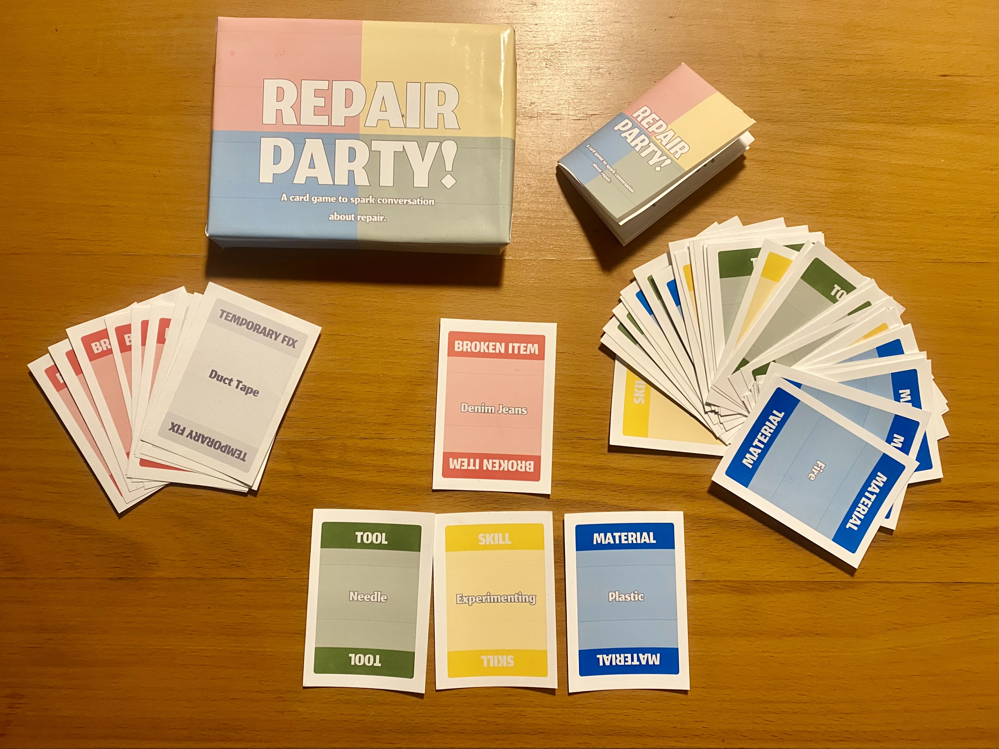

# Design Studio 05 - Fifth Session 

!!! abstract "Course Details"
    **Name:** Design Studio 05 - Fifth Session 

    **Dates:** 03 March 2025

    **Faculty:** Jana Tothill Calvo & Roger Guilemany

## Situated Intervention 

### Previous work & context 

For my final situated design intervention of the term, I worked on further developing the game I made during the Elisava workshop, Hazard Spaces with Tereza Ruller. During the workshop, I had developed a game to try to spark creative conversation about repair. It is a collaborative game about repairing things with somewhat strange, silly, or limited tools, materials, and skills. The purpose of this game is to get people laughing and talking about repair through ideating about creative ways to fix things, from a broken plate to society and many things in between. 

 

The first prototype of the game, during the class was a very simple, hand written version. The rules were vague, it needed a lot of work-shopping. At first, my idea had been to try to be very practical, only including things that I felt could *really* be fixed. However, the teacher for the seminar liked the idea of including a variety of things, especially things that fall more into the wicked problems category, to keep the game extra interesting. 

The first round of printed cards included some of the more challenging "broken items". This was the version of the game I showcased at the Elisava workshop show case. I had play tested the game only a few times at that point and had the opportunity to play test it once more. Without having the rules fully locked down nor written out at the time, I was able to adapt quickly and try different options. The teacher had suggested including a board so make clear how the other cards 'attach' to the "broken item". I did not have the chance to print one out, so I hand drew one for the occasion. 

 

 

 

 

All of this was done well before the fifth session of Design Studio, so what follows is the actual work I did for this portion of the Design Studio. 

### Iteration and Intervention 

I wanted to test this game to see if it is a useful tool for getting others interested in the ideas of repair, or at least discussion with friends the possibilities. First, I had to make sure the game was actually playable, made sense, was at least a little bit fun, and had been tested a few times. 

The first step in this process was coming up with actual rules, testing them, and then iterating on them with the help of my classmates. I played the game with a few friends who suggested things to help make it more engaging.

??? note "Repair Party! Rules" 

    Welcome to the Repair Party, we have many broken items that need to be fixed and we need your help to do that. 

    You will need to work together with your group of repairers using Skills, Tools, and Materials to fix as many items as you can before time runs out.

    **Setup the Game**

    **Build the Decks**

    - Sort the Broken Item and Temporary Fix Cards out of the deck and shuffle remaining (Skill, Tool, and Material) cards together to form the Repair Deck. 
    - Shuffle the Broken Item Cards and place them face down to form the Item Deck. 
    - Place the Temporary Fix Cards off to the side, face up. 

    **Prepare to Play**

    - Deal 3 cards from the Repair Deck to each player. 
    - Determine who is wearing the most repaired or second hand clothes in your group - they will take their turn first. 
    - Prepare for a number of rounds equal to the number of players + 1.  (Ex. 3 players will have 4 rounds)
    - Get ready for repairing chaos!

    **Play the Game**

    Flip over the first 2 cards from the Item Deck and start with the first player. 

    **Actions:**

    Until the rounds run out, each player can do any of the following actions on their turn. 

    - **Play a Card:** From your hand, place a Skill, Tool, or Material Card on one of the in-play Broken Item Cards. This card must be something you think can be used to fix the Broken Item you are playing it on. Then draw a new Card from the Repair Deck.
    - **Move a Card:** Move a card from one Broken Item to another. Place a Temporary Fix on the moved card’s spot.
    - **Play a Temporary Fix:** Place a Temporary Fix on a Broken Item if there are no usable cards are in your hand. Do not draw a new card. The next player remove it on their turn.
    - **Remove a Temporary Fix:** Replace a Temporary Fix card with one from your hand, or play another Temporary Fix if no card fits. Both fixes must be removed before drawing a new card.
    - **Complete a Repair:** If a Broken Item has a Skill, Tool, and Material Card, explain a plausible repair story of how the item was fixed. If the group approves, remove the item and cards, score a point, flip over another Broken Item Card and pass play to the next player. 

    **Winning the Game**

    Your team of repairers wins the game if the number of repairs completed within the number of rounds equal to the number of players in your team + 1. If the stories told about the repairs are hilarious, far-fetched, or ridiculous, all the better, but make sure you are justifying them clearly and that the whole group agrees they are valid. 

    **Losing the Game**

    Your team of repairers loses the game if you do not complete the number of repairs within the round limit. 
    Additionally, if you have played all of the Temporary Fix Cards and do not replace the last card with a card from your hand, your team loses. Unfortunately in this scenario, you have fixed too many things with temporary fixes and the whole Repair Party comes crashing to the ground.

In my mind, the game is mostly an ideation tool, something to get people talking. The intended audience is perhaps people at a workshop about repair, maybe as an ice breaker. However, if it were interesting enough, it could be interesting to try making it a bit more like a traditional game, unfortunately, it is not at that point yet. There is still a long way to go. 

I wanted to use the game for the Work in Progress presentation at Elisava, and so I created a few more cards, printed the rules, and made a box for the game to make it more presentable. To make the box, I initially tried laser cutting a large cardboard box I had found next to a garbage bin and walked with to school. The laser cut didn't work out correctly though, so I ended up making the box the old fashioned way: with a straightedge, box cutter, ruler, and glue. It is not the most polished outcome, but it felt very *me* in a way. 

 

At the Work in Progress showcase, I was able to get a few people to play the game. I am not sure they found it as engaging as I had hoped, but it wasn't really the correct environment for it as I had very little time to explain how it works, they had other projects to look at, and they were only mildly interested anyway. Still, it was useful to get people's reactions to it. 

The real intervention with this game is yet to come. I have not pursued the chance to test it with repairers or with people involved in a repair workshop. Many people who have spoken to me have asked the purpose of the game, what I am aiming to achieve with it. Upon reflection, I think using it as an ice breaker at a workshop is probably the best place to start. Get people laughing and talking about repair with a simple game. Start a conversation about how we can potentially fix some small broken things and to get whimsical and creative about how we might be able to fix larger, more challenging things. I hope to test this game in that kind of setting soon, and to collect more feedback about it as well. 

 

## Reflection on Transition Design Talk 

### Mapping the Landscape 

 

Mapping the landscape about repair feels like it is reiterating on my design space, but with a more external look than I have previously had. I used scrap paper from our activity on Solar-Centered Design to sketch out the landscape as a means of trying to practice the things I preach in terms of reuse. I hope the messiness of the result is acceptable. 

I know that this is not an exhaustive map of the landscape around repair. It has helped me to recognize that perhaps what I am most interested in is the specific concepts around "community-led repair efforts" rather than necessarily larger scale repair efforts. While I recognize that legislation about repair, companies who repair and reuse, and other large-scale efforts are necessary, for the context I am working with, smaller, community-led practices are more what I am interested in looking into going forward. 

### Actant Mapping

With my clearer focus on community-led repair, I worked to map the actants in this space. While some of my focus has been on Barcelona, I also included information that is both more global, and more localized to my context in Baltimore, Maryland, back in the USA. I think continuing to do this sort of work as I progress through the rest of this program will be very helpful. Including the contacts that I make along the way and the people I admire will be helpful while continuing to remember to include people I may have less access to, but who have stakes in the outcomes of these sorts of initiatives. 

 

### Theories of Change 

I will admit, I did not fully understand this portion of the lecture on transition design. However, here is my best attempt at what I think is intended for this. 

The ideal change I am going for is to have more space for community-led repair activities and Do It With Others (DIWO) repair efforts, to remove the power over our objects from corporations who just want to suck as much money as possible out of planned obsolescence and new upgrades to technology and fashion. 

To do this, I want to make sure I am not negatively impacting existing repair infrastructure, people who currently make a living repairing, or by steam rolling any existing community-led repair efforts. I want to try to fit into the existing systems, help elevate them, and get more people interested in and seeking out repair opportunities. 

I am still working to understand the current systems around repair communities. There are many different models, what works for one community may or may not work for another. This step is going to require continued research and investigation. I intend to engage more in the community here in Barcelona while I start making more meaningful connections with repair efforts in Baltimore, Boston, and the US in general. 

I hope to support the transition from existing community-led repair efforts to more numerous and utilized repair efforts by learning from the places I have been and the experts I have spoken to and bringing those learning to existing spaces with the goal to facilitate further growth of the efforts. 

## Design Space 

Updates to my Design Space to reflect my progress and projects

<figure markdown="span"> [Design Space](../../designSpace.md/#__tabbed_1_10){ .md-button } </figure> 

## Audio Reflection 

Below is my audio reflection for this week of design studio, it includes some of my thoughts about 'why repair?'.

 
<figure markdown="span">
    <audio controls src="../../../audio/DesignStudioReflection_05Mar.mp3"></audio>
</figure>