# Design Studio 02 - End of Term

!!! abstract "Course Details"
    **Name:** Design Studio 02 - End of Term

    **Dates:** 30 March 2025  

    **Faculty:** Jana Tothill Calvo, Roger Guilemany, Jessica Guy, & Julia Danae Bertolaso

## Draft Pictorial 

Here is the second draft of my pictorial. Unfortunately, I have still not figured out the exact way for the physical and digital pieces to fit together. I am thinking the digital version can include options to hover over the photos of the handwritten letters to see the typed version. I haven't experimented with how to allow for a typed version or audio version of the letters to be accessible from the physical version yet. I suppose there is still a lot of work that needs to go into this.

<!-- Slideshow container -->

  <!-- Full-width images with number and caption text -->
  

    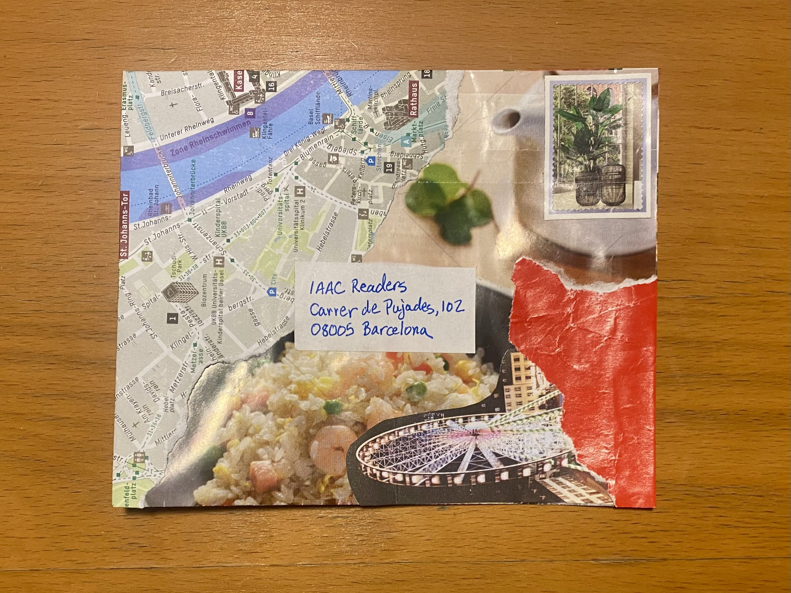
  

  

    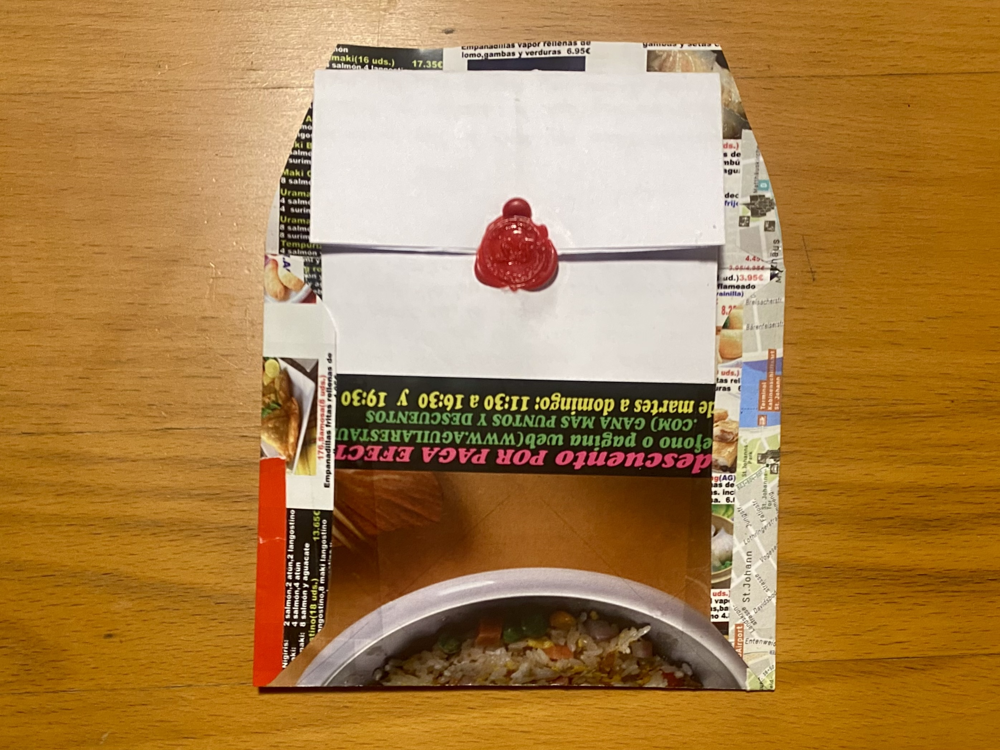
  

  

    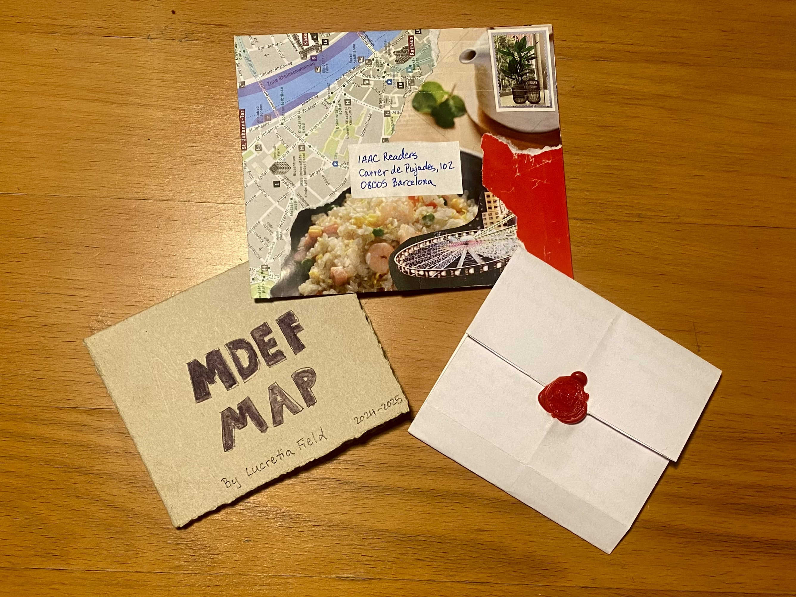
  

  

    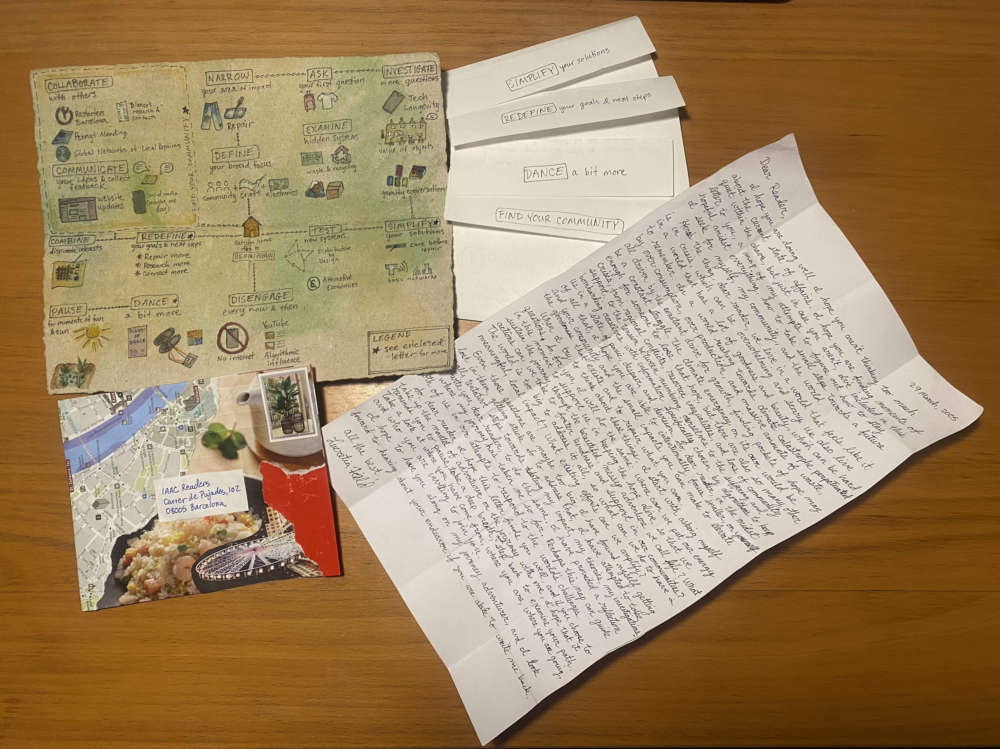
  

  

    
  

  
  

    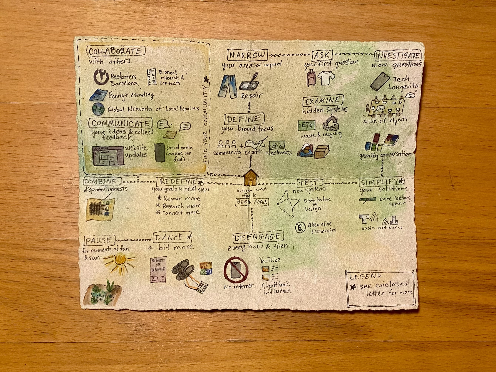
  

  

    
  

  

    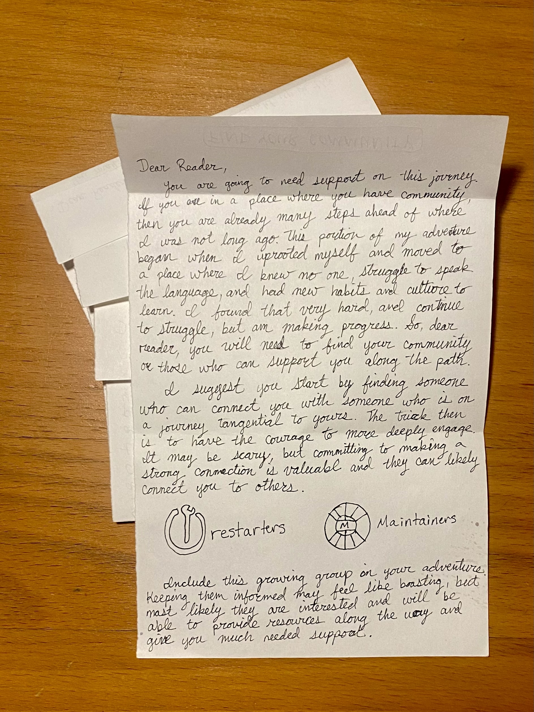
    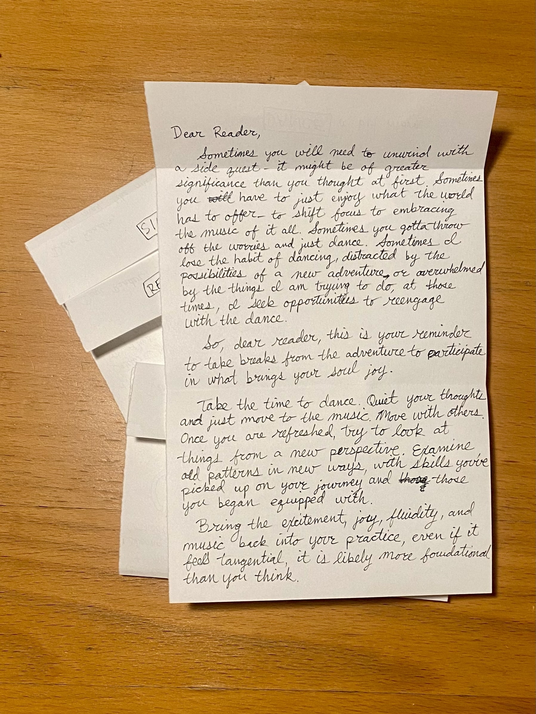
  

  

    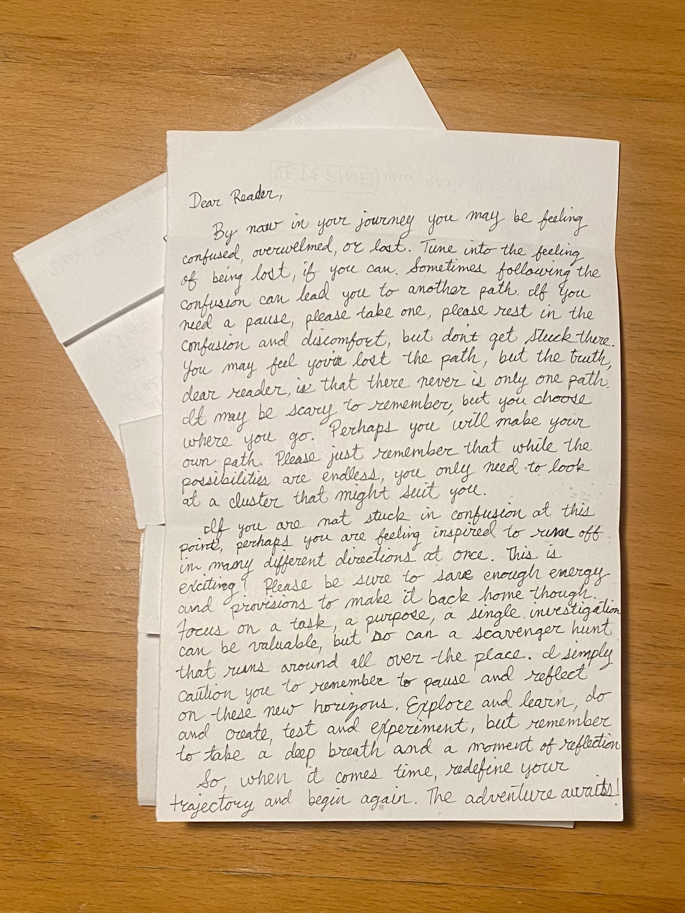
    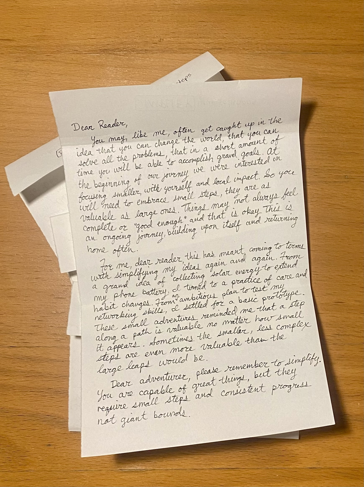
  

  <!-- Next and previous buttons -->
  <a class="prev" onclick="plusSlides(-1)">&#10094;</a>
  <a class="next" onclick="plusSlides(1)">&#10095;</a>

<!-- The dots/circles -->

  
  
  
  
  
  
  
  
  

### The text of the letter:

Dear Reader, 

28 March 2025 

I hope you are doing well. I hope you aren’t thinking too much about the current state of affairs. I hope you are finding moments of quiet within the chaos, but just in case you aren’t, I’ve included in this letter to you, a map of my attempts to figure out how to stay hopeful amidst everything, how to take small steps towards a future I seek for myself, my community, and the world. 

Here’s the thing, dear reader, we live in a world that feels like it is in crisis, which can be overwhelming and scary. We also live in a world that has a lot of goodness and beauty, which can be hard to remember. In a world rushing towards climate catastrophe perpetrated by over-consumption, over-production, and massive amounts of waste, all driven by the constant drive for growth, finding pockets of hope may be a constant struggle. The climate emergency on its own would be enough for someone to lose that hope, but there are also so many other crises, from regional conflicts, resource inequalities, and loss of community support, to the tension between numbing ourselves to the suffering and bombarding ourselves with information specifically chosen by algorithms to keep us in a state of panic, despair, and division. So, dear reader, in the midst of all that, I hope you are able to intentionally focus smaller, on yourself and your community and the small impacts you can make to elevate the goodness that exists and to repair what you can. 

When I try to think about these things, I start with asking myself questions. So, for you, I will do the same. Where can we put our energy in this moment to supports us in keeping the hope alive, so that we can sustain the journey through the beautiful, messy adventure we call life? What actions can we take to foster kindness and support in our communities? The world is too big to address it all, so what can we do to have a meaningful, local impact? What existing efforts can be amplify?

Even these questions are maybe too big.I have found myself getting lost in them, getting stuck. So, to address that, I have attempted to take small, tentative steps towards testing my impact, my theories, my investigations. I invite you, dear reader, to do the same. I have provided a reflection of where my journey has taken me so far. Perhaps this map can guide both of us in our attempts to respond to the world’s challenges. 

So, dear reader, I hope this letter finds you well and if you choose to take up the mantel of adventurer on the journey with me, I hope that it reminds you to pause, take a deep breath, step back to examine your path. Take a look at where you have come from, where you are, where you are going, and who you are inviting to join you. 

I hope to have you along on my journey, adventurer, and I look forward to hearing about your endeavor if you are able to write me back. 

All the best, 

Lucretia Field 

??? note "Find Your Community" 

    Dear Reader, 

	You are going to need support on this journey. If you are in a place where you have community, then you are already many steps ahead of where I was not long ago. This portion of my adventure began when I uprooted myself and moved to a place where I knew no one, struggle to speak the language, and had new habits and cultures to learn. I found that very hard and continue to struggle, but am making progress. So, dear reader, you will need to find your community or those who can support you along the path. 

	I suggest you start by finding someone who can connect you with someone who is on a journey tangential to yours. The trick then, is to have the courage to more deeply engage. It may be scary, but committing to making a strong connection is valuable and they can likely connect you to others. 

	Include this growing group in your adventure. Keeping them informed may feel like boasting, but most likely they are interested and may be able to provide you resources and support along the way. 

??? note "Dance a bit more"

    Dear Reader, 

	Sometimes you will need to rest and unwind with a side quest - it might be of greater significance than you thought at first. Sometimes you have to just enjoy what the world has to offer - to shift focus to embracing the music of it all. Sometimes you gotta throw off the worries and just dance. Sometimes I lose the habit of dancing, distracted by the possibilities of a new adventure or overwhelmed by the things I am trying to do, at those times, I seek opportunities to reengage with the dance. 
	
	So, dear reader, this is your reminder to take breaks from the adventure to participate in what brings your soul joy. 

	Take the time to dance. Quiet your thoughts and just move to music. Move with others. Once you are refreshed, try to look at things from a new perspective. Examine old patterns in new ways, with skills you’ve picked up on your journey and those you began equipped with. 
	
	Bring the excitement, joy, fluidity and music back into your practice, even if it feels tangential, it is likely more foundational than you think. 

??? note "Simplify your solutions" 

    Dear Reader, 

	You may, like me, often get caught up in the idea that you can change the world, that you can solve all the problems, that in a short amount of time you will be able to accomplish grand goals. At the beginning of our journey we were interested in focusing smaller, with yourself and local impact. So you will need to embrace small steps, they are as valuable as large ones. Things may not always feel complete or “good enough” and that is okay. This is an ongoing journey building upon itself and returning home often. 

	For me, dear reader, this has meant coming to terms with simplifying my ideas again and again. From a grand idea of collecting solar energy to extend my phone battery, I turned to a practice of care and habit changes. From an ambitious plan to test my networking skills, I settled for a basic prototype. These small adventures reminded me that a step along a path is valuable no matter how small it appears. Sometimes the smaller, less complex steps are even more valuable than the large leaps would be. 

	Dear adventurer, please remember to simplify. You are capable of great things, but they require small steps and consistent progress not giant bounds. 

    From a grand plan to test my networking skills, to ideas about sustainable energy collection to extend my phone battery, sometimes 

??? note "Redefine your goals & next steps" 

    Dear Reader,

	By now in your journey, you may be feeling confused, overwhelmed, or lost. Tune into the feeling of being lost, if you can. Sometimes following the confusion can lead you to another path. If you need a pause, please take one, please rest in the confusion and discomfort, but don’t get stuck there. You may fear you have lost the path, but the truth, dear reader, is there is that there is never only one path. It may be scary to remember, but you choose where you go. Perhaps you will make your own path. Please just remember that while the possibilities are endless, you only need to look at a cluster that might suit you. 

	If you are not stuck in confusion at this point, perhaps you are feeling inspired to run off in many different directions all at once. This is a very exciting! Please be sure to save enough energy and provisions to make it back home though. Focus on a task, a purpose, a single investigation can be valuable, but so can a scavenger hunt that runs around all over the place. I simply caution you to remember to pause and reflect on these new horizons. Explore and learn, do and create, test and experiment, but remember to take a deep breath and a moment of reflection. 

	So, when it comes time, redefine your trajectory and begin again. The adventure awaits! 

	All the best, 
	Lucretia 

## Peer Interpretation  

What follows is my interpretation of the first draft pictorial by [David](https://davmdef.github.io/MDEFWEB/term2/01-desing-studio%20ll.html){:target="_blank"}. When I saw his draft, I wanted to highlight the multilayer visualization he is using. From what I know about his project, the idea of a welcoming group around a fire was the immediate visual that came to my mind. 

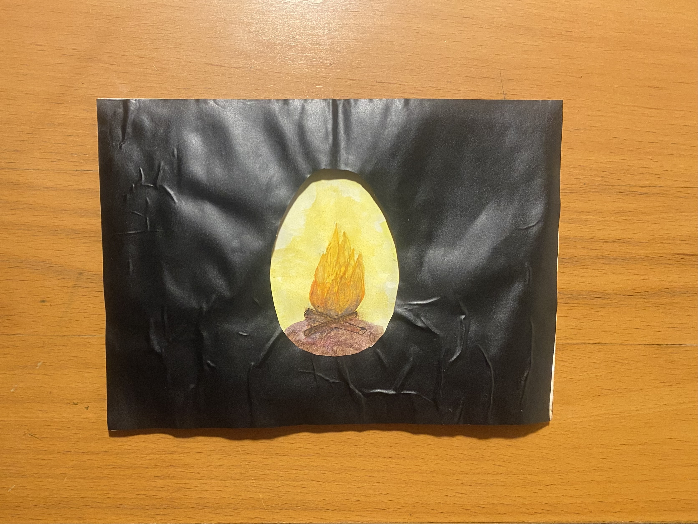 
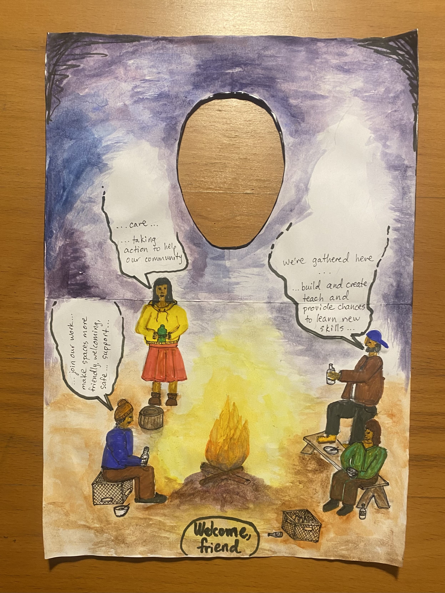 

## Images from Term 

### Photo 1 

 

### Photo 2

### Photo 3

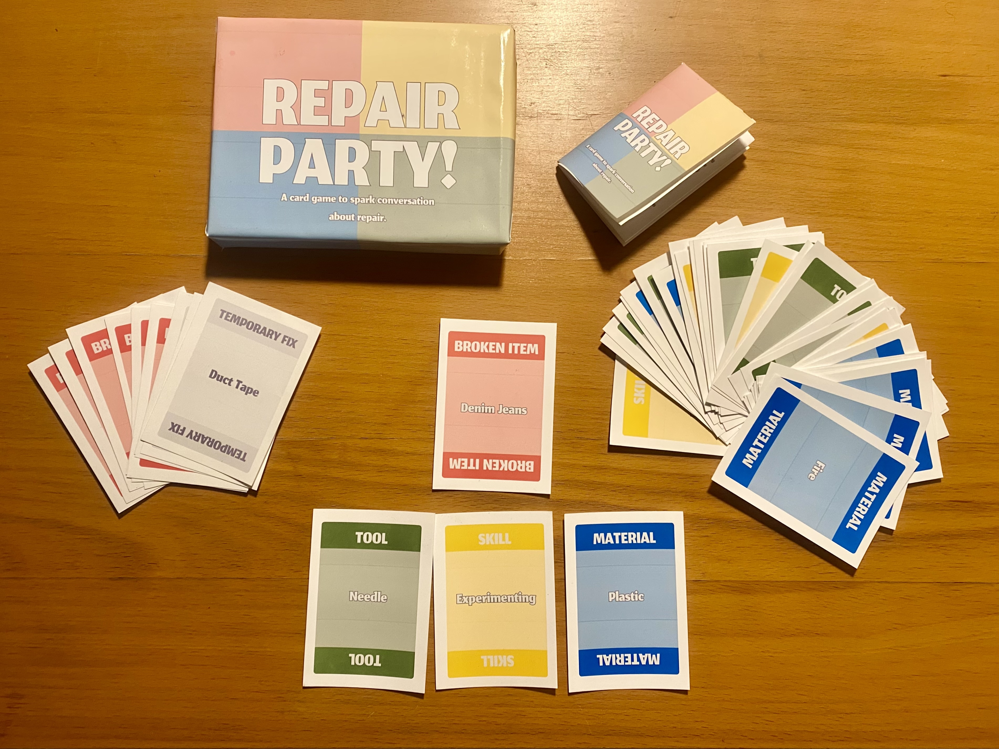

### Photo 4 

### Photo 5 

## Design Space Progression 

### Design Space for Design Dialogue I (End of Term 1)

### Design Space with Term 2 and Community 

### Design Space for Design Dialogue II 
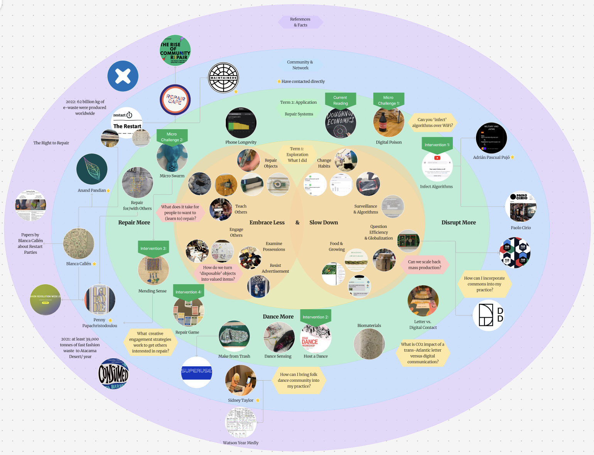

## Audio Reflection 

Below is my audio reflection for the end of term 2. 

 
<figure markdown="span">
    <audio controls src="../../../audio/DesignStudioReflection_EndTerm2.mp3"></audio>
</figure>
