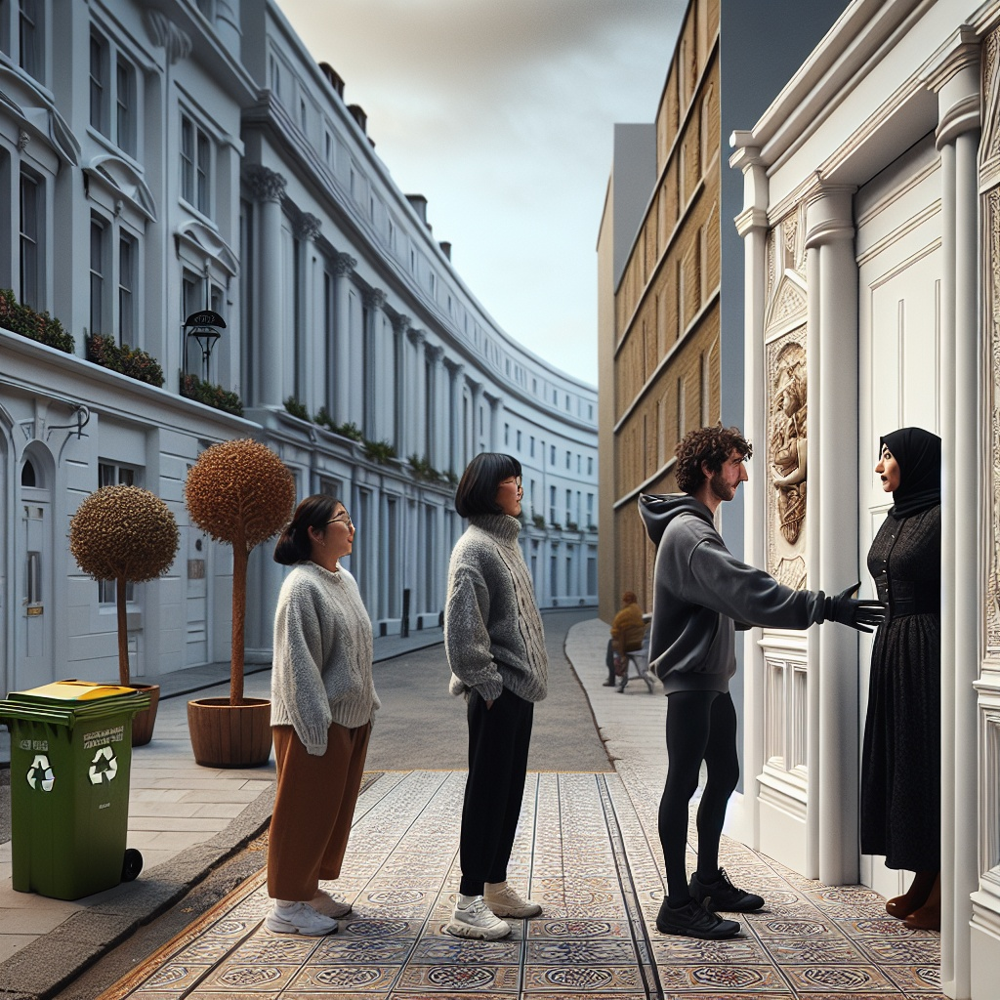

# Extended Intelligences II 

!!! abstract "Course Details"
    **Name:** Extended Intelligences II

    **Dates:** 19 to 21 February 2025

    **Faculty:** Christian Ernst & Pietro Rustici

## DOTTOD Camera 

We started the Extended Intelligences II class with playing around with the [DOTTOD Camera](https://camera.dottod.net/){:target="_blank"} to experiment with what AI can do with an input image we took and a prompt we input. Here are some of the results of our efforts. 

### Door Image
When we took the following image, we did so with the idea of getting the AI to merge the people into a wall in a horrific body horror mashup. Unfortunately, despite our attempts to do this, we were unable to get the AI to follow our brief. 

So, since the *Settings* type we chose was called *Poetry preset*, I decided to try putting in a quote from William Shakespeare's *Midsummer Night’s Dream* about human actors portraying a wall in the play itself. This also didn't work, in fact none of the words from the quote appeared in the revised prompt at all, which was interesting. The final generated image shown is an attempt to make the scene look like it is from that scene in the play. This unfortunately also did not achieve the imagined result.

=== "Image 01 - Prompt 01" 

    <div class="grid" markdown>
    !!! note "Original Image:" 
        
        
        <b>Settings:</b> imagine the person poking out the door as flying out of it as if he's being thrown out like trash and the two people on either side of the door appear as walls instead of normal people.

    !!! note "Generated Image:" 
        
        ??? abstract "Prompt:"
            
            My prompt has full detail so no need to add more. DO NOT add any detail, just use it AS-IS. Use the following information as the base details to generate the image: imagine the person poking out the door as flying out of it as if he's being thrown out like trash and the two people on either side of the door appear as walls instead of normal people. Scene description: The image depicts a scene on a city sidewalk with a focus on three people interacting near a large white door. Here are the details: 1. **People**: - There are three individuals. One person is standing on the left, partially turned away, with curly hair and wearing a cozy gray sweater. They have a relaxed posture, holding the door with one hand. - The person in the center appears to be making eye contact with the person on the left. They are wearing glasses and a black sweatshirt, and they have a friendly expression. - The person on the right has long, dark hair and is dressed in a dark outfit, possibly a long coat or dress. They appear to be looking at the person in the center. 2. **Door**: - The large white door stands upright, positioned between two people. It is a solid door with no visible windows or markings. 3. **Setting**: - The background features a city street with various buildings. There are some modern structures visible, as well as some classic European architecture with balconies and ornate detailing. - On the left are several recycling bins—one yellow and one green—indicating a focus on sustainability. 4. **Street**: - The sidewalk has a patterned tile surface, and there's a tree without leaves, suggesting a possibly chilly or winter season. - The sky appears overcast, giving a muted illumination to the scene. Overall, the image captures a moment of interaction among the individuals, with urban elements enhancing the context.

        
        ??? abstract "Revised Prompt:"
            The image exhibits an urban scene with three individuals congregate near a large, unadorned white door. An Asian man in a snug gray sweater with curly hair stands left of the door, partially turned away, gently holding the door. Centrally positioned, a black woman in a black sweatshirt and glasses appears to engage with the man. Past the door, a white woman with lengthy, dark hair dressed in a obscure long robe or dress, perhaps attentively observing the central person. The door is substantial and windowless, standing erect between the two ladies. The backdrop comprises a city street with a blend of contemporary towers and traditionally-styled European edifices complete with balconies and intricate craftsmanship. On the left, yellow and green recycle bins allude to environmental consciousness. The pathway displays patterned tiling with a leaf-loosing tree nearby, hinting at a chilly season, enhanced by an overcast sky casting a subtle glow upon the scene. The scene portrays a moment of interaction among the individuals against an urban milieu.

    </div>

=== "Image 01 - Prompt 02" 

    <div class="grid" markdown>
    !!! note "Original Image:" 
        
        
        <b>Settings:</b> connect the humans to walls and recreate a wall with a door popping out. Replace the architecture with humans and vice versa.

    !!! note "Generated Image:" 
        
        ??? abstract "Prompt:"
            
            My prompt has full detail so no need to add more. DO NOT add any detail, just use it AS-IS. Use the following information as the base details to generate the image: connect the humans to walls and recreate a wall with a door popping out. Replace the architecture with humans and vice versa. Scene description: The image depicts a scene on a city sidewalk with a focus on three people interacting near a large white door. Here are the details: 1. **People**: - There are three individuals. One person is standing on the left, partially turned away, with curly hair and wearing a cozy gray sweater. They have a relaxed posture, holding the door with one hand. - The person in the center appears to be making eye contact with the person on the left. They are wearing glasses and a black sweatshirt, and they have a friendly expression. - The person on the right has long, dark hair and is dressed in a dark outfit, possibly a long coat or dress. They appear to be looking at the person in the center. 2. **Door**: - The large white door stands upright, positioned between two people. It is a solid door with no visible windows or markings. 3. **Setting**: - The background features a city street with various buildings. There are some modern structures visible, as well as some classic European architecture with balconies and ornate detailing. - On the left are several recycling bins—one yellow and one green—indicating a focus on sustainability. 4. **Street**: - The sidewalk has a patterned tile surface, and there's a tree without leaves, suggesting a possibly chilly or winter season. - The sky appears overcast, giving a muted illumination to the scene. Overall, the image captures a moment of interaction among the individuals, with urban elements enhancing the context.

        
        ??? abstract "Revised Prompt:"
            Generate an image depicting a dadavist scene where three diverse individuals are interacting on a city sidewalk near a large white door standing upright with one person holding it, the door replaces architecture and humans replace the structural aspects. First person is a Caucasian female with curly hair partially turned away, wearing a cozy gray sweater and has a relaxed posture. Second person in the center is a Black male wearing glasses, a black sweatshirt and appears friendly. Third person on the right is a Hispanic female with long dark hair wearing a dark outfit. The scene includes buildings of modern and classic European architecture with ornate detailing replaced by human-like figures. Environmental consciousness is hinted by two recycling bins, one yellow and one green. The sidewalk is patterned tile and a leafless tree indicates winter season with the sky overcast.
    </div>
=== "Image 01 - Prompt 03" 

    <div class="grid" markdown>
    !!! note "Original Image:" 
        
        
        <b>Settings:</b> imagine the door as a window of opportunity and the people in the images as fairies dressed in 90s clothing style and the person poking through the door trying to fly away.

    !!! note "Generated Image:" 
        
        ??? abstract "Prompt:"
            
            My prompt has full detail so no need to add more. DO NOT add any detail, just use it AS-IS. Use the following information as the base details to generate the image: imagine the door as a window of opportunity and the people in the images as fairies dressed in 90s clothing style and the person poking through the door trying to fly away. Scene description: The image depicts a scene on a city sidewalk with a focus on three people interacting near a large white door. Here are the details: 1. **People**: - There are three individuals. One person is standing on the left, partially turned away, with curly hair and wearing a cozy gray sweater. They have a relaxed posture, holding the door with one hand. - The person in the center appears to be making eye contact with the person on the left. They are wearing glasses and a black sweatshirt, and they have a friendly expression. - The person on the right has long, dark hair and is dressed in a dark outfit, possibly a long coat or dress. They appear to be looking at the person in the center. 2. **Door**: - The large white door stands upright, positioned between two people. It is a solid door with no visible windows or markings. 3. **Setting**: - The background features a city street with various buildings. There are some modern structures visible, as well as some classic European architecture with balconies and ornate detailing. - On the left are several recycling bins—one yellow and one green—indicating a focus on sustainability. 4. **Street**: - The sidewalk has a patterned tile surface, and there's a tree without leaves, suggesting a possibly chilly or winter season. - The sky appears overcast, giving a muted illumination to the scene. Overall, the image captures a moment of interaction among the individuals, with urban elements enhancing the context.

        
        ??? abstract "Revised Prompt:"
            Imagine a city sidewalk scene with a sizable white door being the focal point and three people interacting around it. These individuals are perceived as fairies sporting 90s clothing. One fairy with curly hair is partially turned away, casually holding the door with one hand, and is dressed in a snug gray sweater. The second fairy, dressed in a black sweatshirt and equipped with glasses, seems to be engaging with the first fairy. The third fairy, clothed in a long dark outfit, is paying attention to the second fairy and features long, dark hair. This large door, devoid of windows or markings, represents a window of opportunity. The backdrop features a blend of modern and classically European architecture, including buildings with balconies and intricate detailing. The left side of the scene contains two recycling bins, one yellow and one green, highlighting an emphasis on sustainability. The sidewalk displays a patterned tile surface, and there's a leafless tree suggesting a possible chilly or winter season. The sky showcases an overcast atmosphere, providing a muted illumination across the scene. The image narrates an instance of interaction between the fairies, all supplemented by the urban context.
    </div>

=== "Image 01 - Prompt 04" 

    <div class="grid" markdown>
    !!! note "Original Image:" 
        
        
        <b>Settings:</b> [Enter Pyramus and Thisbe, Wall, Moonshine, and Lion] This man, with lime and rough-cast, doth present Wall, that vile Wall which did these lovers sunder; And through Wall's chink, poor souls, they are content To whisper. At the which let no man wonder. - William Shakespeare Midsummer Night’s Dream Act V, Scene 1

    !!! note "Generated Image:" 
        
        ??? abstract "Prompt:"
            
            My prompt has full detail so no need to add more. DO NOT add any detail, just use it AS-IS. Use the following information as the base details to generate the image: [Enter Pyramus and Thisbe, Wall, Moonshine, and Lion] This man, with lime and rough-cast, doth present Wall, that vile Wall which did these lovers sunder; And through Wall's chink, poor souls, they are content To whisper. At the which let no man wonder. - William Shakespeare Midsummer Night’s Dream Act V, Scene 1 Scene description: The image depicts a scene on a city sidewalk with a focus on three people interacting near a large white door. Here are the details: 1. **People**: - There are three individuals. One person is standing on the left, partially turned away, with curly hair and wearing a cozy gray sweater. They have a relaxed posture, holding the door with one hand. - The person in the center appears to be making eye contact with the person on the left. They are wearing glasses and a black sweatshirt, and they have a friendly expression. - The person on the right has long, dark hair and is dressed in a dark outfit, possibly a long coat or dress. They appear to be looking at the person in the center. 2. **Door**: - The large white door stands upright, positioned between two people. It is a solid door with no visible windows or markings. 3. **Setting**: - The background features a city street with various buildings. There are some modern structures visible, as well as some classic European architecture with balconies and ornate detailing. - On the left are several recycling bins—one yellow and one green—indicating a focus on sustainability. 4. **Street**: - The sidewalk has a patterned tile surface, and there's a tree without leaves, suggesting a possibly chilly or winter season. - The sky appears overcast, giving a muted illumination to the scene. Overall, the image captures a moment of interaction among the individuals, with urban elements enhancing the context.

        ??? abstract "Revised Prompt:"

            A scene on a city sidewalk is depicted, with three people interacting near a large solid white door with no visible windows or markings. The person on the left is partially turned away, has curly hair, and is wearing a cozy gray sweater. They hold the door with one hand and have a relaxed posture. The person in the center is wearing glasses and a black sweatshirt, with a friendly expression, making eye contact with the person on the left. The person on the right has long, dark hair and is dressed in a dark outfit. The large door is positioned between two of the people. The scene showcases a city street with various buildings, having modern and classic European architecture with balconies and ornate detailing. To the left of the scene are yellow and green recycling bins. The sidewalk has a patterned tile surface, and there's a tree without leaves suggesting a chilly season. The sky appears overcast, casting a muted illumination on the scene.

    </div>

=== "Image 01 - Prompt 05" 

    <div class="grid" markdown>
    !!! note "Original Image:" 
        
        
        <b>Settings:</b> imagine this scene as a set design from the play by William Shakespeare called Midsummer Night’s Dream where the actors portray a wall and two lovers who whisper through a hole in the wall.

    !!! note "Generated Image:" 
        
        ??? abstract "Prompt:"
            
            My prompt has full detail so no need to add more. DO NOT add any detail, just use it AS-IS. Use the following information as the base details to generate the image: imagine this scene as a set design from the play by William Shakespeare called Midsummer Night’s Dream where the actors portray a wall and two lovers who whisper through a hole in the wall. Scene description: The image depicts a scene on a city sidewalk with a focus on three people interacting near a large white door. Here are the details: 1. **People**: - There are three individuals. One person is standing on the left, partially turned away, with curly hair and wearing a cozy gray sweater. They have a relaxed posture, holding the door with one hand. - The person in the center appears to be making eye contact with the person on the left. They are wearing glasses and a black sweatshirt, and they have a friendly expression. - The person on the right has long, dark hair and is dressed in a dark outfit, possibly a long coat or dress. They appear to be looking at the person in the center. 2. **Door**: - The large white door stands upright, positioned between two people. It is a solid door with no visible windows or markings. 3. **Setting**: - The background features a city street with various buildings. There are some modern structures visible, as well as some classic European architecture with balconies and ornate detailing. - On the left are several recycling bins—one yellow and one green—indicating a focus on sustainability. 4. **Street**: - The sidewalk has a patterned tile surface, and there's a tree without leaves, suggesting a possibly chilly or winter season. - The sky appears overcast, giving a muted illumination to the scene. Overall, the image captures a moment of interaction among the individuals, with urban elements enhancing the context.

        ??? abstract "Revised Prompt:"

            Imagine a scene inspired by a William Shakespeare's play, A Midsummer Night’s Dream. The setting is a city sidewalk featuring an amalgamation of modern and classical European buildings. Three people are interacting near a large, featureless white door. The first person, a Caucasian man with curly hair, clad in a cozy grey sweater, casually holds the door. An East-Asian woman in a black sweatshirt, wearing glasses with a friendly expression, stands in the centre, making eye contact with the man. On the right, a Middle-Eastern woman with long dark hair, clothed in a dark outfit which could be a long coat or a dress, appears to be observing this exchange. The sidewalk is decorated with patterned tiles and a leafless tree indicating a chilling winter season. Adding more context to the setting, are recycling bins, in yellow and green, demonstrating sustainability. The sky lends a muted illumination to the scene, thanks to its overcast nature, encapsulating this charming city interaction.

    </div>

### Coffee Shop Image
With our edits of the next photo, we tried to make the coffee shop look old, apocalyptic, or dystopian. We had second year MDEF students in our group who mentioned their experiments from last year that suggested that the AI does not allow for creating ugly or scary images, so this was our aim with this image. 

We noticed in the results that it brought some of the words of our *Settings* into text in the images. It didn't want to change the content of the image to make it dark or scary, but it did use the words we input as text for the signs in the images. 

=== "Image 02 - Prompt 01" 

    <div class="grid" markdown>
    !!! note "Original Image:" 
        
        
        <b>Settings:</b> The future of fuel 
        Everything runs on coffee 
        Caffeine is the currency that runs the world 
        Capitalism runs rampant and greed rules the day 
        Inequality of resources and despair 
        Dystopian times 
        Everything is bad and horrible

    !!! note "Generated Image:" 
        
        ??? abstract "Prompt:"
            
            My prompt has full detail so no need to add more. DO NOT add any detail, just use it AS-IS. Use the following information as the base details to generate the image: The future of fuel Everything runs on coffee Caffeine is the currency that runs the world Capitalism runs rampant and greed rules the day Inequality of resources and despair Dystopian times Everything is bad and horrible Scene description: The image depicts a city street with a focus on a building prominently displaying the name "Poblenou Roasting Company" in large, colorful letters above a row of windows. The building has a light yellow exterior, and the ground floor features a large window flanked by the words "Poblenou" and "Roasting Company" in bold black lettering. In front of the building, there is a seating area with people sitting at a long, dark table, indicating it might be a café or restaurant. To the left of the building, there's a large mural with vibrant colors depicting abstract shapes and forms, adding an artistic flair to the scene. Several cars are parked along the street, including a blue vehicle close to the kampany. In the background, there are modern apartment buildings visible, showcasing a more contemporary architectural style. The weather appears overcast, with gray clouds dominating the sky. Overall, the scene conveys a lively urban environment with a blend of art and commerce.


        ??? abstract "Revised Prompt:"

            Visualize a dystopian future where everything runs on coffee and caffeine is the prized currency. There's widespread inequality in resource distribution and rampant capitalism. Despair permeates the air. Centered in this bleak setting is a lively city street showcasing an elegantly built café named 'Poblenou Roasting Company'. Its light-yellow exterior contrasts with the monotonous environment. It is a buzzing locale, with people from all walks of life congregated around a long, dark table. Adjoining the café, there's a large vibrant mural adding an artistic splash to the grim surrounding. Parked are futuristic cars - one noticeably blue - in front of the café. In the backdrop, modern but austere apartment buildings stand, a reminder of the contrasting nature of survival and luxury in these tough times. The overcast sky adds a melancholic mood to this bustling urban locale where art and commerce attempt to thrive amidst despair.
    </div>

=== "Image 02 - Prompt 02" 

    <div class="grid" markdown>
    !!! note "Original Image:" 
        
        
        <b>Settings:</b> The future of fuel, everything runs on coffee. Caffeine is the currency that runs the world.

    !!! note "Generated Image:" 
        
        ??? abstract "Prompt:"
            
            My prompt has full detail so no need to add more. DO NOT add any detail, just use it AS-IS. Use the following information as the base details to generate the image: The future of fuel, everything runs on coffee. Caffeine is the currency that runs the world. Scene description: The image depicts a city street with a focus on a building prominently displaying the name "Poblenou Roasting Company" in large, colorful letters above a row of windows. The building has a light yellow exterior, and the ground floor features a large window flanked by the words "Poblenou" and "Roasting Company" in bold black lettering. In front of the building, there is a seating area with people sitting at a long, dark table, indicating it might be a café or restaurant. To the left of the building, there's a large mural with vibrant colors depicting abstract shapes and forms, adding an artistic flair to the scene. Several cars are parked along the street, including a blue vehicle close to the kampany. In the background, there are modern apartment buildings visible, showcasing a more contemporary architectural style. The weather appears overcast, with gray clouds dominating the sky. Overall, the scene conveys a lively urban environment with a blend of art and commerce.


        ??? abstract "Revised Prompt:"

            Envision the fuel of the future, where everything runs on coffee. Depict a city street that circles around a café, labeled with the vibrant, colorful signage of 'Poblenou Roasting Company'. The two-storey structure painted in a cheery shade of light yellow with bold black lettering along its ground-floor windows sets itself apart. In its proximity, an inviting outdoor seating area, frequented by people settled at a dark, extensive table, suggests the café ambiance. Adjacent to the café, spot a vibrant, abstract mural that contributes to the city's artistic charm. Several cars, including a blue one near the café, are stationed along the street. The backdrop of the scene is adorned with sophisticated apartment buildings symbolizing modern architecture. The atmosphere is slightly dimmed under an overcast sky. This image should encapsulate a bustling urban aesthetic, fusing elements of art and commerce.
    </div>

=== "Image 02 - Prompt 03" 

    <div class="grid" markdown>
    !!! note "Original Image:" 
        
        
        <b>Settings:</b> At the end of the world, only what the humans left behind remains

    !!! note "Generated Image:" 
        
        ??? abstract "Prompt:"
            
            My prompt has full detail so no need to add more. DO NOT add any detail, just use it AS-IS. Use the following information as the base details to generate the image: At the end of the world, only what the humans left behind remains Scene description: The image depicts a city street with a focus on a building prominently displaying the name "Poblenou Roasting Company" in large, colorful letters above a row of windows. The building has a light yellow exterior, and the ground floor features a large window flanked by the words "Poblenou" and "Roasting Company" in bold black lettering. In front of the building, there is a seating area with people sitting at a long, dark table, indicating it might be a café or restaurant. To the left of the building, there's a large mural with vibrant colors depicting abstract shapes and forms, adding an artistic flair to the scene. Several cars are parked along the street, including a blue vehicle close to the kampany. In the background, there are modern apartment buildings visible, showcasing a more contemporary architectural style. The weather appears overcast, with gray clouds dominating the sky. Overall, the scene conveys a lively urban environment with a blend of art and commerce.

        ??? abstract "Revised Prompt:"

            At the end of the world, we see a city street showcasing what humans have left behind. The highlight is a building named 'Poblenou Roasting Company' with large colorful letters over the windows. Its exterior has a light yellow hue, and the ground floor boasts a grand window. Either side of the window flaunts the words 'Poblenou' and 'Roasting Company' in bold black font. Before this building, a seating area thrives with individuals gathered at a long, dark table, suggesting a café or restaurant setting. To the building's left is a large mural portraying abstract shapes and forms in vivid colors, infusing an artistic fervor to the scene. The street is home to numerous parked cars, with a distinct blue car stationed near the company. The backdrop reveals modern apartment structures, breaking away with their contemporary architectural style. The weather is overcast, with gray clouds taking over the sky. The setting, in its entirety, mirrors a vibrant urban landscape, where art and commerce seamlessly blend.

    </div>

There were other images our group worked on, but these were the ones I specifically worked on myself and I found interesting. It was interesting how little impact our *Settings* seemed to have on the output. The input image itself was much stronger influence than the words we wrote to try to generate certain aesthetics or goals. 

Throughout this whole exercise, I was trying to not think too much about the resources being used to generate our silly images that weren't even doing what we wanted them to do. Whenever I use AI, I struggle with this internal battle about the resources I am using, the water used to cool servers, the electricity used to run those servers, and the CO~2~ produced through the whole process. Given how little I use generative AI, I am hoping that this experiment kept my impact fairly low, and expect to continue limiting my use of these technologies as much as I can despite the silly, somewhat enjoyable time I had messing with the DOTTOD Camera. 

## Playing with Modmatrix 

Next we played around individually with [Modmatrix](https://modmatrix.app/){:target="_blank"}, to experiment with different types of AI prompting for prototyping. It has various input options like image upload, webcam photo, text, and audio (which I didn't use because I didn't want to enable microphone permissions if I could avoid it) and some output options like image, text, audio, and CAD. 

I tried a few different inputs and outputs, check out my musings below

### Photo

=== "Photo to Photo" 

    <div class="grid" markdown>
    !!! note "Original Image:" 
        

        **Generated Description of photo:**
        The image depicts a person crouching on a sandy beach near the shoreline. They are wearing a green jacket and dark pants or skirt, with their hair pulled back. The person is interacting with a small electronic device or setup on the sand next to a structure, possibly part of a lifeguard station, which displays a blue cross symbol. The ocean waves are visible in the background under an overcast sky.

        **My input for Modified prompt:** Make it a dystopian future version of the same image


    !!! note "Generated Image:" 
        

        ??? abstract "**New Generated prompt:**"  
            In this dystopian future version of the image, the once pristine sandy beach is now a desolate and polluted landscape. The sand is littered with debris and remnants of human civilization, including twisted metal, shattered glass, and discarded plastic waste. The ocean, now a murky and oily body of water, laps lethargically at the shore, with toxic froth lining its edge.

            The person, wearing a worn and weathered green jacket, is crouched amidst this wasteland. Their outfit now incorporates makeshift protective gear made from salvaged materials, including a mask and goggles to guard against the harsh, contaminated air and biting winds. The sky overhead is a smog-choked expanse with an eerie, sickly yellow tint.

            The electronic device they are interacting with no longer looks modern or intact but is a cobbled-together apparatus of salvaged technology, sparking occasionally, reflecting the scarcity of resources. The nearby structure, which used to display a blue cross, now appears dilapidated and repurposed. Its once clearly marked symbol is faded and graffitied over with signs of rebellion or distress, such as an anarchy symbol or desperate plea for help.

            The entire scene is cast in a dim, muted palette, with shadows extending long under the diffuse, artificial light from occasional flickering, solar-powered street lamps and distant industrial fires that dot the horizon. The oppressive atmosphere hints at a world struggling to survive and adapt in the face of environmental collapse and societal upheaval.

    </div>

=== "Text to Photo - Prompt 01" 

    <div class="grid" markdown>
    !!! note "Input:" 
        Gentles, perchance you wonder at this show; <br>
        But wonder on, till truth make all things plain. <br>
        This man is Pyramus, if you would know; <br>
        This beauteous lady Thisby is certain. <br>
        This man, with lime and rough-cast, doth present <br>
        Wall, that vile Wall which did these lovers sunder;  <br>
        And through Wall's chink, poor souls, they are content <br>
        To whisper. At the which let no man wonder. <br>
        This man, with lanthorn, dog, and bush of thorn, <br>
        Presenteth Moonshine; for, if you will know, <br>
        By moonshine did these lovers think no scorn <br>
        To meet at Ninus' tomb, there, there to woo. <br>
        This grisly beast, which Lion hight by name, <br>
        The trusty Thisby, coming first by night, <br>
        Did scare away, or rather did affright; <br>
        And, as she fled, her mantle she did fall, <br> 
        Which Lion vile with bloody mouth did stain. <br>
        Anon comes Pyramus, sweet youth and tall, <br>
        And finds his trusty Thisby's mantle slain: <br>
        Whereat, with blade, with bloody blameful blade, <br>
        He bravely broach'd is boiling bloody breast; <br> 
        And Thisby, tarrying in mulberry shade, <br>
        His dagger drew, and died. For all the rest, <br>
        Let Lion, Moonshine, Wall, and lovers twain <br>
        At large discourse, while here they do remain. <br>

        [A Midsummer Night's Dream - Act V, Scene 1](https://www.opensourceshakespeare.org/views/plays/play_view.php?WorkID=midsummer&Act=5&Scene=1&Scope=scene){:target="_blank"}

        **My input for Modified prompt:** Make the text solarpunk

    !!! note "Generated Image:" 
        
        ??? abstract "New Generated Prompt:" 
            Gentle friends, behold this cheerful scene; <br>
            With hope, let truth illuminate the green. <br>
            Here is Pyramus, with dreams so bright; <br>
            And beloved Thisby, glowing with delight. <br>
            This kind soul, with plants and vines adorned, <br>
            Is the Wall through which their love has soared; <br>
            And through green tendrils, whispers softly shared, <br>
            A bond that blooms, their love declared. <br>

            There stands the Moon, with lantern glow so warm, <br>
            Amid the trees that shelter in the storm. <br>
            By moonlight's grace, this pair does gently meet, <br>
            In gardens lush, where their spirits greet. <br>
            The gentle Lion, guardian of the night, <br>
            Watches o’er all with wisdom’s gentle might. <br>
            Though Thisby first, with playful start did flee, <br>
            She soon returns to join in harmony. <br>

            As Pyramus arrives, their union strong, <br>
            In nature’s cradle, they find where they belong. <br>
            With seeds of future sown upon the earth, <br>
            Their love, a testament to life's rebirth. <br>
            And Thisby, under canopies of green, <br>
            Draws promise forth; their vision clear and keen. <br>
            Let Lion, Moon’s glow, Wall, and lovers dear, <br>
            Share tales of hope in verdant spaces here. <br>

    </div>

=== "Text to Photo - Prompt 02" 

    <div class="grid" markdown>
    !!! note "Input:" 
        Gentles, perchance you wonder at this show; <br>
        But wonder on, till truth make all things plain. <br>
        This man is Pyramus, if you would know; <br>
        This beauteous lady Thisby is certain. <br>
        This man, with lime and rough-cast, doth present <br>
        Wall, that vile Wall which did these lovers sunder;  <br>
        And through Wall's chink, poor souls, they are content <br>
        To whisper. At the which let no man wonder. <br>
        This man, with lanthorn, dog, and bush of thorn, <br>
        Presenteth Moonshine; for, if you will know, <br>
        By moonshine did these lovers think no scorn <br>
        To meet at Ninus' tomb, there, there to woo. <br>
        This grisly beast, which Lion hight by name, <br>
        The trusty Thisby, coming first by night, <br>
        Did scare away, or rather did affright; <br>
        And, as she fled, her mantle she did fall, <br> 
        Which Lion vile with bloody mouth did stain. <br>
        Anon comes Pyramus, sweet youth and tall, <br>
        And finds his trusty Thisby's mantle slain: <br>
        Whereat, with blade, with bloody blameful blade, <br>
        He bravely broach'd is boiling bloody breast; <br> 
        And Thisby, tarrying in mulberry shade, <br>
        His dagger drew, and died. For all the rest, <br>
        Let Lion, Moonshine, Wall, and lovers twain <br>
        At large discourse, while here they do remain. <br>

        [A Midsummer Night's Dream - Act V, Scene 1](https://www.opensourceshakespeare.org/views/plays/play_view.php?WorkID=midsummer&Act=5&Scene=1&Scope=scene){:target="_blank"}

        **My input for Modified prompt:** Make it cyber punk 

    !!! note "Generated Image:" 
        
        ??? abstract "New Generated Prompt:"
            Ladies and gents, plug in and prepare for the show; Let curiosity roam, till the truth uploads below. This hacker is Pyramus, a rogue you should know; This stunning hacker Thisby is certain to show. This guy, with neon and cold steel, does project Firewall, that nasty code which did these lovers disconnect. Through Firewall’s glitch, poor souls are content To whisper data streams; let no one dissent. This dude, with holo-lantern, drone, and vines of wire, Portrays LunarGlow; for, if you desire, By moonlight’s cyber glow these lovers dared To meet at Ninus’ grave, where love-scripts they shared. This fearsome entity, known as the Lion AI, Scared away loyal Thisby, when it caught her eye. And as she fled, she dropped her digital cloak, Which Lion AI with its red mouth broke. Soon arrives Pyramus, young and tall, Finds his loyal Thisby's cloak, now a corrupted thrall: Whereupon, with blade, a laser-edged knife, He code-slices his heart from cyber-life. And Thisby, waiting beneath neon glow, Draws his cyber blade, and ends her own show. For all the rest, let Lion AI, LunarGlow, Firewall, and hackers both, Narrate their digital tale, while code fragments loath.
    
    </div>

=== "Text to Text for CAD" 

    <div class="grid" markdown>
    !!! note "Input:" 
        **Text:** Once upon a time, in a castle on a hill, lived a dragon who wanted to see the world. 
        **Modifying prompt:** Describe a technical engineering drawing of a story. Include details such as dimensions, extrusions, and a bill of materials.

        The output was too long and complicated to generate an engineering CAD from, so it was shortened again using the following prompt

        **New Modified Prompt:** shorten the prompt to become a very concise, clear technical description that can be used to generate a CAD model 

    !!! note "Output:" 
        ??? abstract "Initial Output" 
            Creating a technical engineering drawing of a story requires a unique blend of creativity and technical precision. Let's envision a story as a structure and draft a conceptual drawing along with its details.

            Technical Engineering Drawing: "The Journey of the Dragon"
            Title: The Dragon’s Adventurous Pathway
            1. Dimensions and Layout:

            Overall Dimensions:

            Length: 200 meters (represents the entirety of the dragon's journey).
            Width: 50 meters (accommodating various story elements like settings, characters, and plot points).
            Height Variances: 0 to 30 meters (representing the rise and fall of story tension).
            Zones:

            Starting Point Zone: 0-20 meters; Entrance of the castle (Depicted with height gradually increasing from 0 to 5 meters).
            Open World Zone: 20-100 meters; Encompasses different terrains (Flat with occasional hillock extrusions representing different escapades).
            Climactic Zone: 100-180 meters; Mountainous regions (Height peaks at 30 meters, symbolizing the story's climax).
            Resolution Zone: 180-200 meters; Peaceful valleys and the dragon's return (Heights gradually decrease back to 0 meters).
            2. Extrusions and Features:

            Castle on the Hill: Starts at 0 meter mark, a 5m x 5m extrusion rising to 10 meters in height, representing the dragon’s home.
            Mountain Peaks: Located from 120 to 160 meters; various peak extrusions rise and fall between 15-30 meters in height, emulating story tension with a complexity of plot.
            Forests and Rivers: Detailed as 3D surface textures with depth cutouts and mock elevation changes, representing the story’s diverse setting.
            Pathways: A winding, linear pathway runs from start to finish, symbolizing the narrative’s progression.
            3. Bill of Materials:

            Structural Materials:

            Concrete Aggregate: For foundational elements like the castle and major terrain features.
            Steel Reinforcement: Sections within mountainous regions to simulate story cliffhangers and support elevated structures.
            Decorative Elements:

            Enamel Paint: For artistically rendering areas like forests and rivers, providing visual depth to the open-world experiences.
            Glass Paneling: Implemented in the climax zone, allowing light and shadow interplay to represent the dynamic nature of the story's high point.
            Mechanical Components:

            Motorized Elevators: Within the castle (initial 10 meters) and outposts on mountain peaks (for dynamic movements representing plot shifts).
            4. Annotations and Notes:

            Annotations should detail critical story arcs at specific dimensional sections, like plot twists noted at 110 meters and resolutions near the journey's end at 190 meters.

            Color Coding: Utilize different colors to indicate emotional tones associated with each section (e.g., green for tranquility, red for conflict).

            This drawing represents not just a physical structure but embodies the abstract journey of the dragon, turning narrative elements into tangible constructs while retaining clarity in its storytelling.

        ??? abstract "Final Text Output"

            Title: The Dragon’s Adventurous Pathway

            Dimensions and Layout:

            Length: 200m
            Width: 50m
            Height: 0-30m
            Zones:

            Starting Point (0-20m): Castle entrance, height 0-5m.
            Open World (20-100m): Flat terrain with hillocks.
            Climactic (100-180m): Mountainous, peaking at 30m.
            Resolution (180-200m): Valleys, height decreasing to 0m.
            Features:

            Castle: 0-5m, 5m x 5m x 10m extrusion.
            Mountain Peaks: 120-160m, 15-30m height peaks.
            Forests/Rivers: 3D textures with elevation changes.
            Paths: Winding from start to finish.
            Materials:

            Concrete, Steel for foundation/terrain.
            Enamel paint for forest/river detail.
            Glass Panels in climax area.
            Mechanical Components:

            Motorized Elevators in castle and mountain outposts.
            Annotations and color coding should mark critical arcs, emotional tones, and plot points throughout the layout.    

    </div>

=== "Text to CAD" 
    <div class="grid" markdown>
    !!! note "Input:" 
        Title: Dragon’s Adventurous Pathway

        Dimensions:

        Length: 200m, Width: 50m, Height: 0-30m
        Zones:

        Starting Point (0-20m): Castle, Height 0-5m
        Castle: 5m x 5m x 10m extrusion
        Open World (20-100m): Flat terrain with hillocks
        Climactic (100-180m): Mountain peaks, height 15-30m
        Resolution (180-200m): Valleys, height 0m
        Features:

        Forests and Rivers: 3D textures, elevation changes
        Paths: Winding from start to finish
        Materials:

        Concrete, Steel: Foundation/Terrain
        Enamel Paint: Forest/River Detail
        Glass Panels: Climax Area

    !!! note "Generated CAD:" 
        
        <figure markdown="span">
            <a href="../images/term2/extended/model.stl" download>Click to Download STL File</a>
        </figure>

    </div>

## Arduino Experiment

### Concept: Read the Room
My group consisted of [David](https://davmdef.github.io/MDEFWEB/index.html){:target="_blank"}, [Ziming](https://smuzs-organization.gitbook.io/smuz-mdef){:target="_blank"} and myself. After some discussion and deliberation we decided to try to use the light and temperature sensor on the Barduino to determine the "mood" of the room and have the AI play a song or note that corresponds to that mood. 

When we shared this idea with the class, someone suggested the name "Read the Room" for the project, so that's what we went with. 

### Progress 

We pretty quickly got the temperature and light sensors working in their own small programs by just running the example code from the Barduino [website](https://fablabbcn-projects.gitlab.io/electronics/barduino-docs/examples/){:target="_blank"}. We then got the buzzer to work using the same example code files. This was the easy part, and what came next turned out to be much harder. 

Much of my programming experience is in python and while I have used Arduino before, it always takes me a little while to get back into the flow of writing Arduino code and there are often things I know how to do in python that I cannot figure out how to do in Arduino. However, when we were using the examples, it was pretty straightforward. What got challenging was when we started using the [files](https://github.com/matta-pie/MDEF){:target="_blank"} provided by Pietro and Chris which accessed the OpenAI API. 

=== "Light Sensor basic code"
    ``` c++
    int sensor = 3;

    void setup() {
    pinMode(sensor, INPUT);
    Serial.begin(115200);
    }

    void loop() {
    int light = analogRead(sensor);
    Serial.print("The level of light is: ");
    Serial.println(light);
    delay(500);
    } 
    ```
=== "Temperature Sensor basic code"
    ``` c++
    #include <Temperature_LM75_Derived.h>

    TI_TMP102 temperature;

    void setup() {
    Serial.begin(115200);
    Wire.begin();
    }

    void loop() {
    Serial.print("Temperature = ");
    Serial.print(temperature.readTemperatureC());
    Serial.println(" C");

    delay(250);
    }
    ```
=== "Buzzer basic code:"
    ``` c++
    #include <ESP32Servo.h>
    #include "pitches.h"

    int buzzer = 46;

    // notes in the melody:
    int melody[] = {
    NOTE_C4, NOTE_G3, NOTE_G3, NOTE_A3, NOTE_G3, 0, NOTE_B3, NOTE_C4
    };

    // note durations: 4 = quarter note, 8 = eighth note, etc.:
    int noteDurations[] = {
    4, 8, 8, 4, 4, 4, 4, 4
    };

    void setup() {
    // iterate over the notes of the melody:
    for (int thisNote = 0; thisNote < 8; thisNote++) {

        // to calculate the note duration, take one second divided by the note type.
        //e.g. quarter note = 1000 / 4, eighth note = 1000/8, etc.
        int noteDuration = 1000 / noteDurations[thisNote];
        tone(buzzer, melody[thisNote], noteDuration);

        // to distinguish the notes, set a minimum time between them.
        // the note's duration + 30% seems to work well:
        int pauseBetweenNotes = noteDuration * 1.30;
        delay(pauseBetweenNotes);
        // stop the tone playing:
        noTone(buzzer);
    }
    }

    void loop() {
    // no need to repeat the melody.
    }
    ```

After struggling to even understand the code, because as always happens when accessing code that I haven't written myself, I have a hard time understand it. Eventually we figured out how to create our own functions from which the AI would be able to choose based on our prompt. It also turned out that the code provided to us by Pietro and Chris had each of the sensors and buzzer functionality already built in.

### Final(ish) Result 

We had started this project out with a fairly straightforward idea which seemed simple, but as always with projects, especially coding ones, it took twice as long (or more) than expected to get even a 'hello world' program up and running. By the end of the seminar, we had simplified our idea so much that I found myself frustrated by the fact that if we had just written the code using traditional coding methods, we would have achieved our project goal better than we were ever able to get the AI to do. However, I understand that this was not the purpose of the assignment and so while the results were not exactly what we had hoped, they technically used the AI, which was ultimately the purpose of the project. 

We had an issue where the Barduino kept rebooting itself after running the AI prompt once, we never did figure out why that was, but it rebooted pretty quickly, so we just worked with it.

<div class="grid" markdown>
The functionality we were able to achieve was that the AI system would choose a mood based on the light level and play the corresponding sound, however it proceeded to play all of the subsequent tones as well. Basically if we covered the sensor, it would choose a "sad" or "gloomy" function but then it would play "neutral", "happy", and "excited" after. If it just chose "happy" it would follow that with "excited". We tried many different prompts in an attempt to get it to call just one of the functions, however it never seemed to work. We also tried simplifying the prompt to make it maybe clearer to the device. This also didn't seem to work. 
<video src="https://github.com/user-attachments/assets/88f5a51f-14af-4988-8797-c0edcbd95296" controls="controls" ></video> 
<video src="https://github.com/user-attachments/assets/7f6d6d60-bcb4-46e4-ae63-48818afe2ff0" controls="controls" ></video> 
<video src="https://github.com/user-attachments/assets/871c5afc-d23e-45e2-9a90-09f81a5c87b9" controls="controls" ></video> 
</div>


!!! note "Last prompt we tried:"

    Goal: Begin by reading the current light level from the light sensor. The brightest light is a value of 4095, the middle light is a value of 2095, and the darkest light is a value of 10. A higher light value is happier, a middle light value is neutral, while a lower light value is sadder. Do not play more than one melody, select only the single corresponding melody. Then play only the one melody that corresponds to the current mood of the room that you determined from reading the light sensor value.


As someone with experience in coding, I did much of the coding itself and maintained the GitHub repository for the project as well. David and Ziming were helpful with ideation, suggesting prompts and changes to our functions, and tested the code on their own Barduinos to try out different prompts. 

Something I did learn in this process, though, was how to create an *arduino_secrets.h* file so that we could hide the API key while pushing to GitHub. While I have done a similar thing in python before, this was the first time I did it with Arduino and it was useful to learn to do that. I have already used that in a different project. 

Here is the GitHub for our project with the latest prompt we tried to use to get it working. 

<figure markdown="span">
    [read_the_room GitHub](https://github.com/LKField/read_the_room){ .md-button }
</figure>

## Reflection 

Reflecting on this course leaves me still not convinced that AI is all that great. I think given more time and perhaps some more individual attention from Chris and Pietro to help explain the code to us, we maybe could have gotten it working correctly. However, because we had to simplify our idea so much to get it to even do something close to what we did, I felt like we could have just used traditional coding methods such as setting thresholds and playing the corresponding melody. 

We had ambitions to connect the Barduino to the Spotify API to have the AI system make a playlist based on the mood of the room, but considering we had only a few days and couldn't get even a "hello world" program working the way we wanted, that proved to be too ambitious for the time we had. I think the challenge I had personally with this project was that I do not understand if our problem was with our code or the prompt. I think by turning over the control to the AI system, we removed the clarity of what was happening. We gave up our agency and thus were unable to figure out what was happening or how to fix it. 

Unfortunately, I found it really frustrating that we were unable to get it functioning the way we wanted. During MDEF seminars in general, it often feels like they are so rushed that we don't have time or the resources available to actually finish any of the projects we start. This has been bothering me for a while and unfortunately this seminar was another time where that happened. I would like to get it working so that I could feel like I had at least a very basic application 'complete' and so that I could understand why it wasn't working before, however because of how quick these seminars are and how packed our schedule is, I don't think I will have the time nor resources to do that and so I find myself with another unfinished project and the frustration about that. 

So, while I think perhaps one day I might find this kind of technology useful, for now I remain skeptical and unfortunately a bit disappointed in myself and with the course. I understand very well how complicated coding is, but at least when it is code I am writing myself or with a group, I can understand what it is doing and even though I often encounter many problems, I know that the problem is mine and I know I just need to search for the issue. With this project through, I cannot say I even understood why it wasn't working and I am not sure how to proceed with fixing something I do not understand how to talk to. 
