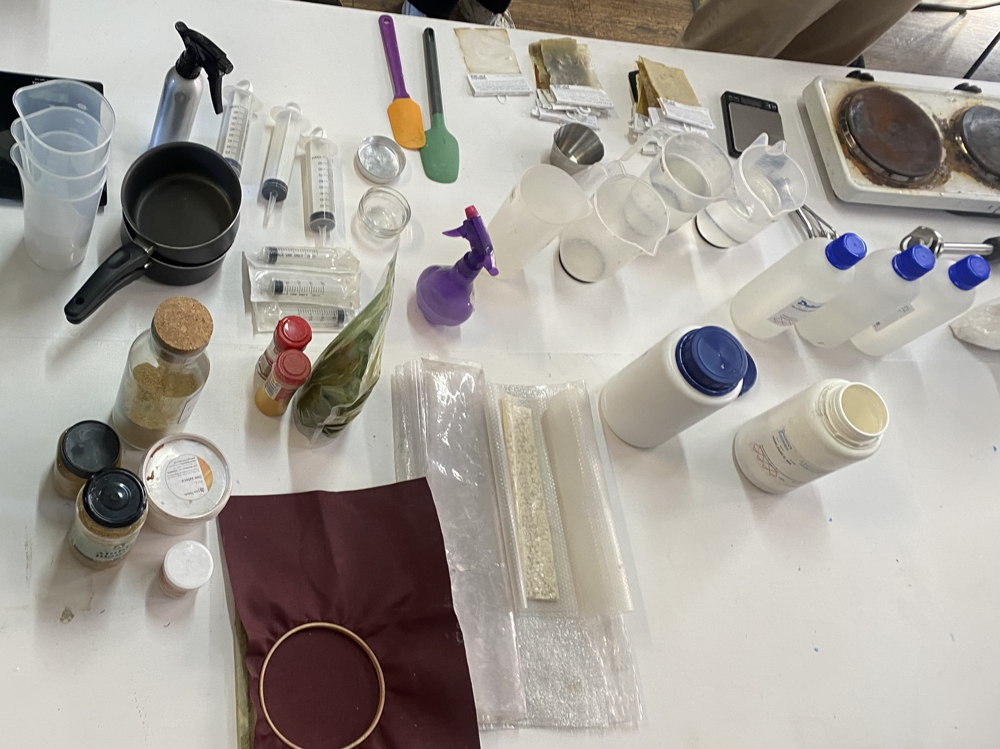
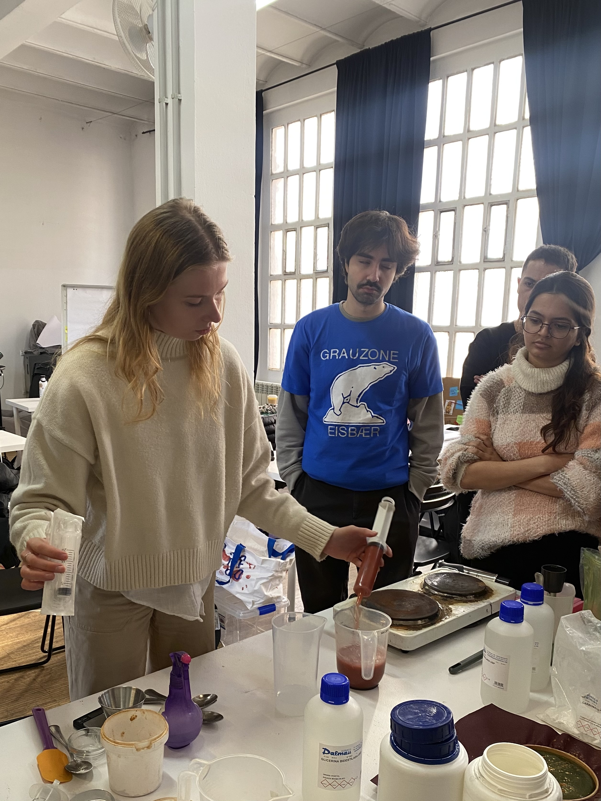
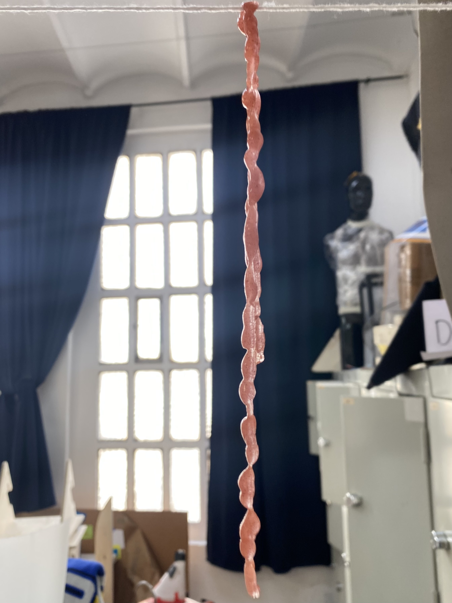
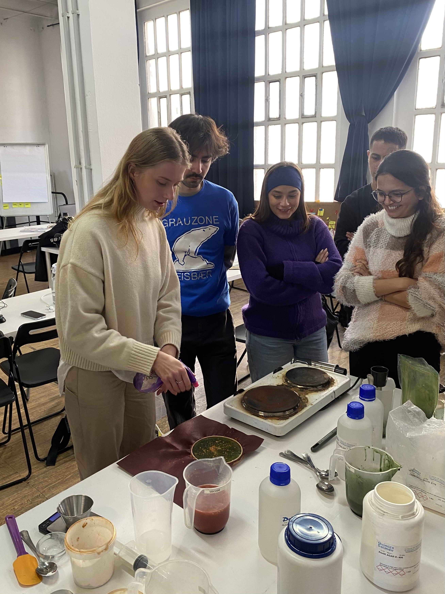
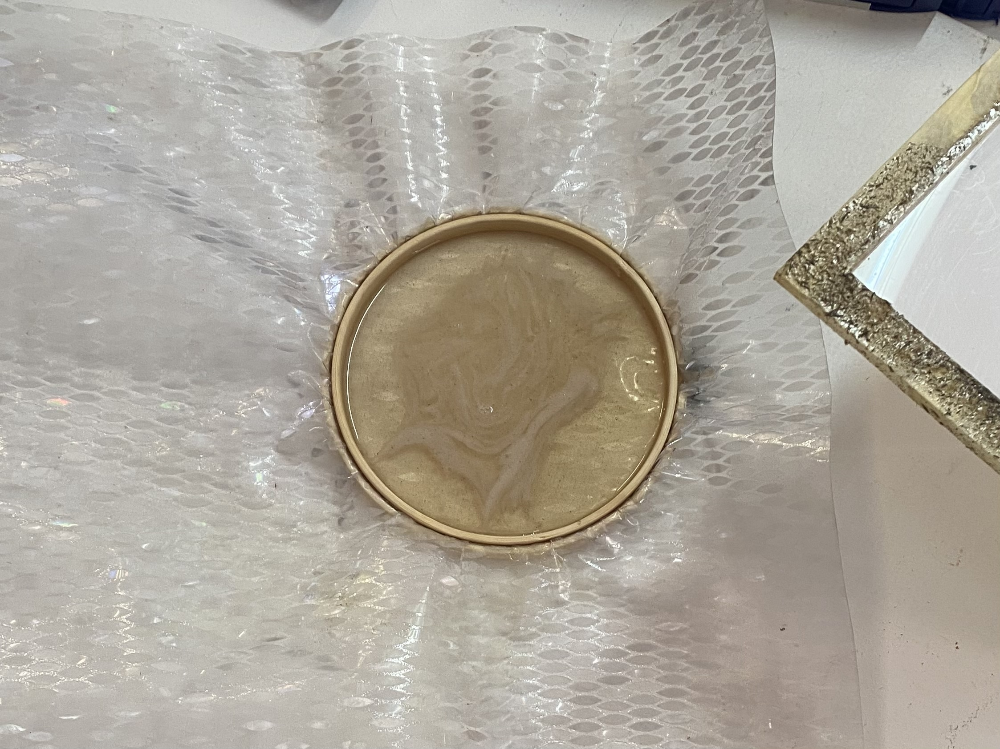
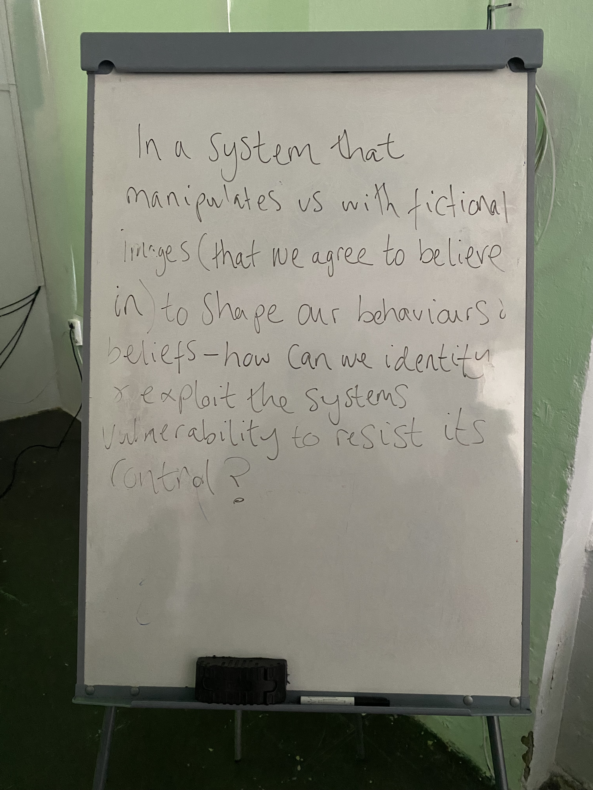
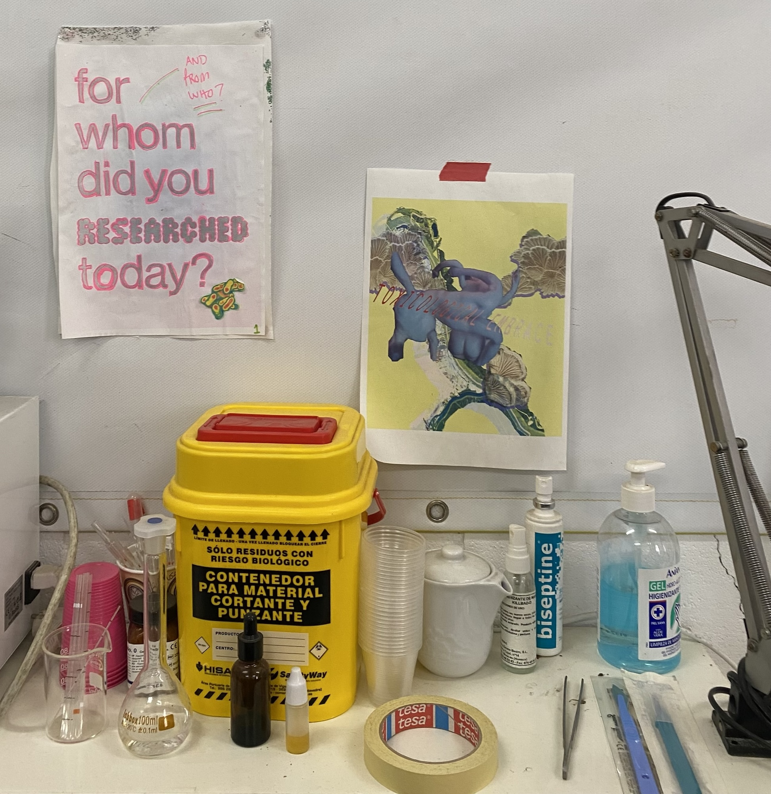
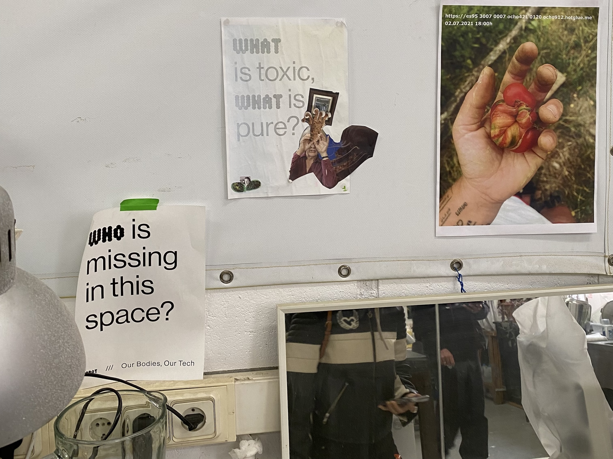
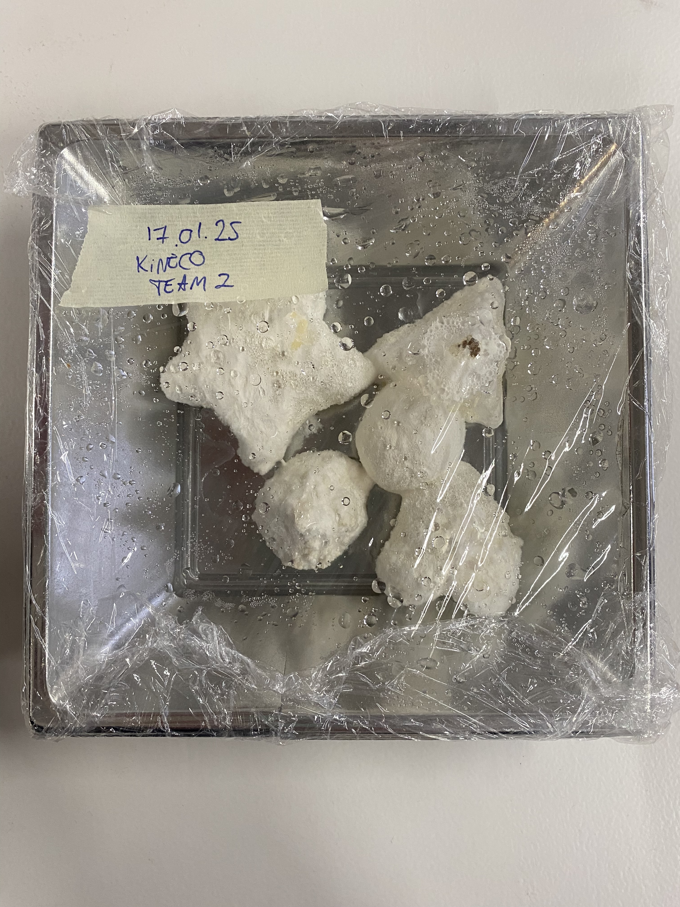
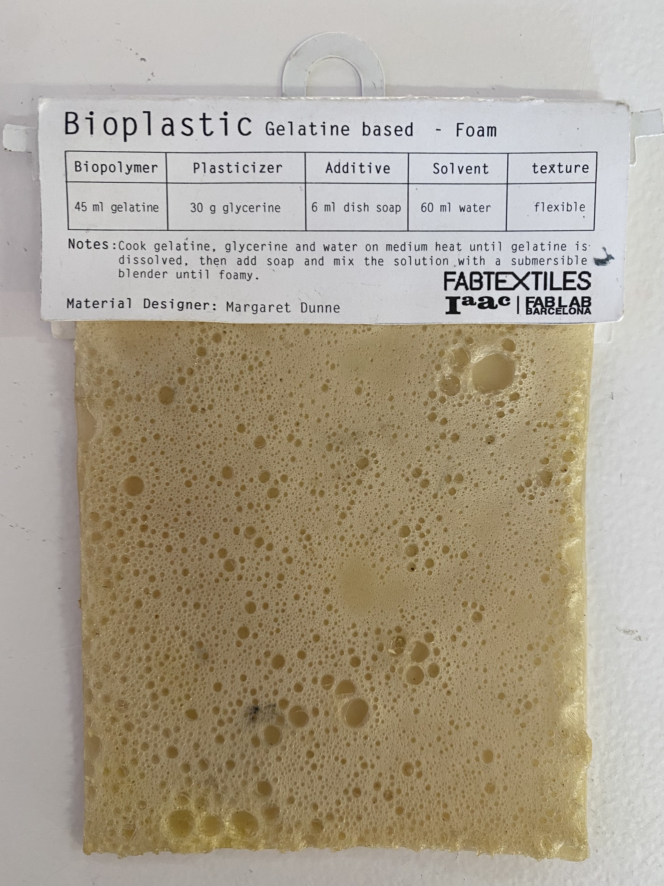

# Living Materials 

!!! abstract "Course Details"
    **Name:** Living Materials 

    **Dates:** 15 to 17 January 2025

    **Faculty:** Petra Garajová

## Biomaterials Class

We started the workshop with a presentation about sustainability vs. regenerative practices and how bioplastics fit into these methodologies. She introduced us to some fabrication techniques and showed biomaterial projects for inspiration. After the presentation, we had a hands-on portion of the class where we created some bioplastics using three different biopolymers and with different recipes to create materials with different properties. 

=== "Alginate String"

    

    !!! abstract "Sodium Alginate String Recipe"
        * 400 ml Water
        * 8 gr Sodium alginate
        * 60 gr Glycerol
        * small scoop Mica powder

    !!! abstract "Calcium chloride"
        * 200 ml Water 
        * 20 gr Calcium chloride 

    

    { width=45%, align=left }
    { width=45%, align=right }

=== "Alginate Cast"

    

    !!! abstract "Sodium Alginate Cast Recipe"
        * 400 ml Water
        * 8 gr Sodium alginate
        * 16 gr Glycerol
        * small scoop Mica powder
        * small scoop Spirulina 
        * small scoop Orange peel 

    !!! abstract "Calcium chloride Spray"
        * 200 ml Water 
        * 20 gr Calcium chloride 

    

    { width=45%, align=left }
    { width=45%, align=right }

=== "Gelatin"

    !!! abstract ""
        * 240 ml Water 
        * 48 gr Gelatin 
        * 48 gr Glycerol
        * small scoop Cinnamon 

    { width=50%, align=right }

=== "Agar Agar"

    !!! abstract ""
        * 300 ml Water 
        * 10 gr Agar Agar 
        * 4.5 gr Glycerol 
        * small scoop of various additives 

## Hangar.org 

{ width=40%, align=left }

We visited [Hangar](https://hangar.org/en/){:target="_blank"} and got a tour of the overall space before visiting the [Wetlab](https://hangar.org/en/wetlab-blog/){:target="_blank"}. [Ce Quimera](https://hangar.org/en/quimera-rosa/){:target="_blank"}, who was an artist in residence at Hangar from 2022-2024, showed us some of her past projects and took us to the Wetlab to see what things are happening there now. 

Ce spoke to us about mixing fiction with reality. Blurring the line between fabricated stories and 'truth' which I find is something I am becoming more and more interested in exploring, but also find challenging because so much information and news these days is 'fake' that it feels irresponsible to add to the noise. I will reflect more on this as I continue with the program. 

  

!!! quote "Whiteboard quote" 

    In a system that manipulates us with fictional images (that we agree to believe in) to shape our behaviors and beliefs - how can we identify and exploit the system's vulnerability to resist its control? 

{ width=40%, align=left }
{ width=55%, align=right }

!!! note "Thoughts Ce shared" 

    Question Scales: How does production change our relationship with living things? 

    If we don't change capitalism first, we don't change anything 

While my instinct is to agree with this, I think the reality is it is very hard to change a system like the one we have, to break down how things work now and perhaps the only way to not lose hope is to commit to changing what we can and knowing that tackling the whole problem all at once is too big. 

    

    
 I really enjoyed the embroidered science tarot cards that Ce is developing. The idea of bringing magic back into science and science to magic is a very cool idea to me. Additionally, the use of fabric and embroidery in this project was very interesting to me because of my interest in fiber arts and embroidery. I hope I get to see a bit more where this project goes as it develops further. 

## S-Biotica 

At S-Biotica, we met with [Jessica](https://www.biobabes.co.uk/){:target="_blank"} and [Lara](https://lara-campos.com/){:target="_blank"} about their work with biomaterials and collaborative ecosystems. 

!!! question "Thoughts they shared" 

    * Our bodies change, so why do our designed objects not change? 
    * Appreciate the narratives, rhythms, and cycles of our materials
    * Pay attention to non-human life in daily life to generate empathy 

They showed us a presentation about many of their previous projects as well as a presentation about fungi to give us an introduction to the world of mycelium as a material but also as a biological entity. 

We got a tour of their space and I found myself wondering if a artist space like this could exist anywhere in the US or if the economic and social structure of my home country is antithetical to this kind of collective, industrial repurposed space. In general, throughout our time visiting collectives and artist spaces throughout Barcelona, I have wondered how to bring these kinds of creative spaces to my home country. I am not sure if it is possible, but I am curious to explore. 

 We then had a workshop on using Kombucha SCOBY as a material. Specifically Lara showed us how to start kombucha from a mother culture. 

<figure markdown="span">
  { width=50%}
  <figcaption>Then we had a very quick workshop with Jessica about mycelium</figcaption>
</figure>

## My Biomaterials 

### Crafted Material - First Attempt

My initial thought for the crafted material was to use a biomaterial to make soles for the slippers I crocheted out of discarded fabric I found on the streets of Barcelona. 

Maithili and I decided to try to reproduce the foamed gelatin material because it would create a nice, cushy sole for the slipper. 

!!! abstract "Inspiration Recipe"
    * Biopolymer: 45ml gelatin 
    * Plasticizer: 30g glycerin
    * Additive: 6ml dish soap
    * Solvent: 60ml water 

However, we were concerned that this ratio of water to gelatin seemed like it was way too high when compared to the recipe we were given in class, so we followed the recipe from class instead, with some small modifications. 

!!! quote "Recipes" 

    !!! abstract "From Class"
        * 150ml water
        * 12g gelatin
        * 12g glycerol
        * 1 spoon dish washing soap

    !!! abstract "Our Recipe"
        * 150ml coffee water 
        * 12g gelatin 
        * 12g glycerol
        * 1 spoonful dish washing soap
        * few drops tee tree oil

Maithili and I laser cut a mold for the sole, in an attempt to reduce waste material by designing the perfect shape. Unfortunately, we had issues with the sizing of the Rhino file and it ended up way too large. Additionally, when we glued the pieces together, the glue did not hold well when we poured the material into the mold and it leaked. 

We did not have enough volume with this recipe and once we let it dry, we found that it was flimsier than we had hoped.

### Crafted Material - Second Attempt

We decided to change to a different recipe and attempt it again, this time just in a sheet rather than in the sole mold, which had become completely unglued. 

!!! abstract "Inspiration Recipe"
    * 100ml water
    * 25g gelatin
    * 25g glycerol
    * 15g activated charcoal

!!! abstract "Our Recipe"
    * 600ml water 
    * 150g gelatin 
    * 150g glycerol 
    * 2 spoons dish washing soap
    * 1 spoon of spirulina 
    * a few drops tee tree oil 

<video src="https://github.com/user-attachments/assets/88baa750-75a9-43a5-918a-0e0cb6d0605c" controls="controls" style="max-width: 100%;">
</video>

Here is a video of our process of making our second attempt at a gelatin biomaterial for the soles of my slippers. We used a modified recipe and made a much higher volume than the first attempt. We ended up filling up two extra molds because we made too much volume in an attempt to have enough unlike our first attempt.

<figure markdown="span">
  
  <figcaption>Time lapse of the mixing process</figcaption>
</figure>

!!! note "Next Steps"

    Cutting the material to the correct size and sewing it to the slippers

### Living Material 

Maithili and I had hoped to grow mycelium for this material, but our initial idea of growing it on clay ended up being something we realized wouldn't work how we had envisioned it. We eventually pivoted to coloring the scoby with mica and drying it out to create a leather. 

We had hoped to make a bracelet out of the leather, but it became very very thin after drying and ripped when we were removing it from the mold. I would have liked the experience of growing the scoby to make a much thicker leather, but that will take more time than we had for this project. I would like to set up a kombucha fermentation chamber in the classroom at some point and hope that this can happen as we progress further into the program. 

Additionally, I would like to create something with the dried scoby leather we did manage to make. Perhaps it could be a pendant or charm. I hope to explore this option more going forward. 

## Reflection 

Overall, I enjoyed the Living Materials workshop and projects. While I was less excited about the persistent smell in our classroom, I found experimenting with biomaterials to be interesting and exciting in a way that I had not necessarily anticipated. I hope to get the chance to do more later. Specifically, I have a project I want to do experimenting with pine resin.