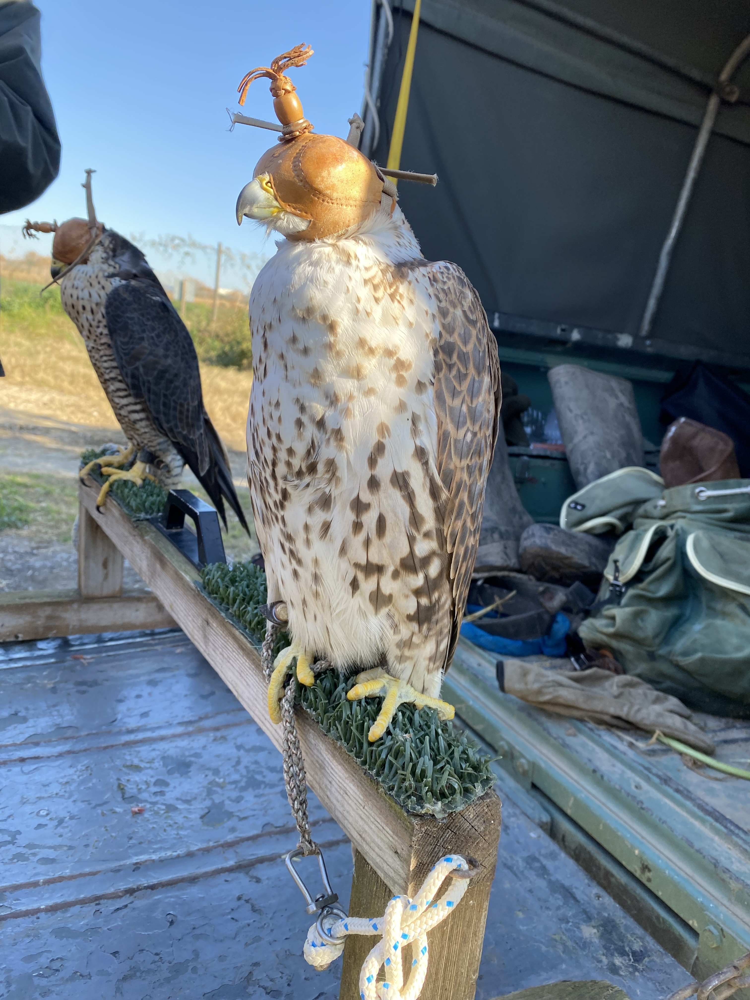

# Situated Design Practices

!!! abstract "Course Details"
    **Name:** Situated Design Practices 

    **Dates:** Various 

    **Faculty:** Saúl Baeza

## Bike trip along the Llobregat River to Cal Negre

!!! abstract "Date"
    13 January 

<!-- Slideshow container -->

  <!-- Full-width images with number and caption text -->
  

    
  

  

    
  

  

    
  

  

    
  

  

    
  

  

    
  

  

    
  

  

    
  

  

    
  

  

    
  

  

    
  

  

    
  

  

    
  

  

    
  

  

    
  

  <!-- Next and previous buttons -->
  <a class="prev" onclick="plusSlides(-1)">&#10094;</a>
  <a class="next" onclick="plusSlides(1)">&#10095;</a>

<!-- The dots/circles -->

  
  
  
  
  
  
  
  
  
  
  
  
  
  
  

## Session with Hibai Harbidez about Borders and Forced Communities

!!! abstract "Date"
    21 January 

## Visit to Jokkoo 

!!! abstract "Date"
    11 February

<!-- Slideshow container -->

/Users/lucretiafield/Documents/School/MDEF/WebsiteMDEF/mdef-journey/docs/

  <!-- Full-width images with number and caption text -->
  

    
  

  

    
  

  

    
  

  

    
  

  

    
  

  

    
  

  <!-- Next and previous buttons -->
  <a class="prev-2" onclick="plusSlides_2(-1)">&#10094;</a>
  <a class="next-2" onclick="plusSlides_2(1)">&#10095;</a>

<!-- The dots/circles -->

  
  
  
  
  
  

## Session with Ben Ditto about Internet Subcultures

!!! abstract "Date"
    18 February 

## Reflection

I have been struggling to find and define my community of impact for my interventions and projects. Most likely I have been fighting against my instincts to try to fit into a preconceived notion of what my community would or should be for this program. Additionally, I have been focusing my energy in too many directions to have a clearly defined project or focus that will allow me to find and connect with a local community of impact. Anxiety and fear has also kept me in my shell and not communicating with Barcelona communities who maybe could be a part of my community. 

So, to try to break out of my preconceived notions of my positioning and context, I will reflect on a community I am a part of personally and perhaps that can tie into my professional life as a designer in ways that I can leverage going forward, or at least that I can pull valuable information from. 

In my personal life, I am a part of a folk dance community that spreads across regions of the USA and around the world and spans generations while often staying rooted in similar political ideologies and identities. I have traveled to places like Stockholm, Berlin, and Glasgow and found people who speak a similar physical language as me, that of a shared appreciation of a particular style of dance. While this global network of people sharing an interest can give me a landing space in a new city I visit, the place where I most acutely feel the strength and value of this community is at Pinewoods Camp in Plymouth, Massachusetts, USA. This is a community I grew up in, from age four until I went to university and stepped away for a few years. While some of the faces have changed, some leaving the immediate periphery while many new faces have joined, the physical place and the shared activity of dancing beneath pine trees has remained a strong thread through most of my life. 

I feel that the multi-generational aspect of the community is an important part of this group. Much of the strength of the community comes from mixing people of different ages, with different generational perspectives, together into a dance pavilion where we share laughs, movement, and support. While ideologically many of the people involved in these spaces share a lot of similar identity traits - trending white, upper-middle class, liberal to an sometimes insular degree - there is diversity in life experience simply in terms of amount of life lived that creates a space for sharing support, advice, and ideas beyond of siloed age-specific groups. Hearing stories of camp long ago or sharing excitement with a younger person who is discovering something new for the first time is a magic that I find is so often missing from my non-folk dance life. 

When I first arrived in Barcelona, I went to a dance with a group that meets here in the city. They were welcoming and lovely, as I have gotten used to. The dancing was familiar and I had a great time. Then when I left, I found myself completely exhausted. The challenge of trying to communicate in Spanish while they spoke to each other in Catalan was a barrier that I did not anticipate having. Since the language of dance and movement so often transcends verbal communication barriers, I was not prepared for the struggles. This group fit the criteria of being multi-generational and yet somehow it did not feel comfortable in the way that I am used to. I did not immediately understand the social structure and how I fit in, as I have been accustomed to. Unfortunately, I have not gone back to the dance and have found myself getting more and more drawn into my language bubble as the months of being here have accumulated. I am finding myself daydreaming of comfort within the community I fit so easily into and struggling to engage with spaces here where I do not feel confident in my own position within the group. 

So, where does that leave me? How can I position myself given the context I come from, the context I am in, and the examples of situated communities we saw in this class? Where can I find my community of practice, my community of impact for the topics I want to explore? Have I been putting too much pressure on myself to connect with people here while failing to make connections that feel meaningful enough to frame my practice? Are these communities back in my home environment? If I choose to embrace the idea of my community of practice existing within a context where I am not physically located, what will that look like in terms of my design practice itself? If I choose to focus on communities where I already feel safe and secure, where I experience fun and support, am I missing an opportunity to find another such community here? Am I going to fundamentally change my relationship with those communities in a potentially negative or harmful way by trying to include them as part of my practice?

To all these questions, I find myself answering with an 'I don't know'. I struggle to form connection online with people I don't yet know. I have never been interested in social media, even as a means of meeting people and connecting with creatives and potential collaborators. Perhaps I need to change that though, perhaps I need to embrace the idea that my community of practice may not be physically here in Barcelona or in Boston. Perhaps I need to get over the anxiety of putting myself out there on the internet while also putting myself out there in communities here where I am currently physically situated. Both of those options sound exhausting and overwhelming. I do not know how to dig deeper than I have with the communities I am attempting to become a part of here in Barcelona. If I were to make it back to the dancing, I would feel awkward trying to explain why I disappeared for five months, why my language skills have not improved, and why I do not know if I can commit to coming ever again. I feel guilt over not wanting to put in the work and am simultaneously struggling to allow myself to be okay with the fact that I may not ever go back. I am also struggling to figure out where I fit in the Restarters Barcelona. I have visited two Restart Parties and felt peripheral and uncertain about how I fit. These spaces too fit the multi-generational criteria and also have the language challenges I have encountered in the dance space. I have not gone back to either event and do not know if I will be able to get up the courage or willpower to do so again. 

So, once again, I have to ask, where does that leave me? How am I situating my design practice, how can I frame my community of impact? Once again, I am not sure I have an answer. Much of my work has been focused on myself, on the people within MDEF, and daydreams of 'one day' when I am back in a place I can feel confident and comfortable. I'm not sure how to give myself credit for what I have accomplished, it feels like I have accomplished little to nothing with a situated perspective, with any semblance of completion, with any community of practice. 

I suppose I will just keep trying and putting the effort I can in, trying to overcome anxiety, and staying in touch with communities back home to sustain myself in the meantime. 

