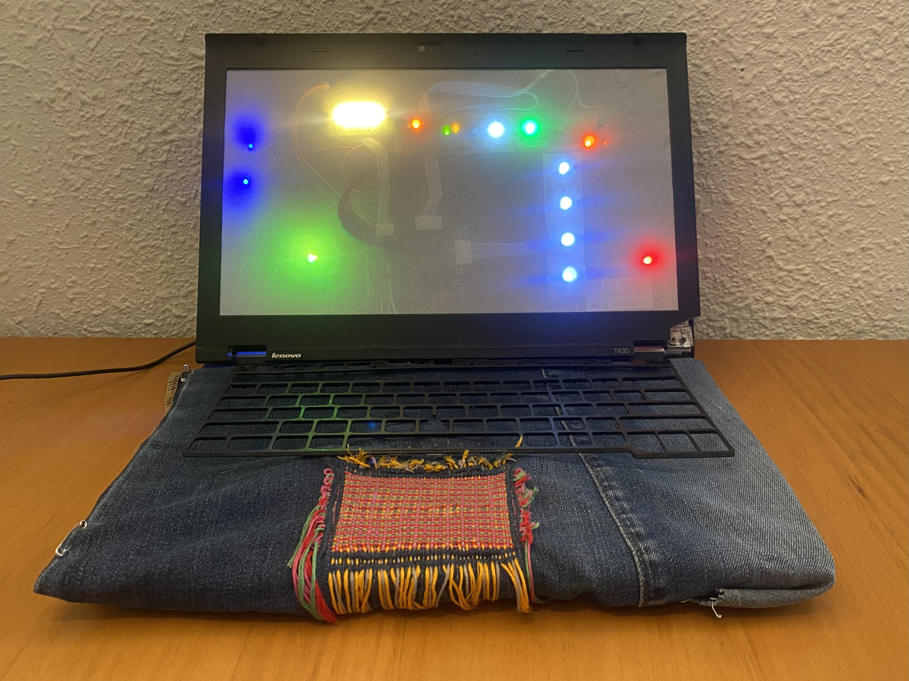

# Final Project 

<figure markdown="span">
    <video autoplay src="https://github.com/user-attachments/assets/4d7d99b9-ca6d-433f-8652-81f54a7804fa" controls="controls" style="max-width: 100%;"></video>
    <figcaption></figcaption>
</figure>

Dear Reader, 

Have you ever marveled at the amount of clothing in the trash on your street? Have you ever noticed a broken television in the garbage? Have you ever picked these items up? 

I do. 

I take discarded clothing and consumer electronics and transform them into objects from another reality; where computers have cloth screens and woven trackpads and jeans have butt patches that light up. In my world, parts of different items are combined in ways that challenge the expectations of products and the way we are used to seeing them. 

In the real world, the United Nations reports 62 billion kgs of e-waste were generated in 2022; the Ellen MacArthur Foundation found that the equivalent of a truck full of clothing waste is burned or buried every second. We accept these absurdities as the cost of progress.

Instead of throwing away our old, broken, or simply unwanted items, we need to shift collective habits to actually fix or reimagine our items, prolonging their useful life. Community repair efforts from Restart Parties, Repair Cafes, Mend in Public Days, to individual repair habits are a place to start addressing these practical problems and deepening our connection to the objects in our lives. However, when repair is not even an option in our collective thoughts, when we face external pressure from advisements and social judgement, why not embrace the weird? 

Reader, what weird will you embrace? Maybe you will take pieces of a broken laptop to ‘mend’ your clothes or ‘fix’ your electronics with cloth and thread. Perhaps instead of just fixing objects, will you fix your relationship with them by transforming them into new items that break the conventions of purpose and useful functioning. Or, will you try your hand at repairing your clothes in a traditional manner? Will you find a community that can help you fix the fan that stopped working last summer? Can you keep your smartphone for just one year longer? Will you begin to brag about how old your items are, because really, it’s ridiculous that we don’t view the longevity of our objects as a personal achievement. 

I hope you will join me in this world of Darned Circuits where I imagine a world on the opposite extreme, and perhaps, we can start conversations with those still stuck in reality, so that we can meet in the middle. 

All the best, 

Lucretia Field  

<!-- Slideshow container -->

  <!-- Full-width images with number and caption text -->
  

    
  

  

    
  

  

    
  

  

    
  

  

    
  

  <!-- Next and previous buttons -->
  <a class="prev" onclick="plusSlides(-1)">&#10094;</a>
  <a class="next" onclick="plusSlides(1)">&#10095;</a>

<!-- The dots/circles -->

  
  
  
  
  

<figure markdown="span">
    <video src="#" controls="controls" style="max-width: 100%;"></video>
    <figcaption></figcaption>
</figure>